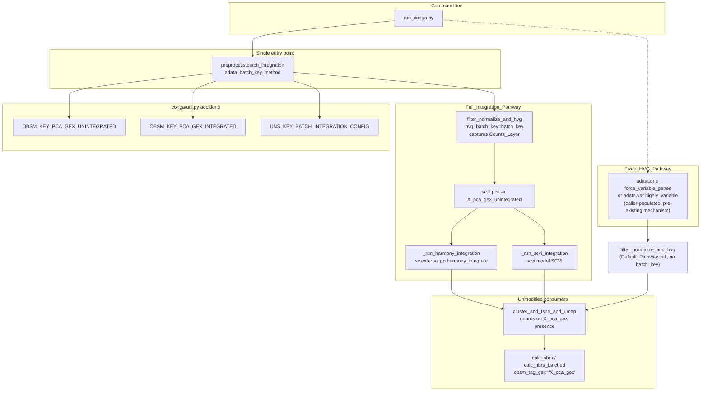
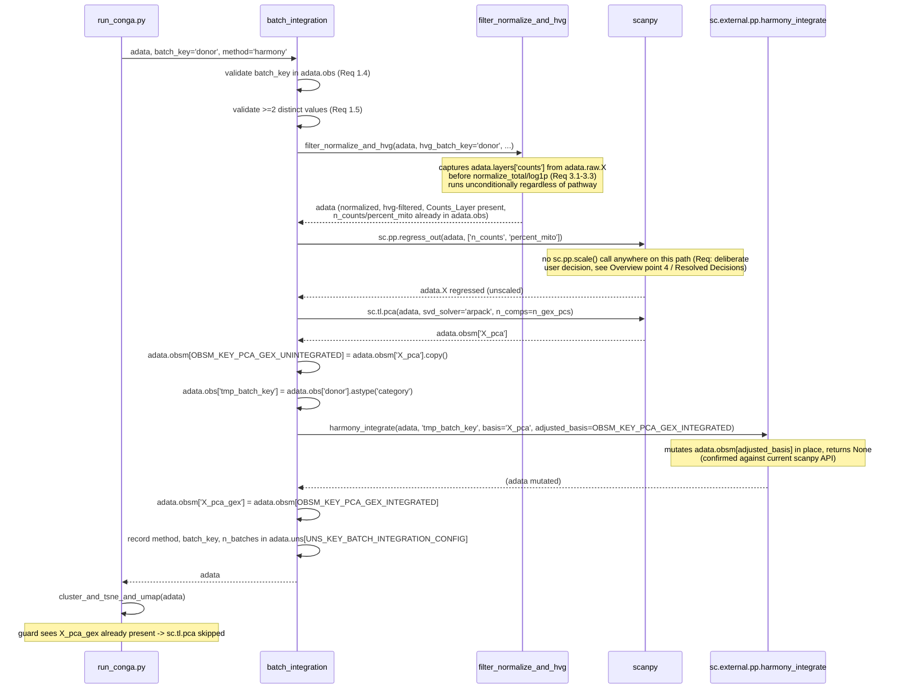
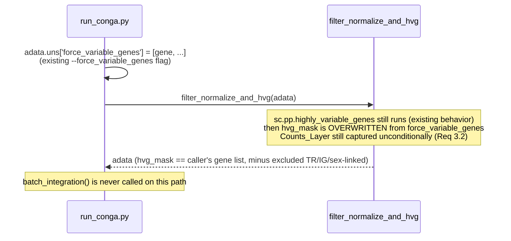

# Design Document: Batch Integration

## Overview

CoNGA's GEX preprocessing (`conga.preprocess.filter_normalize_and_hvg`, called from `filter_and_scale`) already accepts an `hvg_batch_key` parameter that makes highly-variable-gene selection batch-aware, but nothing in the current codebase turns that into a batch-*corrected* GEX representation. This feature adds exactly that: a `batch_integration()` entry point that, given one `batch_key`, drives both HVG selection and a Harmony- or scVI-based correction of the GEX PCA embedding, and a parallel `Fixed_HVG_Pathway` that lets a caller substitute a pre-defined gene panel for automatic HVG detection while running no integration at all. Both pathways are opt-in; a no-argument preprocessing run behaves exactly as it does today.

The design ports the shape of the `dev` branch's `batch_integration(adata, method, key, basis='X_pca', adjusted_basis='X_batch', **kwargs)`, but narrows it in three ways the requirements make explicit: only `harmony` and `scvi` are supported (not `scanorama`, not `bbknn`); the batch column is threaded through a single parameter rather than two independently-settable ones; and a `Counts_Layer` capture step is added to `filter_normalize_and_hvg` because nothing today stashes pre-normalization counts, and scVI cannot run without them.

Four things had to be pinned down rather than assumed from `dev`-era memory or default convention — the first three against the actual master-branch code, because `dev`'s own sequence does not carry over unchanged, and the fourth as an explicit design-review decision:

1. **Where PCA is first computed.** On master, `filter_and_scale` and `filter_normalize_and_hvg` never call `sc.tl.pca` at all — the first (and normally only) unbatched GEX PCA is computed inside `cluster_and_tsne_and_umap` (`conga/preprocess.py` ~line 741), which writes directly to `adata.obsm['X_pca_gex']`, not to `adata.obsm['X_pca']` the way `dev`'s `batch_integration()` (operating on `basis='X_pca'`) assumes. `dev`'s function cannot be called verbatim against master's call sequence: there is no `adata.obsm['X_pca']` lying around by the time a caller would want to run integration in today's pipeline.
2. **Where the new step must sit.** `batch_integration()` is therefore designed as a step that runs the initial GEX PCA itself (via `sc.tl.pca`) rather than assuming one already exists, immediately writes the Unintegrated_Representation, corrects it, and writes the result into `adata.obsm['X_pca_gex']` before `cluster_and_tsne_and_umap` ever runs. Because `cluster_and_tsne_and_umap`'s guard is `if 'X_pca_gex' not in adata.obsm.keys() or recompute_pca_gex:`, a pre-populated `X_pca_gex` is silently accepted and reused — confirmed by reading that function body directly (see "Why the Full_Integration_Pathway does not touch `cluster_and_tsne_and_umap`" below) — so no change to `cluster_and_tsne_and_umap`, `calc_nbrs`, or `calc_nbrs_batched` is required. This is the load-bearing design fact behind Requirement 4.2.
3. **What `harmony_integrate` actually does.** Checked directly against the current scanpy API rather than trusted from `dev`-era memory: `scanpy.external.pp.harmony_integrate(adata, key, *, basis='X_pca', adjusted_basis='X_pca_harmony', **kwargs)` mutates `adata.obsm[adjusted_basis]` in place and returns `None` ([scanpy docs](https://scanpy.readthedocs.io/en/stable/generated/scanpy.external.pp.harmony_integrate.html)). *Content rephrased for compliance with licensing restrictions.* The design's sequence diagram reflects this in-place-mutation, no-return-value behavior rather than assuming a returned array.
4. **What preprocessing runs before `sc.tl.pca` inside `batch_integration()`.** This is a deliberate user decision made during design review, not something derived from `dev`-branch code or from scVI's own requirements alone: `batch_integration()` runs `sc.pp.regress_out(adata, ['n_counts', 'percent_mito'])` before `sc.tl.pca` for **both** `method='harmony'` and `method='scvi'`, but does **not** run `sc.pp.scale()` for either method. This was a real tradeoff, not a default: Harmony's own official quickstart documentation explicitly recommends scaling before PCA — "We library normalized the cells, log transformed the counts, and scaled the genes. Then we performed PCA and kept the top 20 PCs." ([Harmony quickstart](https://portals.broadinstitute.org/harmony/articles/quickstart.html)). The user considered that documented convention and chose to diverge from it anyway, because `sc.pp.scale()`'s per-gene mean-center/unit-variance step inflates the relative influence of low-expression, noisy genes on the PCA that both Harmony and scVI ultimately correct — and the user judged that noise-suppression benefit as worth losing Harmony's own documented preprocessing convention. `sc.pp.regress_out` is kept for both methods because removing technical covariates (`n_counts`, `percent_mito`) is a separate operation from per-gene variance-scaling, and only the latter is the source of the noise-inflation concern. See Component 1 for exactly where these calls sit relative to `sc.tl.pca`, and "Resolved Decisions" below for the decision record.

## Architecture



The single owning function is `batch_integration()`. It is the only place that (a) validates `batch_key` against `adata.obs`, (b) threads that one key into `filter_normalize_and_hvg`'s `hvg_batch_key`, and (c) dispatches to Harmony or scVI. Nothing else in the codebase re-implements or duplicates that branch, mirroring the "one function owns the three-way branch" pattern used for `resolve_tcr_representation` in the vectorized-tcrdist design.

### Why the Full_Integration_Pathway does not touch `cluster_and_tsne_and_umap`

`cluster_and_tsne_and_umap`'s GEX branch (`conga/preprocess.py` line 735) reads:

```python
if 'X_pca_gex' not in adata.obsm.keys() or recompute_pca_gex:
    ...
    sc.tl.pca(adata, svd_solver='arpack', n_comps=n_gex_pcs)
    adata.obsm['X_pca_gex'] = adata.obsm['X_pca']

assert 'X_pca_gex' in adata.obsm
```

Confirmed by direct inspection: if `batch_integration()` has already written `adata.obsm['X_pca_gex']` (to the Integrated_Representation) before this function runs, and the caller does not pass `recompute_pca_gex=True`, the guard is false, `sc.tl.pca` is skipped entirely, and the assert at the end passes trivially. `calc_nbrs` and `calc_nbrs_batched` both default `obsm_tag_gex='X_pca_gex'` (confirmed at `conga/preprocess.py` lines 1363 and 1835) and read whatever array is there. No signature or body change is needed in any of the three functions — this closes Requirement 4.2 by construction rather than by modifying downstream code.

### Sequence: Full_Integration_Pathway with Harmony



### Sequence: Full_Integration_Pathway with scVI

```mermaid
sequenceDiagram
    participant CLI as run_conga.py
    participant BI as batch_integration
    participant FNH as filter_normalize_and_hvg
    participant SC as scanpy
    participant SCVI as scvi.model.SCVI

    CLI->>BI: adata, batch_key='donor', method='scvi'
    BI->>BI: validate batch_key (Req 1.4, 1.5)
    BI->>FNH: filter_normalize_and_hvg(adata, hvg_batch_key='donor', ...)
    FNH-->>BI: adata (Counts_Layer present, n_counts/percent_mito already in adata.obs)
    BI->>BI: assert 'counts' in adata.layers (Req 3.4) else raise ValueError
    BI->>SC: sc.pp.regress_out(adata, ['n_counts', 'percent_mito'])
    Note over SC: no sc.pp.scale() call anywhere on this path either --<br/>scVI's own training input is adata.layers['counts'] regardless,<br/>this regress_out only feeds the Unintegrated_Representation PCA below
    SC-->>BI: adata.X regressed (unscaled)
    BI->>SC: sc.tl.pca(adata, svd_solver='arpack', n_comps=n_gex_pcs)
    SC-->>BI: adata.obsm['X_pca'] (Unintegrated_Representation)
    BI->>SCVI: SCVI.setup_anndata(adata, layer='counts',<br/>batch_key='donor',<br/>continuous_covariate_keys=['percent_mito'])
    SCVI-->>BI: (adata registered)
    BI->>SCVI: model = SCVI(adata); model.train()
    SCVI-->>BI: trained model
    BI->>BI: latent = model.get_latent_representation()
    BI->>BI: adata.obsm[OBSM_KEY_PCA_GEX_UNINTEGRATED] = adata.obsm['X_pca'].copy()
    BI->>BI: adata.obsm[OBSM_KEY_PCA_GEX_INTEGRATED] = latent
    BI->>BI: adata.obsm['X_pca_gex'] = latent
    BI->>BI: record method, batch_key, n_batches in adata.uns[UNS_KEY_BATCH_INTEGRATION_CONFIG]
    BI-->>CLI: adata
```

### Sequence: Fixed_HVG_Pathway (no integration)



## Components and Interfaces

### Component 1: `conga/preprocess.py` additions — `batch_integration` and helpers

**Purpose**: the single public entry point for the Full_Integration_Pathway, plus two private per-method helpers. This is a new standalone function, not a modification to `filter_normalize_and_hvg` or `filter_and_scale` — it *calls* `filter_normalize_and_hvg` internally (passing `batch_key` through to the existing `hvg_batch_key` parameter) and then runs a new integration step. `filter_and_scale` is not on the Full_Integration_Pathway at all: on master it applies `sc.pp.regress_out` followed by `sc.pp.scale`, and `batch_integration()` does not call it. Instead, `batch_integration()` re-runs `sc.pp.regress_out(adata, ['n_counts', 'percent_mito'])` itself, immediately before `sc.tl.pca`, for both `method='harmony'` and `method='scvi'` — but deliberately omits `sc.pp.scale()` for both. Harmony in this design does **not** correct a PCA computed from scaled data; it corrects a PCA computed from normalized, log-transformed, technical-covariate-regressed, HVG-selected, but *unscaled* data. scVI, as before, trains directly on the Counts_Layer and never sees any scaled (or regressed) matrix at all — `sc.pp.regress_out` and `sc.pp.scale` are both irrelevant to scVI's own input, since scVI's `setup_anndata(layer='counts', ...)` reads raw counts regardless of what happens to `adata.X`. `sc.pp.regress_out` is still run unconditionally ahead of `sc.tl.pca` on the `scvi` path for consistency with the `harmony` path and because `sc.tl.pca`'s *own* output — `OBSM_KEY_PCA_GEX_UNINTEGRATED` — is computed identically for both methods and is reused as the Unintegrated_Representation for comparison in the Data Models table below; it has no effect on scVI's corrected representation itself. This omission of `sc.pp.scale()` is a deliberate user decision made during design review, not a default inherited from `dev` or from either library's own convention — see Overview point 4 and "Resolved Decisions" for the full rationale and the documented Harmony-quickstart counterpoint the user weighed and chose to diverge from. This relationship — new function wraps the existing one and adds a step after it — is stated once here rather than left to be inferred from the sequence diagrams above.

```python
# Restricted, validated set of Integration_Method values (Requirement 2.1, 2.2)
BATCH_INTEGRATION_METHODS: frozenset[str] = frozenset({'harmony', 'scvi'})


def batch_integration(
    adata: AnnData,
    batch_key: str,
    method: str,
    *,
    n_gex_pcs: int = 40,
    hvg_min_mean: float = 0.0125,
    hvg_max_mean: float = 3,
    hvg_min_disp: float = 0.5,
    min_genes_per_cell: int | None = None,
    max_genes_per_cell: int | None = None,
    max_percent_mito: int | None = None,
    normalize_antibody_features_CLR: bool = True,
    scvi_max_epochs: int | None = None,
    random_seed: int = util.DEFAULT_RANDOM_SEED,
) -> AnnData:
    """Run batch-aware HVG selection followed by batch integration.

    Runs `filter_normalize_and_hvg(adata, hvg_batch_key=batch_key, ...)`,
    then `sc.pp.regress_out(adata, ['n_counts', 'percent_mito'])`, then
    computes a GEX PCA, corrects it with the requested Integration_Method,
    and writes the corrected representation into `adata.obsm['X_pca_gex']`
    so that `cluster_and_tsne_and_umap` and `calc_nbrs` consume it with no
    further changes.

    PCA input, for both `method='harmony'` and `method='scvi'`, is
    normalized + log-transformed + `regress_out`-corrected + HVG-selected
    data -- `sc.pp.scale()` is deliberately **not** run before `sc.tl.pca`
    on either path. This is a deliberate design choice, made to avoid
    `sc.pp.scale()`'s per-gene unit-variance step inflating the relative
    influence of low-expression, noisy genes on the PCA. Note this departs
    from Harmony's own documented quickstart convention, which scales
    before PCA; that tradeoff was considered and accepted for the
    noise-suppression benefit. See the design Overview and "Resolved
    Decisions" for the full rationale and the counterpoint.

    Parameters
    ----------
    adata : anndata.AnnData
        Annotated data matrix. Must **not** yet have had
        `filter_normalize_and_hvg` or `filter_and_scale` called on it --
        this function calls `filter_normalize_and_hvg` itself.
    batch_key : str
        Name of the single `adata.obs` column driving both HVG selection
        and the Integration_Method. See Requirement 1.
    method : str
        One of `'harmony'` or `'scvi'`. See Requirement 2.
    n_gex_pcs : int
        Number of PCs to compute for the Unintegrated_Representation
        before correction. Passed to `sc.tl.pca`.
    scvi_max_epochs : int, optional
        Passed to `scvi.model.SCVI.train(max_epochs=...)`. `None` uses
        the scvi-tools default epoch-selection heuristic.
    random_seed : int
        Seed passed to `sc.tl.pca` (`svd_solver='arpack'` is deterministic
        given a seed) and to scVI's trainer.

    Returns
    -------
    anndata.AnnData
        The same object, mutated in place and also returned for chaining,
        consistent with `filter_and_scale`'s existing convention.

    Raises
    ------
    ValueError
        If `batch_key` is missing from `adata.obs`, names a column with
        fewer than two distinct values, or `method` is not in
        `BATCH_INTEGRATION_METHODS`.
    ImportError
        If `method='harmony'` and `harmonypy` is not installed, or
        `method='scvi'` and `scvi-tools` is not installed.

    Examples
    --------
    >>> import conga
    >>> adata = conga.preprocess.batch_integration(
    ...     adata, batch_key='donor_id', method='harmony')
    >>> 'X_pca_gex' in adata.obsm
    True
    """


def _regress_out_technical_covariates(adata: AnnData) -> None:
    """Runs `sc.pp.regress_out(adata, ['n_counts', 'percent_mito'])`
    unconditionally, for both `method='harmony'` and `method='scvi'`,
    immediately before `sc.tl.pca` in `batch_integration()`. Both
    `adata.obs['n_counts']` and `adata.obs['percent_mito']` are already
    populated by `filter_normalize_and_hvg` (which `batch_integration()`
    always calls first) -- confirmed by reading `filter_normalize_and_hvg`
    directly: both columns are written at existing lines ~504-509, well
    before that function returns, so both are present on `adata.obs` by
    the time this helper runs. No new column needs to be computed here.
    Does not run `sc.pp.scale()` -- see Overview point 4 and Component 1's
    introductory paragraph for why scaling is deliberately omitted.
    """


def _validate_batch_key(adata: AnnData, batch_key: str) -> None:
    """Requirement 1.4, 1.5: column exists and has >= 2 distinct values."""


def _run_harmony_integration(
    adata: AnnData,
    batch_key: str,
    *,
    basis: str = 'X_pca',
    adjusted_basis: str = util.OBSM_KEY_PCA_GEX_INTEGRATED,
) -> None:
    """Requirement 2.3, 2.5, 2.7. Casts adata.obs[batch_key] to categorical,
    imports harmonypy only here, calls
    scanpy.external.pp.harmony_integrate(adata, key, basis=, adjusted_basis=).
    That call mutates adata.obsm[adjusted_basis] in place and returns None
    (confirmed against the current scanpy API); this helper does not rely
    on any return value.
    """


def _run_scvi_integration(
    adata: AnnData,
    batch_key: str,
    *,
    counts_layer: str = 'counts',
    continuous_covariate_keys: Sequence[str] = ('percent_mito',),
    max_epochs: int | None = None,
    random_seed: int = util.DEFAULT_RANDOM_SEED,
) -> np.ndarray:
    """Requirement 2.4, 2.6, 2.7, 3.4, 3.5. Imports scvi only here. Raises
    ValueError if `counts_layer` is absent from adata.layers (Requirement
    3.4). Calls scvi.model.SCVI.setup_anndata(adata, layer=counts_layer,
    batch_key=batch_key, continuous_covariate_keys=list(continuous_covariate_keys)),
    trains an scvi.model.SCVI(adata), and returns model.get_latent_representation().
    """
```

**Why `harmony`/`scvi` import only inside the two helper functions** (Requirement 2.7): `conga/preprocess.py` is imported by `conga/__init__.py`, which every CLI script and every test imports. If `import harmonypy` or `import scvi` sat at module scope, installing CoNGA without either optional extra would make `import conga` itself fail. Both imports are deferred to inside `_run_harmony_integration` and `_run_scvi_integration`, wrapped in `try/except ImportError` that re-raises a `conga`-authored `ImportError` naming the package and the `pyproject.toml` extra that installs it (`conga[batch-integration]`, see Component 4).

### Component 2: `conga/preprocess.py` modification — Counts_Layer capture in `filter_normalize_and_hvg`

**Exact diff location**, based on the current function body (`conga/preprocess.py`, `filter_normalize_and_hvg`, lines 437–564 in the version read for this design):

```python
    # see https://github.com/scverse/scanpy/issues/3073
    adata.raw = adata.copy() # potential BUGFIX for newer anndata          # <- existing, ~line 547
    feature_types_colname = util.get_feature_types_varname( adata )
    if feature_types_colname:
        mask = (adata.var[feature_types_colname] ==
                util.ANTIBODY_CAPTURE_FEATURE_TYPE)
        print('num antibody features:', np.sum(mask))
        adata.uns['conga_stats']['num_antibody_features'] = np.sum(mask)
        if np.sum(mask):
            adata = adata[:,~mask].copy()
            removed_at_end = (np.sum(mask[:adata.shape[1]])==0)
            print('Removed {} antibody features from adata, using colname {}'\
                  .format(np.sum(mask), feature_types_colname ))
            assert removed_at_end # want to make this assumption somewhere else

    # +++ NEW (Requirement 3.1-3.3): capture the Counts_Layer here, after
    # +++ antibody-feature removal (so gene/cell ordering matches the final
    # +++ adata.raw.X used downstream) but strictly before normalize_total/log1p.
    adata.layers['counts'] = adata.raw.X.copy()

    # Normalize and log data using modern scanpy API
    sc.pp.normalize_total(adata, target_sum=1e4)  # normalize_per_cell deprecated since 1.3.7   # <- existing, ~line 561
    sc.pp.log1p(adata)                                                                          # <- existing, ~line 562
```

The capture point is placed *after* the antibody-feature-removal block rather than immediately after `adata.raw = adata.copy()`, because that block can reassign `adata` to a column-sliced copy (`adata = adata[:,~mask].copy()`) when protein/antibody features are present. Capturing before that reassignment would size-mismatch `adata.layers['counts']` against the final `adata.shape[1]`; capturing after it guarantees the layer's gene ordering matches `adata.raw.X`'s ordering *at the time of capture* (Requirement 3.3), which is also the ordering every downstream `adata.var_names` read uses.

**Unconditional and behavior-preserving** (Requirement 3.2): the added line has no parameters, no branch, and reads only `adata.raw.X`, which already exists unconditionally at that point in the function (it is assigned two lines above by pre-existing code). It runs for every call to `filter_normalize_and_hvg`, regardless of whether `hvg_batch_key`, `force_variable_genes`, or neither is set, and it does not alter `adata.raw`, `adata.X`, `adata.var`, or the function's return value — a caller who never touches batch integration observes an extra key in `adata.layers` and nothing else different. `.copy()` is used (not a view) so that the later in-place `sc.pp.normalize_total`/`sc.pp.log1p` calls, which mutate `adata.raw.X` in place via `sparsefuncs.inplace_row_scale` and `np.log1p(..., out=...)` inside `normalize_and_log_the_raw_matrix`, cannot retroactively alter the stashed counts.

### Component 3: `conga/util.py` additions — shared constants

Following the existing `OBSM_KEY_*`/`UNS_KEY_*` convention (`OBSM_KEY_VEC_TCR`, `OBSM_KEY_PCA_TCR`, `UNS_KEY_ACTIVE_TCR_REP`):

```python
# AnnData obsm keys for batch-integrated GEX representations (Requirement 4.3)
OBSM_KEY_PCA_GEX_UNINTEGRATED: str = 'X_pca_gex_unintegrated'
OBSM_KEY_PCA_GEX_INTEGRATED: str = 'X_pca_gex_integrated'

# AnnData uns key for batch integration run metadata (Requirement 4.4)
UNS_KEY_BATCH_INTEGRATION_CONFIG: str = 'batch_integration_config'

# Restricted, validated Integration_Method values (Requirement 2.1, 2.2)
BATCH_INTEGRATION_METHODS: frozenset[str] = frozenset({'harmony', 'scvi'})
```

`BATCH_INTEGRATION_METHODS` lives in `util.py` rather than `preprocess.py` so that a future consumer (e.g. the CLI's `--batch_integration_method` choices, Component 4) can import it without importing all of `preprocess.py`'s scanpy-dependent module body — the same reasoning `util.py`'s own header comment ("try not to have any conga imports here") already applies to keep it a leaf module.

### Component 4: `scripts/run_conga.py` additions — CLI flags

**Placement**: immediately after the existing `--force_variable_genes` flag (line 177) and before the `--batch_keys` flag (line 182), since `--batch_keys` is an unrelated pre-existing mechanism (integer-valued logo-coloring metadata, Requirement/Out-of-Scope note: this feature does not touch it) and the proximity to `--force_variable_genes` reflects that the two new flags and `--force_variable_genes` are the three mutually-exclusive-or-paired entry points this feature governs.

```python
# preprocessing options
parser.add_argument('--max_genes_per_cell', type=int)
parser.add_argument('--min_genes_per_cell', type=int)
parser.add_argument('--max_percent_mito', type=float)
parser.add_argument('--force_variable_genes')

# Batch integration flags (Requirement 6). Both default to None, resolved
# and cross-validated after `import conga` below -- see the note on argparse
# ordering carried over from the vectorized-tcrdist design.
parser.add_argument('--batch_key', type=str, default=None,
                    help='adata.obs column shared by batch-aware HVG selection'
                    ' and batch integration (Full_Integration_Pathway).'
                    ' Requires --batch_integration_method.')
parser.add_argument('--batch_integration_method', type=str, default=None,
                    help='Batch integration method: "harmony" or "scvi".'
                    ' Requires --batch_key. Validated set is'
                    ' conga.util.BATCH_INTEGRATION_METHODS.')
```

**Validation placement**: Requirement 6's flag-pairing and mutual-exclusion checks need `conga.util.BATCH_INTEGRATION_METHODS` to word the error message against the real supported set rather than a hardcoded duplicate, so — following the same pattern the vectorized-tcrdist design established for `util.KPCA_REDUCTION_LIMIT` — the checks are placed immediately after `import conga` (line ~306), not at parser-construction time:

```python
args = parser.parse_args()          # existing, line 277
...
import conga                        # existing, line 306
from conga import util              # existing, line 308
...
# +++ NEW: Requirement 6.3, 6.5, 6.6
if bool(args.batch_key) != bool(args.batch_integration_method):
    sys.exit('ERROR: --batch_key and --batch_integration_method must be'
              ' supplied together (Full_Integration_Pathway requires both);'
              f' got --batch_key={args.batch_key!r}'
              f' --batch_integration_method={args.batch_integration_method!r}')

if args.batch_integration_method is not None and \
   args.batch_integration_method not in util.BATCH_INTEGRATION_METHODS:
    sys.exit(f'ERROR: --batch_integration_method={args.batch_integration_method!r}'
              f' is not supported; choose from {sorted(util.BATCH_INTEGRATION_METHODS)}')

if args.force_variable_genes and (args.batch_key or args.batch_integration_method):
    sys.exit('ERROR: --force_variable_genes (Fixed_HVG_Pathway) and'
              ' --batch_key/--batch_integration_method (Full_Integration_Pathway)'
              ' are mutually exclusive')
```

This mirrors the vectorized-tcrdist design's resolution to the same structural problem: all CLI scripts build their `ArgumentParser` before `import conga` for startup-speed reasons (`conga/__init__.py` pulls in scanpy), so any check or default that needs a `conga`-defined constant is deferred to immediately after the import, not written into `add_argument(...)`. Unlike that design's numeric defaults (which use `default=None` and are back-filled with a constant), these two flags have no default *value* to back-fill — `None` is itself the correct default, meaning "neither pathway requested" — so only the *validation* is deferred, using `choices=` deliberately avoided at `add_argument` time because `choices` would reject `None` (the legitimate not-requested state) before the pairing check could produce the more specific paired-flag error message.

**Call site**: after the existing `if args.force_variable_genes:` block (line 672) and before `conga.preprocess.filter_and_scale(...)` (line 678), inserted as an alternative branch:

```python
if args.force_variable_genes:
    with open(args.force_variable_genes,'r') as f:
        force_genes = [x.strip() for x in f]
    adata.uns['force_variable_genes'] = force_genes

if args.batch_key:
    adata = conga.preprocess.batch_integration(
        adata, batch_key=args.batch_key, method=args.batch_integration_method)
    # batch_integration() already ran filter_normalize_and_hvg internally;
    # skip the plain filter_and_scale call below for this pathway.
else:
    adata = conga.preprocess.filter_and_scale(
        adata,
        max_genes_per_cell = args.max_genes_per_cell,
        min_genes_per_cell = args.min_genes_per_cell,
        max_percent_mito = args.max_percent_mito,
        outfile_prefix_for_qc_plots = outfile_prefix_for_qc_plots,
        add_variable_genes = add_variable_genes,
    )
```

This is a genuine branch, not a cosmetic one: `batch_integration()` calls `filter_normalize_and_hvg` itself and additionally runs `sc.pp.regress_out`/`sc.pp.scale` are *not* run on the Full_Integration_Pathway (see Component 1's rationale — those steps target the unbatched clustering path and are not part of how Harmony or scVI expect their inputs). The Fixed_HVG_Pathway and Default_Pathway both continue to go through `filter_and_scale` unchanged.

## Data Models

### `adata.obsm` layout after each pathway

| Key | Full_Integration_Pathway | Fixed_HVG_Pathway | Default_Pathway |
|---|---|---|---|
| `X_pca_gex_unintegrated` (`OBSM_KEY_PCA_GEX_UNINTEGRATED`) | GEX PCA computed before correction, (N, n_gex_pcs) float | absent | absent |
| `X_pca_gex_integrated` (`OBSM_KEY_PCA_GEX_INTEGRATED`) | corrected representation: Harmony's `adjusted_basis` array, or scVI's `get_latent_representation()` output | absent | absent |
| `X_pca_gex` | set equal to `X_pca_gex_integrated` (Requirement 4.2) | computed later by `cluster_and_tsne_and_umap` as today | computed later by `cluster_and_tsne_and_umap` as today |

### `adata.layers` and `adata.obs`/`adata.var`/`adata.uns` layout

| Location | Field | Full_Integration_Pathway | Fixed_HVG_Pathway | Default_Pathway |
|---|---|---|---|---|
| `adata.layers['counts']` | Counts_Layer | present (consumed by scVI) | present (unused) | present (unused) |
| `adata.var['highly_variable']` | HVG mask | batch-aware (from `hvg_batch_key`) | caller-supplied Fixed_Gene_List, minus excluded genes | automatic, non-batch-aware |
| `adata.uns['force_variable_genes']` | Fixed_Gene_List | absent | present (list of gene symbols) | absent |
| `adata.uns[UNS_KEY_BATCH_INTEGRATION_CONFIG]` | run metadata | `{'method': 'harmony'\|'scvi', 'batch_key': str, 'n_batches': int}` | absent | absent |
| `adata.uns['conga_stats']['fixed_hvg_list_size']` | Requirement 5.8 | absent | caller-supplied list length | absent |
| `adata.uns['conga_stats']['fixed_hvg_mask_size']` | Requirement 5.8 | absent | resulting mask size after exclusion | absent |

`UNS_KEY_BATCH_INTEGRATION_CONFIG` is a flat dict of scalars (`str`, `str`, `int`), which is what `anndata` round-trips losslessly through `.h5ad` — the same constraint the vectorized-tcrdist design already established for `uns` dicts (no nested containers, no `None` values). This satisfies Requirement 4.5's round-trip requirement together with `X_pca_gex_unintegrated`/`X_pca_gex_integrated` being plain `float` `ndarray`s, which `anndata` already round-trips elementwise-equal for every other `obsm` array in the codebase.

### `batch_integration()` parameter validation rules

| Parameter | Rule | Requirement |
|---|---|---|
| `batch_key` | must name a column present in `adata.obs` | 1.4 |
| `batch_key` | the named column must have `>= 2` distinct values (via `adata.obs[batch_key].nunique()`) | 1.5 |
| `method` | must be in `util.BATCH_INTEGRATION_METHODS` (`{'harmony', 'scvi'}`) | 2.1, 2.2 |

## Fixed_HVG_Pathway: confirming Requirements 5.3–5.8 against existing code

Requirement 5's Fixed_HVG_Pathway is not new code in the sense the Full_Integration_Pathway is — `filter_normalize_and_hvg` already reads `adata.uns['force_variable_genes']` and already overwrites `hvg_mask` from it (`conga/preprocess.py`, the `if 'force_variable_genes' in adata.uns.keys():` block, ~line 599). Reading that block directly confirms the guarantees Requirement 5.3/5.4 ask this feature to state explicitly:

- **5.3 (`sc.pp.highly_variable_genes` not invoked when Fixed_HVG_Pathway is active)**: not true as currently written — the existing code calls `sc.pp.highly_variable_genes` unconditionally *before* checking `force_variable_genes`, then overwrites its result. The call itself is not skipped; only its output is discarded. This is a **behavior gap** this feature must close for 5.3 to hold literally: the design adds a guard so that when `adata.uns['force_variable_genes']` is present, `sc.pp.highly_variable_genes` is skipped rather than called-and-discarded, both because Requirement 5.3 says so explicitly and because it saves the (non-trivial) cost of automatic HVG detection on a run that never uses its output.
- **5.4 (Integration_Method not invoked)**: true by construction, since nothing in `filter_normalize_and_hvg` or `filter_and_scale` calls `batch_integration()` — that only happens on the explicit `run_conga.py` branch shown in Component 4, which the Fixed_HVG_Pathway does not take.
- **5.6 (excluded gene symbols logged at WARNING, not raised)**: the existing block does not currently log anything for gene symbols absent from `adata.var_names` — `hvg_mask` construction via `x in force_variable_genes for x in adata.var_names` silently drops them. This feature adds the `logging.WARNING` call naming the excluded symbols and their count.
- **5.7 (TR/IG and sex-linked exclusion still applied)**: true today — the `exclude_TR_genes`/`exclude_sexlinked` blocks run unconditionally after the `force_variable_genes` override, operating on `hvg_mask` regardless of its source.
- **5.8 (record Fixed_Gene_List size and resulting mask size)**: not present today; this feature adds the two `conga_stats` keys shown in the Data Models table.

### `filter_normalize_and_hvg` diff for the Fixed_HVG_Pathway

```python
    #find and filter by highly variable genes
    force_variable_genes = adata.uns.get('force_variable_genes')     # +++ NEW: check first
    if force_variable_genes is None:                                  # +++ NEW: guard the auto-HVG call
        if hvg_batch_key is None:
            sc.pp.highly_variable_genes(
                adata, min_mean=hvg_min_mean, max_mean=hvg_max_mean,
                min_disp=hvg_min_disp,
            )
        else:
            tmp_key = 'tmp_hvg_batch_key'
            adata.obs[tmp_key] = adata.obs[hvg_batch_key].astype('category')
            sc.pp.highly_variable_genes(
                adata, min_mean=hvg_min_mean, max_mean=hvg_max_mean,
                min_disp=hvg_min_disp, batch_key=tmp_key,
            )
            del adata.obs[tmp_key]
        hvg_mask = np.array(adata.var['highly_variable'])
    else:
        force_variable_genes = set(force_variable_genes)              # existing logic, now the only path
        hvg_mask = np.array([x in force_variable_genes for x in adata.var_names])
        excluded = force_variable_genes - set(adata.var_names)         # +++ NEW: Requirement 5.6
        if excluded:
            logging.warning(
                'filter_normalize_and_hvg: %d gene symbols from '
                'force_variable_genes not found in adata.var_names, '
                'excluding: %s', len(excluded), sorted(excluded))
        print('using user-specified variable genes:',
              len(force_variable_genes), np.sum(hvg_mask))
        adata.uns['conga_stats']['fixed_hvg_list_size'] = len(force_variable_genes)  # +++ NEW: Req 5.8
```

`adata.uns['conga_stats']['fixed_hvg_mask_size']` (the second half of Requirement 5.8) is recorded later, at the point the existing code already writes `adata.uns['conga_stats']['num_highly_variable_genes'] = adata.shape[1]` (~line 615, after TR/IG and sex-linked exclusion) — the same value satisfies both keys, so the design adds `conga_stats['fixed_hvg_mask_size'] = adata.shape[1]` alongside it rather than duplicating the computation, but only when the Fixed_HVG_Pathway is active (guarded by the same `force_variable_genes is not None` condition, tracked via a local flag set above).

**The direct `adata.var['highly_variable']` assignment pattern** (Requirement 5.2): a caller who sets `adata.var['highly_variable']` directly before calling `filter_normalize_and_hvg`, without touching `adata.uns['force_variable_genes']`, is relying on the `else` branch above never running (since `force_variable_genes is None`) — meaning `sc.pp.highly_variable_genes` *does* run and *will* overwrite `adata.var['highly_variable']` with its own automatic result under the current design as stated. This is a genuine second code path, distinct from the `uns`-based override, and the guard above does not protect it. **Resolution**: the guard condition is broadened to also check for a pre-existing `highly_variable` column:

```python
    force_variable_genes = adata.uns.get('force_variable_genes')
    caller_supplied_hvg_mask = (
        force_variable_genes is None and 'highly_variable' in adata.var.columns
    )
    if force_variable_genes is None and not caller_supplied_hvg_mask:
        # ... run sc.pp.highly_variable_genes as above ...
        hvg_mask = np.array(adata.var['highly_variable'])
    elif caller_supplied_hvg_mask:
        hvg_mask = np.array(adata.var['highly_variable'])   # caller's mask, untouched
        adata.uns['conga_stats']['fixed_hvg_list_size'] = int(np.sum(hvg_mask))
    else:
        # ... force_variable_genes branch as above ...
```

This distinguishes three states cleanly: no caller input (run auto-HVG), `adata.uns['force_variable_genes']` set (map gene list to mask, log exclusions), or `adata.var['highly_variable']` pre-set with neither of the other two (use the caller's mask verbatim, skip auto-HVG). All three still fall through to the same unconditional TR/IG and sex-linked exclusion code that follows.

## Component 5: `pyproject.toml` additions — dependency declaration

Requirement 7 asks for `harmonypy` as a new optional dependency and confirms `scvi-tools` stays associated with the pre-existing `scvi` extra, while explicitly not adding `scanorama` or `bbknn` to whatever extra this feature introduces. The existing `batch` extra (`bbknn>=1.6.0`) is unrelated to this feature per the requirements' Out of Scope section and Requirement 7's scope note, and is left untouched.

```toml
[project.optional-dependencies]
# ... existing performance / performance-gpu / batch / scvi / dev unchanged ...

# Batch integration: Harmony (harmonypy) and scVI (scvi-tools). Excludes
# Scanorama and BBKNN by design -- see batch-integration Requirement 2, 7.
batch-integration = [
    "harmonypy>=0.0.10",
    "scvi-tools>=1.1.0",
]

# All optional dependencies (CPU performance)
all = [
    "conga[performance,batch,batch-integration,dev]",
]

# All optional dependencies (GPU performance)
all-gpu = [
    "conga[performance-gpu,batch,batch-integration,dev]",
]
```

`scvi-tools>=1.1.0` is intentionally duplicated between the pre-existing `scvi` extra and the new `batch-integration` extra rather than having one reference the other, because the two extras serve different callers (the pre-existing `scvi` extra predates this feature and may be used by code outside this feature's scope) and pip optional-dependency groups do not have a lighter-weight way to express "depends on the same package version floor" without one extra listing the other as `conga[scvi]`, which would pull in this feature's own recursive `conga[...]` self-reference unnecessarily. The version floor is kept identical to avoid resolver conflicts if both extras are installed together.

`_run_harmony_integration`'s `ImportError` message and `_run_scvi_integration`'s `ImportError` message both name `conga[batch-integration]` as the extra to install (Requirement 2.5, 2.6), not `conga[scvi]`, since `batch-integration` is now the extras group that documents *why* each package is needed for this feature's two methods.

## Error Handling

| Condition | Raised by | Type | Message contents | Requirement |
|---|---|---|---|---|
| `batch_key` not in `adata.obs` | `preprocess._validate_batch_key` | `ValueError` | the missing column name | 1.4 |
| `batch_key` column has `< 2` distinct values | `preprocess._validate_batch_key` | `ValueError` | the column name and "at least two batches" | 1.5 |
| `method` not in `{'harmony', 'scvi'}` | `preprocess.batch_integration` | `ValueError` | the supplied value and `harmony`/`scvi` as supported values | 2.2 |
| `harmonypy` not installed, `method='harmony'` | `preprocess._run_harmony_integration` | `ImportError` | `harmonypy` and `conga[batch-integration]` | 2.5 |
| `scvi-tools` not installed, `method='scvi'` | `preprocess._run_scvi_integration` | `ImportError` | `scvi-tools` and `conga[batch-integration]` | 2.6 |
| Counts_Layer absent, `method='scvi'` | `preprocess._run_scvi_integration` | `ValueError` | "requires the Counts_Layer" and `filter_normalize_and_hvg` | 3.4 |
| Both pathways requested in one `filter_normalize_and_hvg`/`batch_integration` call sequence | `preprocess.batch_integration` (checked against `adata.uns.get('force_variable_genes')` at entry) | `ValueError` | "mutually exclusive" | 5.5 |
| `--batch_integration_method` without `--batch_key` or vice versa | `run_conga.py` arg check | `sys.exit(1)` | both flag names, "requires both" | 6.3 |
| `--force_variable_genes` with `--batch_key`/`--batch_integration_method` | `run_conga.py` arg check | `sys.exit(1)` | conflicting flag names, "mutually exclusive" | 6.5 |
| `--batch_integration_method` outside `harmony`/`scvi` | `run_conga.py` arg check | `sys.exit(1)` | supplied value and the two supported values | 6.6 |

`batch_integration()`'s mutual-exclusion check (row 6 above) reads `adata.uns.get('force_variable_genes')` at entry and raises immediately if present, so a caller who scripts both pathways programmatically (bypassing the CLI's flag-pairing check) still gets Requirement 5.5's guarantee rather than relying solely on the CLI layer.

## Testing Strategy

This feature is not a parser, serializer, or algorithm with a wide, generative input space in the way the vectorized-tcrdist feature's encoding math is — it is a preprocessing pipeline that dispatches to two third-party libraries (`harmonypy`, `scvi-tools`) and wires existing scanpy calls together in a new order. The correctness questions that matter are: does the single-key validation reject the right inputs, does the pathway dispatch call the right sequence of existing functions with the right arguments, are the new `obsm`/`uns` keys populated and shaped correctly, and does the Fixed_HVG_Pathway's existing-but-now-explicit guarantees hold. All of these are better suited to targeted unit and integration tests against small, concrete `AnnData` fixtures than to property-based testing across a large generated input space — there is no round-trip, no idempotence, and no invariant-under-permutation structure here beyond what a handful of representative examples already exercise. Per the design guidance for when PBT does not apply, this design **omits a Correctness Properties section** and specifies unit and integration tests only.

Checked directly against this revision: none of the unit or integration test descriptions below assert on any PCA output characteristic that would only hold under scaled input (e.g. no test asserts per-PC unit variance, a specific explained-variance-ratio profile, or any other statistic that `sc.pp.scale()` would have produced). The Full_Integration_Pathway integration test asserts only `obsm` key presence, that `X_pca_gex` equals `OBSM_KEY_PCA_GEX_INTEGRATED` elementwise, and that the unintegrated and integrated representations differ elementwise — none of which depend on whether `sc.pp.scale()` ran. No test description needed adjustment for the regress-out-but-unscaled PCA input decision.

### Unit tests

- `_validate_batch_key`: column absent (Requirement 1.4), column present with 0/1 distinct values (Requirement 1.5), column present with >= 2 distinct values (no error).
- `batch_integration` method validation: `'scanorama'`, `'bbknn'`, and an arbitrary string all raise `ValueError` naming the supported set (Requirement 2.2).
- `batch_integration` mutual-exclusion check: `adata.uns['force_variable_genes']` set, `batch_integration()` called, raises `ValueError` (Requirement 5.5).
- Counts_Layer capture: call `filter_normalize_and_hvg` on a small fixture with known counts, assert `adata.layers['counts']` equals the pre-normalization `adata.raw.X` values elementwise, for both the case where antibody features are present (exercises the reordering concern noted in Component 2) and absent.
- Counts_Layer capture runs regardless of pathway: call `filter_normalize_and_hvg` with no `hvg_batch_key` and no `force_variable_genes`, assert `'counts' in adata.layers` (Requirement 3.2).
- `_run_scvi_integration` raises `ValueError` when `adata.layers['counts']` is absent (Requirement 3.4), using a fixture that skips `filter_normalize_and_hvg`.
- Fixed_HVG_Pathway: `force_variable_genes` containing a symbol absent from `adata.var_names` logs at `logging.WARNING` with the correct count (Requirement 5.6), and excludes it from `hvg_mask`.
- Fixed_HVG_Pathway: `sc.pp.highly_variable_genes` is not called when `force_variable_genes` is set (mock/spy assertion) (Requirement 5.3).
- Fixed_HVG_Pathway: direct `adata.var['highly_variable']` assignment survives `filter_normalize_and_hvg` unmodified when neither `force_variable_genes` nor `hvg_batch_key` is set (Requirement 5.2).
- Fixed_HVG_Pathway: TR/IG and sex-linked exclusion still reduce the caller-supplied mask (Requirement 5.7).
- Fixed_HVG_Pathway: `conga_stats['fixed_hvg_list_size']` and `conga_stats['fixed_hvg_mask_size']` are recorded with correct values (Requirement 5.8).
- `adata.uns[UNS_KEY_BATCH_INTEGRATION_CONFIG]` contents: method, batch_key, and n_batches match the run's actual inputs (Requirement 4.4).
- CLI argument validation: `--batch_integration_method` without `--batch_key` exits nonzero naming both flags (Requirement 6.3); `--batch_key` without `--batch_integration_method` likewise; `--force_variable_genes` with either new flag exits nonzero (Requirement 6.5); an unsupported `--batch_integration_method` value exits nonzero naming the supported set (Requirement 6.6).

### Integration tests

- Full_Integration_Pathway with `method='harmony'` on a small synthetic `AnnData` (a few hundred cells, two batches, a handful of genes) with `harmonypy` installed: assert `OBSM_KEY_PCA_GEX_UNINTEGRATED`, `OBSM_KEY_PCA_GEX_INTEGRATED`, and `X_pca_gex` are all present, that `X_pca_gex` equals `OBSM_KEY_PCA_GEX_INTEGRATED` elementwise, and that the two representations are *not* elementwise-equal to each other (integration actually changed something) (Requirement 4.1, 4.2).
- Same, with `method='scvi'`, marked `slow` (scVI training, even on a tiny fixture, is not instantaneous) — asserts the same `obsm` structure and that `scvi.model.SCVI.setup_anndata` was called with `layer='counts'`, the correct `batch_key`, and `continuous_covariate_keys=['percent_mito']` (Requirement 3.5), via a spy/mock on the `setup_anndata` call rather than asserting on trained-model output values, since the latter are not deterministic across scvi-tools versions without pinning far more of its internals than this feature owns.
- `ImportError` integration check: with `harmonypy` uninstalled (simulated via `sys.modules` patching or an isolated environment), `method='harmony'` raises `ImportError` naming `conga[batch-integration]` (Requirement 2.5); same for `scvi-tools` and `method='scvi'` (Requirement 2.6).
- `.h5ad` round-trip: run the Full_Integration_Pathway, write to a temp `.h5ad`, read it back, assert `OBSM_KEY_PCA_GEX_UNINTEGRATED`, `OBSM_KEY_PCA_GEX_INTEGRATED`, and `UNS_KEY_BATCH_INTEGRATION_CONFIG` all round-trip elementwise/value-equal (Requirement 4.5).
- End-to-end downstream consumption: after the Full_Integration_Pathway populates `adata.obsm['X_pca_gex']`, call `cluster_and_tsne_and_umap(adata)` with `recompute_pca_gex=False` (the default) and assert (via a spy on `sc.tl.pca`) that `sc.tl.pca` is **not** called again — confirming the guard-reuse behavior the Architecture section's "Why the Full_Integration_Pathway does not touch `cluster_and_tsne_and_umap`" subsection describes, rather than merely asserting it from reading the code.
- CLI smoke test: invoke `scripts/run_conga.py` as a subprocess with `--batch_key`+`--batch_integration_method=harmony` on a small fixture dataset and assert exit code 0 and the expected `obsm` keys in the output `.h5ad` (one representative example per method is sufficient here; this is wiring verification, not logic verification, per the guidance on when integration tests with 1-3 examples are the right tool over property-based testing).

### Test placement

New test files: `tests/test_batch_integration.py` (unit tests for `batch_integration`, `_validate_batch_key`, `_run_harmony_integration`, `_run_scvi_integration`), `tests/test_fixed_hvg_pathway.py` (unit tests for the `filter_normalize_and_hvg` Fixed_HVG_Pathway changes), `tests/test_counts_layer.py` (Counts_Layer capture unit tests), and additions to a `tests/test_run_conga_cli.py` if one already exists, or a new file of that name if not, for the CLI validation and smoke tests. All follow the existing `pytest` conventions already declared in `pyproject.toml`'s `[tool.pytest.ini_options]` (`testpaths = ["tests"]`, `slow` marker for the scVI integration test).

## Resolved Decisions (carried over from requirements.md, restated against this design)

- **Two methods only:** `harmony` and `scvi` are the only values `batch_integration()`'s `method` parameter accepts; `scanorama` and `bbknn` raise `ValueError`. Enforced by `util.BATCH_INTEGRATION_METHODS` and checked once, in `batch_integration()` itself. See Requirement 2.
- **One shared key, not two:** `batch_integration()`'s public signature takes exactly one `batch_key` parameter. It is threaded to `filter_normalize_and_hvg`'s existing `hvg_batch_key` parameter internally and to whichever of `_run_harmony_integration`/`_run_scvi_integration` runs; no parameter exists on the public entry point that could set a second, independent batch column. See Requirement 1, Component 1.
- **Two pathways are mutually exclusive with each other and opt-in relative to the Default_Pathway:** enforced at the CLI layer (Component 4's argument checks) and again inside `batch_integration()` itself (checking `adata.uns.get('force_variable_genes')` at entry), so the guarantee holds for both CLI and programmatic callers. See Requirement 5.5, 6.5, and the Error Handling table.
- **The Fixed_HVG_Pathway builds on the existing `force_variable_genes` mechanism** rather than introducing a parallel one; this design's changes to it are additive (skip auto-HVG when active, log excluded symbols, record two new `conga_stats` keys, and support the direct `adata.var['highly_variable']` assignment pattern as a third, distinct caller-input state). See Requirement 5 and the "Fixed_HVG_Pathway: confirming Requirements 5.3-5.8" section above.
- **The Counts_Layer is captured unconditionally inside `filter_normalize_and_hvg`**, immediately before `sc.pp.normalize_total`/`sc.pp.log1p` and after antibody-feature removal, rather than asked of the `scvi` Integration_Method to re-derive from already-normalized data. See Requirement 3, Component 2.
- **PCA input for both `harmony` and `scvi` is regressed but unscaled:** `batch_integration()` runs `sc.pp.regress_out(adata, ['n_counts', 'percent_mito'])` before `sc.tl.pca`, for both methods, but never runs `sc.pp.scale()` on either path. This is a deliberate user decision made during design review, not a default carried over from `dev` or from either library's documented usage. It was made knowingly against a real, documented counterpoint: Harmony's own quickstart documentation recommends scaling genes before PCA ([Harmony quickstart](https://portals.broadinstitute.org/harmony/articles/quickstart.html)). The user weighed that documented convention against the concern that `sc.pp.scale()`'s per-gene unit-variance normalization inflates the relative influence of low-expression, noisy genes on the PCA that Harmony/scVI subsequently correct, and chose to accept the divergence from Harmony's own convention for that noise-suppression reason. `sc.pp.regress_out` (technical-covariate removal) is kept for both methods because it is a separable operation from `sc.pp.scale()` (per-gene variance-scaling); only the latter is the source of the noise-inflation concern this decision addresses. See Overview point 4, Component 1's introductory paragraph, the `batch_integration()` docstring, `_regress_out_technical_covariates`, and both sequence diagrams for where this is elaborated in the body.
- **New `obsm`/`uns` keys follow the existing `OBSM_KEY_*`/`UNS_KEY_*` convention** in `conga/util.py`: `OBSM_KEY_PCA_GEX_UNINTEGRATED`, `OBSM_KEY_PCA_GEX_INTEGRATED`, `UNS_KEY_BATCH_INTEGRATION_CONFIG`. See Requirement 4.3, 4.4, Component 3.

## Design questions resolved by this document

1. **Exact new key names** — `OBSM_KEY_PCA_GEX_UNINTEGRATED = 'X_pca_gex_unintegrated'`, `OBSM_KEY_PCA_GEX_INTEGRATED = 'X_pca_gex_integrated'`, `UNS_KEY_BATCH_INTEGRATION_CONFIG = 'batch_integration_config'`. See Component 3.
2. **Public entry point shape** — `batch_integration(adata, batch_key, method, ...)` is a new standalone function in `conga/preprocess.py` that internally calls the existing `filter_normalize_and_hvg` (passing `batch_key` to `hvg_batch_key`) followed by a new PCA-then-correct step; it does not call `filter_and_scale`. See Component 1.
3. **Counts_Layer capture point** — inside `filter_normalize_and_hvg`, immediately after the antibody-feature-removal block and before `sc.pp.normalize_total`/`sc.pp.log1p` (existing lines ~547-562), unconditional, via `adata.layers['counts'] = adata.raw.X.copy()`. See Component 2.
4. **Harmony's in-place mutation** — confirmed against the current scanpy API: `harmony_integrate(adata, key, *, basis='X_pca', adjusted_basis='X_pca_harmony', **kwargs)` mutates `adata.obsm[adjusted_basis]` in place and returns `None`. The sequence diagram and `_run_harmony_integration` docstring reflect this rather than assuming a return value. See Overview point 3 and the Harmony sequence diagram.
5. **`percent_mito` and `n_counts` availability timing** — confirmed by reading `filter_normalize_and_hvg` directly (not assumed): `adata.obs['percent_mito']` and `adata.obs['n_counts']` are both computed together at existing lines ~507-509, well before the Counts_Layer capture point (~line 550) and before `sc.tl.pca`/scVI setup in `batch_integration()`, which runs after `filter_normalize_and_hvg` returns. This confirms two things: Requirement 3.5's `continuous_covariate_keys=['percent_mito']` is satisfiable at the point `scvi.model.SCVI.setup_anndata` is called, and `_regress_out_technical_covariates`'s `sc.pp.regress_out(adata, ['n_counts', 'percent_mito'])` call — which `batch_integration()` runs for both `harmony` and `scvi`, immediately before `sc.tl.pca` — has both columns available with no additional computation needed. Note that on master, `sc.pp.regress_out` and `sc.pp.scale` currently only exist inside `filter_and_scale` (existing lines ~867-869), which the Full_Integration_Pathway never calls; `batch_integration()` re-runs `regress_out` itself for this reason, and deliberately does not port `sc.pp.scale` over (see Overview point 4 and Resolved Decisions). See Component 1's `_regress_out_technical_covariates`, `_run_scvi_integration`, and both sequence diagrams.
6. **CLI flag wiring** — `--batch_key` and `--batch_integration_method` are declared with `default=None` at parser-construction time (before `import conga`) and cross-validated immediately after `import conga`, following the same ordering pattern the vectorized-tcrdist design established for `--kpca_reduction_limit`. See Component 4.
