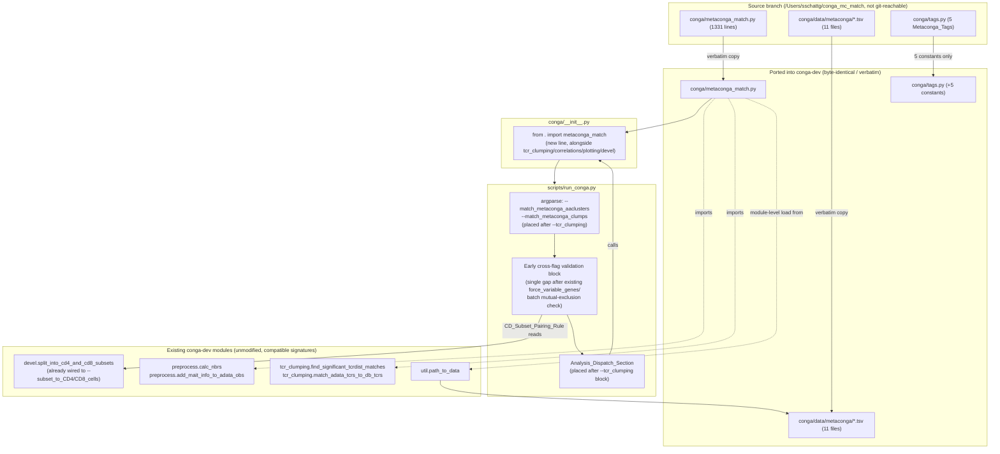
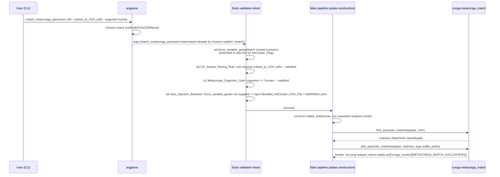

# Design Document

## Overview

This feature ports `conga/metaconga_match.py` (1331 lines), its 11 bundled reference data files, and its 5 result/figure tags from an external branch (`/Users/sschattg/conga_mc_match`, not reachable via `git` from this repository) into `conga-dev`, and wires two new standalone, opt-in CLI flags into `scripts/run_conga.py`: `--match_metaconga_aaclusters` (CDR3aa-bias-cluster matching, the AACluster_Pipeline) and `--match_metaconga_clumps` (TCR clump matching against a curated literature database, the Clump_Pipeline).

This is a port, not a reimplementation. Every non-CLI dependency the module calls — `preprocess.calc_nbrs`, `preprocess.add_mait_info_to_adata_obs`, `tcr_clumping.find_significant_tcrdist_matches`, `util.path_to_data` — already exists in `conga-dev` with a signature confirmed compatible by direct inspection this session. `conga/metaconga_match.py` itself requires no internal edits beyond its own file arriving on disk; the design work here is entirely about data placement, tag placement, the module registration decision, and CLI wiring in `scripts/run_conga.py`.

Two behaviors are deliberately tightened relative to the Source_Branch's own `run_conga.py`:

1. The Source_Branch only prints a 50-times-repeated `WARNING!!!` banner when `--match_metaconga_aaclusters` is used without the matching `--subset_to_CD4_cells`/`--subset_to_CD8_cells` flag, but does not block execution. This feature replaces that with a hard, fail-fast `sys.exit` (the CD_Subset_Pairing_Rule).
2. The Source_Branch's existing, unrelated `--match_to_tcr_database` organism gate is a silent conditional skip evaluated against `adata.uns['organism']` deep in the execution flow, after `adata` is already constructed (confirmed at `scripts/run_conga.py` lines 1166-1168: `if (args.match_to_tcr_database and (args.tcr_database_tsvfile or adata.uns['organism'] == 'human')):`). This feature's two new flags instead use an explicit, fail-fast `sys.exit` in the early argument-validation block, checking `args.organism` directly, before `adata` exists. This is a confirmed, deliberate divergence from the `--match_to_tcr_database` precedent — not an inconsistency to reconcile toward matching it.

While tracing the integration points this session, one placement decision surfaced that the requirements document's wording could be read either way on: whether `conga/__init__.py` should gain a plain `from . import metaconga_match` line. Section "Resolved Decisions" below documents why the answer is yes, consistent with every other analysis submodule already imported there.

## Architecture



### Sequence: one `run_conga.py` invocation with `--match_metaconga_aaclusters cd4 --subset_to_CD4_cells`



## Components and Interfaces

### Component 1: Port `conga/metaconga_match.py` verbatim

The file is copied from `/Users/sschattg/conga_mc_match/conga/metaconga_match.py` to `conga/metaconga_match.py` with no behavioral edits. Its top-of-module imports are already written in the relative-import style `conga-dev` uses elsewhere:

```python
from .tags import *
from . import preprocess
from . import tcr_scoring
from . import util
from . import correlations
from . import plotting
from . import tcr_clumping
```

No change to this import block is needed: `conga-dev` has a `conga/preprocess.py`, `conga/tcr_scoring.py`, `conga/util.py`, `conga/correlations.py`, `conga/plotting.py`, and `conga/tcr_clumping.py`, each exposing the exact functions this module calls into.

**Confirmed-compatible call sites (no edits required):**

- `preprocess.calc_nbrs(adata, [nbr_frac], obsm_tag_gex='X_pca_gex', obsm_tag_tcr=None)` inside `find_aacluster_matches` — matches `conga-dev`'s current signature exactly:
  ```python
  def calc_nbrs(
          adata, nbr_fracs,
          obsm_tag_gex = 'X_pca_gex', obsm_tag_tcr = 'X_pca_tcr',
          also_calc_nndists = False, nbr_frac_for_nndists = None,
          target_N_for_batching = 8192, use_exact_tcrdist_nbrs = False,
          tmpfile_prefix = None, sort_nbrs = False,
          backend_selection = 'auto', disable_faiss_acceleration = False,
          faiss_adaptive_parameters = True, store_backend_config = True):
  ```
  `obsm_tag_tcr=None` is explicitly supported ("set to None to skip calc"), which is exactly what the AACluster_Pipeline needs since it only builds a GEX neighbor graph for this step.
- `add_mait_info_to_adata_obs(adata)` (imported locally inside `find_aacluster_matches`, not at module top) — matches `preprocess.add_mait_info_to_adata_obs(adata, key_added='is_invariant')`'s default signature.
- `tcr_clumping.find_significant_tcrdist_matches(...)` inside `find_clump_matches`, and `tcr_clumping.match_adata_tcrs_to_db_tcrs` — both already present in `conga-dev`'s `conga/tcr_clumping.py` with compatible signatures, ported in an earlier, separate spec.

At module level, `metaconga_match.py` loads `aacluster_info`, builds `all_aacluster_tags`, `aacluster_groups`, and `aacluster2group` dicts, and loads `rep_clumps_info`/`old_mcc_leiden_to_new_mcc_leiden`, all sourced from `path_to_mc_data = util.path_to_data / 'metaconga'` (a module-level path constant). This means **import-time success of `conga.metaconga_match` depends on Component 2's data files already being on disk** — Requirement 1.4's "given that the Metaconga_Data_Files are present" condition is literally this module-level loading code, not a hypothetical.

### Component 2: Bundle the 11 Metaconga_Data_Files

`conga/data/metaconga/` is created and populated with byte-identical copies of all 11 files from `/Users/sschattg/conga_mc_match/conga/data/metaconga/`:

```
big_combo_tcrs_2024-02-02a_gp4_MCC10_NG200_groups_info_MCC10_extras.tsv
big_combo_tcrs_2024-02-02a_gp4_MCC10_NG200_groups_info_MCC10_extras_new_matches.tsv
big_combo_tcrs_2024-02-02a_gp4_ten_tcrs.tsv
cdr3aa_bias_cluster_names.tsv
good_clumps_v1.tsv
hsgenes_1000_plus_cdr3aa_bias_top30_degs.tsv
hsgenes_200_plus_cdr3aa_bias_top30_degs.tsv
round8_v5cd4_run84_xribo_200_process_v1_leiden2_cdr3aa_sig_1e-06_cluster_feature_enrichments.tsv
round8_v5cd8_run84_xribo_200_process_v1_leiden2_cdr3aa_sig_1e-06_cluster_feature_enrichments.tsv
run105_cd4_deg_results.tsv
run106_cd8_deg_results.tsv
```

No renaming, reformatting, or content modification. `hsgenes_1000_plus_cdr3aa_bias_top30_degs.tsv` is singled out among these 11 as the Bundled_AACluster_HVG_File — it is the one file this feature's CLI layer (Component 4) also reads directly, independent of the Metaconga_Module's own loading.

### Component 3: Port the 5 Metaconga_Tags into `conga/tags.py`

Current `conga/tags.py` table-tag section (verified in full this session):

```python
# table tags:
GRAPH_VS_GRAPH_STATS = 'graph_vs_graph_stats'
GRAPH_VS_GRAPH = 'graph_vs_graph'
TCR_DB_MATCH = 'tcr_db_match'
TCR_CLUMPING = 'tcr_clumping'

TCR_GRAPH_VS_GEX_FEATURES = 'tcr_graph_vs_gex_features'
```

becomes (insertion immediately after `TCR_CLUMPING`, before the blank line):

```python
# table tags:
GRAPH_VS_GRAPH_STATS = 'graph_vs_graph_stats'
GRAPH_VS_GRAPH = 'graph_vs_graph'
TCR_DB_MATCH = 'tcr_db_match'
TCR_CLUMPING = 'tcr_clumping'
METACONGA_MATCH_CLUMPS = 'metaconga_match_clumps'
METACONGA_MATCH_AACLUSTERS = 'metaconga_match_aaclusters'

TCR_GRAPH_VS_GEX_FEATURES = 'tcr_graph_vs_gex_features'
```

Current figure-tag section's clumping-adjacent entry:

```python
TCR_CLUMPING_LOGOS = 'tcr_clumping_logos'
GRAPH_VS_SUMMARY = 'graph_vs_summary'
```

becomes:

```python
TCR_CLUMPING_LOGOS = 'tcr_clumping_logos'
METACONGA_MATCH_AACLUSTERS_BARS = 'metaconga_match_aaclusters_bars'
METACONGA_MATCH_AACLUSTERS_UMAPS = 'metaconga_match_aaclusters_umaps'
METACONGA_MATCH_CLUMPS_UMAPS = 'metaconga_match_clumps_umaps'
GRAPH_VS_SUMMARY = 'graph_vs_summary'
```

`METACONGA_MATCH_AACLUSTERS` (the bare table tag) is confirmed not referenced anywhere in `metaconga_match.py`'s own logic — it is vestigial in the Source_Branch itself — but Requirement 3.1 ports all 5 tags regardless of whether the module uses each one, so it is included unconditionally. No other Source_Branch tag is touched, per Requirement 3.3.

### Component 4: Register the module in `conga/__init__.py`

Current `conga/__init__.py` (full file, verified this session):

```python
from . import preprocess
from . import correlations
from . import plotting
from . import util
from . import tcr_scoring
from . import pmhc_scoring
from . import imhc_scoring
from . import cd8_scoring
from . import tcrdist
from . import tcr_clumping
from . import devel # where development / possibly legacy / unused code goes
from . import tags
from . import compatibility
from . import neighbors  # FAISS-accelerated neighbor search
from . import benchmark  # Performance benchmarking infrastructure

# Version
__version__ = "0.2.0"

# Expose key compatibility functions at package level
from .compatibility import (
    check_environment_compatibility,
    safe_obs_columns,
    safe_var_columns, 
    safe_uns_keys,
    safe_obsm_keys,
    safe_is_view
)
```

becomes (one line added, grouped with the other analysis-submodule imports, immediately after `tcr_clumping` since the two modules are closely related — both port Source_Branch TCR-matching capability):

```python
from . import preprocess
from . import correlations
from . import plotting
from . import util
from . import tcr_scoring
from . import pmhc_scoring
from . import imhc_scoring
from . import cd8_scoring
from . import tcrdist
from . import tcr_clumping
from . import metaconga_match
from . import devel # where development / possibly legacy / unused code goes
from . import tags
from . import compatibility
from . import neighbors  # FAISS-accelerated neighbor search
from . import benchmark  # Performance benchmarking infrastructure
```

See "Resolved Decisions" below for why this satisfies Requirement 1.5 despite the requirement's "SHALL NOT add to any automatic import bundle" wording.

### Component 5: CLI argument declarations

Current `scripts/run_conga.py`, lines 89-99 (verified this session):

```python
parser.add_argument('--match_to_tcr_database', action='store_true',
                    help='Find significant matches to paired tcrs in the'
                    ' database specified by --tcr_database_tsvfile (default'
                    ' is the dataset in'
                    ' conga/data/new_paired_tcr_db_for_matching_nr.tsv')
parser.add_argument('--tcr_database_tsvfile',
                    help='Must have columns va cdr3a vb cdr3b, minimally;'
                    ' with imgt-recognized allele names; default is'
                    ' conga/data/new_paired_tcr_db_for_matching_nr.tsv')
parser.add_argument('--tcr_clumping', action='store_true')
parser.add_argument('--find_hotspot_features', action='store_true')
```

becomes (new flags inserted between `--tcr_clumping` and `--find_hotspot_features`, since both new flags are conceptually "matching" analysis modes akin to `--match_to_tcr_database` and `--tcr_clumping` immediately above them):

```python
parser.add_argument('--match_to_tcr_database', action='store_true',
                    help='Find significant matches to paired tcrs in the'
                    ' database specified by --tcr_database_tsvfile (default'
                    ' is the dataset in'
                    ' conga/data/new_paired_tcr_db_for_matching_nr.tsv')
parser.add_argument('--tcr_database_tsvfile',
                    help='Must have columns va cdr3a vb cdr3b, minimally;'
                    ' with imgt-recognized allele names; default is'
                    ' conga/data/new_paired_tcr_db_for_matching_nr.tsv')
parser.add_argument('--tcr_clumping', action='store_true')
parser.add_argument('--match_metaconga_aaclusters',
                    choices=['cd4', 'cd8', 'CD4', 'CD8', None], default=None,
                    help='Match clonotypes against pretrained CDR3aa-bias-'
                    ' cluster signatures (human only); must be paired with'
                    ' the matching --subset_to_CD4_cells/--subset_to_CD8_cells'
                    ' flag')
parser.add_argument('--match_metaconga_clumps', action='store_true',
                    help='Match TCRs against the curated metaconga TCR'
                    ' clump database (human only)')
parser.add_argument('--find_hotspot_features', action='store_true')
```

Neither flag is added to the `all_modes` list (lines 446-455), consistent with Requirement 4.5 and the Source_Branch's own precedent.

### Component 6: Early cross-flag validation block

This is the single highest-risk integration point: four checks must run in one gap, in a specific order, because each one can short-circuit the next. Current `scripts/run_conga.py`, lines 356-361 (verified this session):

```python
if args.force_variable_genes and (args.batch_key or args.batch_integration_method):
    sys.exit('ERROR: --force_variable_genes (Fixed_HVG_Pathway) and'
              ' --batch_key/--batch_integration_method (Full_Integration_Pathway)'
              ' are mutually exclusive')

# Flag conflict detection
encoding_flags_set = [
```

becomes (the existing check at lines 356-359 is extended in place; the three new checks are inserted into the gap at line 360, before the `# Flag conflict detection` comment):

```python
if args.force_variable_genes and (args.batch_key or args.batch_integration_method):
    sys.exit('ERROR: --force_variable_genes (Fixed_HVG_Pathway) and'
              ' --batch_key/--batch_integration_method (Full_Integration_Pathway)'
              ' are mutually exclusive')

# Metaconga validation (Requirements 5, 6, 7). Order matters: the
# mutual-exclusion extension (a) must run before Auto_Injection_Behavior
# (d) ever has a chance to inject --force_variable_genes, so a user who
# would otherwise rely on auto-injection AND who also requested batch
# integration gets one clear mutual-exclusion error instead of a
# confusing silent auto-injection followed by a later, unrelated error.
if args.match_metaconga_aaclusters is not None:
    args.match_metaconga_aaclusters = args.match_metaconga_aaclusters.lower()

# (a) Fixed_HVG_Pathway / Full_Integration_Pathway mutual exclusion,
# extended to also fire when --match_metaconga_aaclusters is set, since
# that flag implies the Fixed_HVG_Pathway via Auto_Injection_Behavior
# even when the user never typed --force_variable_genes themselves.
if args.match_metaconga_aaclusters is not None and \
   (args.batch_key or args.batch_integration_method):
    sys.exit('ERROR: --match_metaconga_aaclusters (Fixed_HVG_Pathway, via'
              ' auto-injected --force_variable_genes) and'
              ' --batch_key/--batch_integration_method (Full_Integration_Pathway)'
              ' are mutually exclusive;'
              f' got --match_metaconga_aaclusters={args.match_metaconga_aaclusters!r}'
              f' --batch_key={args.batch_key!r}'
              f' --batch_integration_method={args.batch_integration_method!r}')

# (b) CD_Subset_Pairing_Rule (Requirement 6): hard-fail instead of
# Source_Branch's non-blocking warning banner.
if args.match_metaconga_aaclusters == 'cd4' and not args.subset_to_CD4_cells:
    sys.exit('ERROR: --match_metaconga_aaclusters cd4 requires'
              ' --subset_to_CD4_cells; got'
              f' --match_metaconga_aaclusters={args.match_metaconga_aaclusters!r}'
              f' --subset_to_CD4_cells={args.subset_to_CD4_cells!r}')

if args.match_metaconga_aaclusters == 'cd8' and not args.subset_to_CD8_cells:
    sys.exit('ERROR: --match_metaconga_aaclusters cd8 requires'
              ' --subset_to_CD8_cells; got'
              f' --match_metaconga_aaclusters={args.match_metaconga_aaclusters!r}'
              f' --subset_to_CD8_cells={args.subset_to_CD8_cells!r}')

# (c) Metaconga_Organism_Gate (Requirement 7): fail-fast against
# args.organism directly, before adata is constructed -- deliberately
# not following the --match_to_tcr_database precedent of a silent
# conditional skip evaluated later against adata.uns['organism'].
if args.match_metaconga_aaclusters is not None and args.organism != 'human':
    sys.exit('ERROR: --match_metaconga_aaclusters requires --organism human;'
              f' got --match_metaconga_aaclusters={args.match_metaconga_aaclusters!r}'
              f' --organism={args.organism!r}')

if args.match_metaconga_clumps and args.organism != 'human':
    sys.exit('ERROR: --match_metaconga_clumps requires --organism human;'
              f' got --match_metaconga_clumps={args.match_metaconga_clumps!r}'
              f' --organism={args.organism!r}')

# (d) Auto_Injection_Behavior (Requirement 5): only reached once (a)-(c)
# have confirmed no conflicting flags, organism, or subset-pairing issues
# exist, so this can never silently proceed into a state one of the
# checks above would otherwise have blocked.
if args.match_metaconga_aaclusters is not None and not args.force_variable_genes:
    variable_genes_file = (
        util.path_to_data / 'metaconga' / 'hsgenes_1000_plus_cdr3aa_bias_top30_degs.tsv')
    args.force_variable_genes = str(variable_genes_file)
    print('WARNING: --match_metaconga_aaclusters',
          'adding --force_variable_genes', variable_genes_file)

# Flag conflict detection
encoding_flags_set = [
```

Checks (b) and (c) are independent of each other (both read `args.match_metaconga_aaclusters`/`args.match_metaconga_clumps` and either `args.subset_to_CD4_cells`/`args.subset_to_CD8_cells` or `args.organism`), so their relative order between themselves does not matter; what matters is that both run strictly before (d), and that (a) runs before (d) for the reason stated in the inline comment above.

### Component 7: Analysis dispatch

Current `scripts/run_conga.py`, lines 1190-1221 (verified this session; blank lines 1218-1220 separate the `--tcr_clumping` block from the next block, `--graph_vs_graph_stats` at line 1221):

```python
if args.tcr_clumping: #########################################################
    ...
    conga.plotting.make_tcr_clumping_plots(
        adata,
        nbrs_gex,
        nbrs_tcr,
        args.outfile_prefix,
        min_cluster_size_for_logos=args.min_cluster_size_for_tcr_clumping_logos,
        pvalue_threshold_for_logos=args.pvalue_threshold_for_tcr_clumping,
        )


if args.graph_vs_graph_stats: #################################################
```

becomes (two new blocks inserted into the existing blank-line gap, after the `--tcr_clumping` block and before `--graph_vs_graph_stats`):

```python
if args.tcr_clumping: #########################################################
    ...
    conga.plotting.make_tcr_clumping_plots(
        adata,
        nbrs_gex,
        nbrs_tcr,
        args.outfile_prefix,
        min_cluster_size_for_logos=args.min_cluster_size_for_tcr_clumping_logos,
        pvalue_threshold_for_logos=args.pvalue_threshold_for_tcr_clumping,
        )


if args.match_metaconga_aaclusters is not None: ###############################
    # cd48 is guaranteed to be 'cd4' or 'cd8' here: lowercased by argparse
    # choices + the explicit .lower() call in the early validation block,
    # and paired with the matching --subset_to_CD4_cells/--subset_to_CD8_cells
    # flag by the CD_Subset_Pairing_Rule check in that same block.
    cd48 = args.match_metaconga_aaclusters
    matches = conga.metaconga_match.find_aacluster_matches(adata, cd48)
    conga.metaconga_match.plot_aacluster_matches(
        adata, matches, args.outfile_prefix)


if args.match_metaconga_clumps: ################################################
    conga.metaconga_match.find_clump_matches(adata)
    conga.metaconga_match.plot_clump_matches(adata, args.outfile_prefix)


if args.graph_vs_graph_stats: #################################################
```

Both blocks can run in the same invocation independently of each other and of every other mode, satisfying Requirement 8.4; neither reads or sets any flag the other depends on.

## Data Models

This feature introduces no new AnnData schema beyond what the Metaconga_Module itself reads and writes; the fields below are either read from the already-constructed `adata` by the time Component 7's dispatch blocks run, or written into `adata.uns['conga_results']` under the 5 new tags from Component 3.

**Fields read by the AACluster_Pipeline (`find_aacluster_matches`):**
- `adata.uns['organism']` — not read directly by `find_aacluster_matches` itself (the Metaconga_Organism_Gate enforces this at the CLI layer before `adata` exists), but implicitly assumed to be `'human'` since every bundled reference signature file is human-derived.
- `adata.obsm['X_pca_gex']` — the GEX PCA representation `calc_nbrs(adata, [nbr_frac], obsm_tag_gex='X_pca_gex', obsm_tag_tcr=None)` reads to build the GEX-only neighbor graph this pipeline needs.
- `adata.obs` columns for CDR3/V/J gene identity used by `_encode_tcr_seqs` (see below) and by `tcr_scoring`.
- `adata.obs['is_invariant']` — written by the locally-imported `add_mait_info_to_adata_obs(adata)` call inside `find_aacluster_matches` itself if not already present; not an external precondition.
- `adata.obs['clusters_gex']` — the GEX cluster assignment column, used by the DEG-scoring helpers (`get_cdr3aa_bias_deg_scores`, `_find_degs_for_subset`) to characterize matched clusters against the bundled `run105_cd4_deg_results.tsv`/`run106_cd8_deg_results.tsv` reference DEG tables.

**Fields read by the Clump_Pipeline (`find_clump_matches`):**
- Paired TCR identity columns (`va`/`ja`/`cdr3a`/`vb`/`jb`/`cdr3b`-style, matching whatever column-naming convention `tcr_clumping.find_significant_tcrdist_matches` expects, since this pipeline delegates its exact-TCRdist search to that existing function unchanged).
- `adata.uns['organism']` — implicitly `'human'`, same reasoning as above.

**Fields written (both pipelines), under Component 3's new tags, into `adata.uns['conga_results']`:**
- `adata.uns['conga_results'][METACONGA_MATCH_AACLUSTERS]` and `adata.uns['conga_results'][METACONGA_MATCH_CLUMPS]` — the two table-tag results.
- Companion `..._help` keys (per `conga/tags.py`'s existing `HELP_SUFFIX` convention) for each.
- Figure outputs recorded under `METACONGA_MATCH_AACLUSTERS_BARS`, `METACONGA_MATCH_AACLUSTERS_UMAPS`, and `METACONGA_MATCH_CLUMPS_UMAPS`, written by `plot_aacluster_matches`/`plot_clump_matches` respectively. `plot_aacluster_matches`'s UMAP figure additionally depends on `adata.obsm['X_gex_2d']` (the existing GEX UMAP embedding) being present, consistent with every other UMAP-plotting function elsewhere in `conga/plotting.py`.

**The `Matchinfo` namedtuple** — `find_aacluster_matches`'s return value, consumed by `plot_aacluster_matches`'s second positional argument. Based on direct inspection of the Source_Branch module, it carries three fields:
- `pvals` — per-clonotype or per-cluster hypergeometric-test p-values from the GEX/TCR overlap-significance scoring (`get_cdr3aa_bias_tcr_scores`).
- `degs` — the DEG characterization output from `get_cdr3aa_bias_deg_scores`/`_find_degs_for_subset`, keyed by matched cluster.
- `obs` — a per-cell or per-clonotype table (shape aligned to `adata.obs`/`adata.obs_names`) recording which, if any, aacluster each clonotype was matched to, after `reduce_to_single_aacluster_match_per_clonotype` collapses any multi-match ambiguity down to one match per clonotype.

This feature does not change the shape of `Matchinfo` — it is an existing type the ported module defines and this design consumes, not one introduced by this feature.

## Error Handling

| Site | Trigger | Mechanism | Message content |
|---|---|---|---|
| Early validation block, check (a) | `--match_metaconga_aaclusters` set together with `--batch_key` or `--batch_integration_method` | `sys.exit` | Names `--match_metaconga_aaclusters`, both batch flags' values via `!r`, and both Pathway names |
| Early validation block, check (b) | `--match_metaconga_aaclusters cd4` without `--subset_to_CD4_cells`, or `cd8` without `--subset_to_CD8_cells` | `sys.exit` | Names both the AACluster_Flag value and the missing subset flag, via `!r` |
| Early validation block, check (c) | `--match_metaconga_aaclusters` or `--match_metaconga_clumps` set together with `--organism` other than `'human'` | `sys.exit` | Names the triggering flag and the `--organism` value, via `!r` |
| `argparse` itself | `--match_metaconga_aaclusters` given a value outside `['cd4','cd8','CD4','CD8',None]` | `argparse`'s standard `choices` rejection (`SystemExit` with usage message) | Standard argparse-generated message; not a custom `sys.exit` call |
| `import conga.metaconga_match` | Any of the 11 Metaconga_Data_Files missing from `conga/data/metaconga/` | Whatever exception the module's own module-level file-loading code raises (e.g. `FileNotFoundError` from `pd.read_csv`) | Not a new error path this feature introduces deliberately — a consequence of Component 2 not having been completed correctly; Requirement 9.2's file-presence test exists specifically to catch this before it manifests as an import-time crash |

**Not a new error path.** The pre-existing `--match_to_tcr_database` organism conditional (`if (args.match_to_tcr_database and (args.tcr_database_tsvfile or adata.uns['organism'] == 'human')):`) is explicitly untouched by this feature (Requirement 7.5). It is listed here only to contrast it with check (c) above: this feature's two new organism gates are fail-fast exceptions raised before `adata` exists, not silent conditional skips evaluated after.

**Ordering guarantee.** Checks (a)-(c) are pure validation — they read `args` only and never mutate it — so their relative failure does not depend on execution order among themselves. Only (d) (Auto_Injection_Behavior) mutates `args.force_variable_genes`, and it is placed last specifically so that it never runs when any of (a)-(c) would exit first; this guarantees a user who hits the mutual-exclusion error in (a) never sees a confusing `WARNING: ... adding --force_variable_genes ...` print immediately before the error, since (a) exits before (d) is ever reached.

## Testing Strategy

All tests run via `mamba run -n conga-dev pytest tests/ -v`, per this project's development workflow. Per Requirement 9 and the explicit user direction in the requirements document, this feature's test coverage is integration-level, not deep statistical-correctness coverage of the ported module's internals.

**Import and data presence.**
- A test that `import conga.metaconga_match` succeeds without raising, confirming Component 1's port and Component 4's registration both work together (Requirement 9.1).
- A test that iterates the 11 filenames from Component 2 and asserts each exists under `conga/data/metaconga/` (Requirement 9.2).

**CLI argument parsing.**
- A test constructing `scripts/run_conga.py`'s `argparse.ArgumentParser` (or invoking its `parse_args` with the minimal required-argument stub already used by this project's existing CLI tests) with `--match_metaconga_aaclusters` set to each of `'cd4'`, `'cd8'`, `'CD4'`, `'CD8'`, and omitted (`None`), asserting no `SystemExit` from `choices` rejection for any of these five; a companion test supplying an invalid value (e.g. `'cd48'`) and asserting `SystemExit` is raised (Requirement 9.3).

**Validation `sys.exit` paths.**
- A test invoking the CLI (or the extracted validation logic, if isolable from full script execution) with `--match_metaconga_aaclusters cd4 --organism mouse` and separately `--match_metaconga_clumps --organism mouse`, asserting `sys.exit`/`SystemExit` fires in both cases (Metaconga_Organism_Gate, Requirement 9.4).
- A test with `--match_metaconga_aaclusters cd4` and no `--subset_to_CD4_cells`, and separately `--match_metaconga_aaclusters cd8` and no `--subset_to_CD8_cells`, asserting `sys.exit` fires in both (CD_Subset_Pairing_Rule, Requirement 9.5).
- A test with `--match_metaconga_aaclusters cd4 --subset_to_CD4_cells --batch_key some_col --batch_integration_method harmony`, asserting `sys.exit` fires (mutual-exclusion extension, Requirement 9.6).

**Auto-injection behavior.**
- A test with `--match_metaconga_aaclusters cd4 --subset_to_CD4_cells` and no `--force_variable_genes`, asserting `args.force_variable_genes` ends up equal to `str(util.path_to_data / 'metaconga' / 'hsgenes_1000_plus_cdr3aa_bias_top30_degs.tsv')` after the early validation block runs; a companion test supplying `--force_variable_genes /some/other/path.tsv` explicitly and asserting that value survives unmodified (Requirement 9.7).

**End-to-end pipeline invocation.** Both tests build a Representative_Human_Fixture — a minimal synthetic `AnnData` with `adata.uns['organism'] = 'human'`, `adata.obsm['X_pca_gex']` (and `adata.obsm['X_gex_2d']` for the plotting call), `adata.obs['clusters_gex']`, `adata.obs['clone_sizes']`, and paired TCR identity columns (`va`/`ja`/`cdr3a`/`vb`/`jb`/`cdr3b`) with enough rows and distinct clonotypes for `calc_nbrs` and the exact-TCRdist search to run without a degenerate (e.g. zero-neighbor) edge case.
- `conga.metaconga_match.find_aacluster_matches(adata, 'cd4')` followed by `conga.metaconga_match.plot_aacluster_matches(adata, matches, outfile_prefix)` against this fixture, asserting both complete without raising (Requirement 9.8). Not required to assert on `Matchinfo` statistical content.
- `conga.metaconga_match.find_clump_matches(adata)` followed by `conga.metaconga_match.plot_clump_matches(adata, outfile_prefix)` against this fixture, asserting both complete without raising (Requirement 9.9). Not required to assert on clump-match statistical content.

**Explicitly deferred (Requirement 9.10).** No test in this feature validates the correctness of the hypergeometric tests, DEG scoring, or TCRdist background-sampling statistics internal to the Metaconga_Module.

## Correctness Properties

*A property is a characteristic or behavior that should hold true across all valid executions of a system — essentially, a formal statement about what the system should do.*

### Property 1: Organism gate blocks adata construction

For all invocations where `--match_metaconga_aaclusters` is set (not `None`) or `--match_metaconga_clumps` is set, if `args.organism != 'human'`, the process exits via `sys.exit` before `adata` is constructed. No partial pipeline execution (preprocessing, neighbor-graph construction, or any analysis mode) occurs for a non-human organism when either flag is set.

**Validates: Requirements 7.1, 7.2, 7.3, 7.4**

### Property 2: CD-subset pairing is enforced, not merely warned

For all invocations where `args.match_metaconga_aaclusters == 'cd4'`, `args.subset_to_CD4_cells` is `True`; symmetrically for `'cd8'` and `args.subset_to_CD8_cells`. No invocation reaches `adata` construction with a mismatched or missing subset flag while the AACluster_Flag is set, and no code path in this feature prints a warning and continues in place of raising.

**Validates: Requirements 6.1, 6.2, 6.3, 6.4, 6.5**

### Property 3: Auto-injection never fires after a disqualifying condition

For all invocations where `args.match_metaconga_aaclusters is not None`, if the process reaches the Auto_Injection_Behavior check, then neither the mutual-exclusion condition (batch flags set) nor the CD_Subset_Pairing_Rule violation nor the Metaconga_Organism_Gate violation holds. Equivalently: `args.force_variable_genes` is never set by Auto_Injection_Behavior in the same process execution that also raises one of checks (a)-(c)'s `sys.exit`.

**Validates: Requirements 5.4, 5.5, 5.6**

### Property 4: User-supplied force_variable_genes is never overwritten

For all invocations where `args.match_metaconga_aaclusters is not None` and the user supplied `--force_variable_genes` with a non-empty value, `args.force_variable_genes` after the early validation block equals exactly the user-supplied value, and no `WARNING: --match_metaconga_aaclusters ... adding --force_variable_genes ...` message is printed.

**Validates: Requirement 5.3**

### Property 5: Dispatch is independent per flag

For all invocations where both `args.match_metaconga_aaclusters is not None` and `args.match_metaconga_clumps` is `True` and all validation passes, both `find_aacluster_matches`/`plot_aacluster_matches` and `find_clump_matches`/`plot_clump_matches` are invoked exactly once each against the same constructed `adata`, and the outcome of either pipeline does not depend on whether the other flag is also set.

**Validates: Requirement 8.4**

## Resolved Decisions

1. **`conga/__init__.py` gains `from . import metaconga_match`, consistent with every other analysis submodule already imported there (`tcr_clumping`, `correlations`, `plotting`, `devel`).** Requirement 1.5's wording — "SHALL NOT add `conga.metaconga_match` to any automatic import bundle... beyond what is needed for `scripts/run_conga.py` to call it directly" — is satisfied by this plain import precisely because it *is* what's needed for `scripts/run_conga.py` to call it directly. `run_conga.py` only ever does a bare `import conga` at its own top and then calls `conga.tcr_clumping.foo()`, `conga.plotting.make_tcr_clumping_plots()`, etc. — confirmed this session, there is no lazy-import, `__getattr__`, or dynamic-discovery mechanism anywhere in this codebase that would let `conga.metaconga_match.find_aacluster_matches(...)` resolve without `conga/__init__.py` first importing the submodule. Withholding the import would make Component 7's dispatch blocks raise `AttributeError` at the first invocation of either new flag, which cannot be what Requirement 1.5 intends given Requirement 8 unconditionally requires that dispatch to work. The "not an automatic import bundle" concern is satisfied at the correct layer instead: the module is opt-in at the *CLI-flag* level (Component 5-7's `sys.exit`-gated, flag-conditional dispatch), not opt-in at the *Python-import* level — nothing runs, loads data, or has any side effect merely because `conga/__init__.py` imported the module, since Python module import does not itself invoke `find_aacluster_matches` or `find_clump_matches`. (The module's own top-level data-loading code *does* run at import time, as noted in Component 1 — but that is true regardless of whether `__init__.py` imports it or `run_conga.py` imports it directly; the cost exists either way, and centralizing it in `__init__.py` is the only option consistent with how every other submodule in this file is already treated.)

2. **All new validation logic lives in one contiguous insertion at the existing line-360 gap in `scripts/run_conga.py`, in a fixed four-part order: (a) mutual-exclusion extension, (b) CD_Subset_Pairing_Rule, (c) Metaconga_Organism_Gate, (d) Auto_Injection_Behavior.** This order is not arbitrary: (d) is the only check that mutates `args`, so it must run last, after every check capable of disqualifying the auto-injection has had a chance to exit first (Property 3). (a) is placed before (b) and (c) specifically so that a user who supplied conflicting batch flags gets the mutual-exclusion message rather than, e.g., a CD-subset-pairing message that doesn't address their actual mistake — though in practice (b) and (c) could run before (a) without changing final behavior, since all three are terminal `sys.exit` calls and only one can fire per invocation; the chosen order simply matches the order the requirements document introduces the checks in (Requirements 5, 6, 7).

3. **Dispatch blocks are inserted into the existing blank-line gap between the `--tcr_clumping` block and the `--graph_vs_graph_stats` block**, matching the Source_Branch's own ordering (`match_metaconga_aaclusters` dispatch immediately followed by `match_metaconga_clumps` dispatch) and this codebase's existing convention of placing related "matching" analysis-mode blocks adjacent to each other in the dispatch section.

4. **Argparse placement for both new flags is immediately after `--tcr_clumping`, before `--find_hotspot_features`.** `--match_to_tcr_database`, `--tcr_clumping`, and the two new flags together form a visually and conceptually grouped cluster of "find matches against something" flags in the parser's main-modes section; `--find_hotspot_features` is a different kind of analysis (unsupervised hotspot detection, no matching/reference-database semantics) and is left as the boundary immediately after the new flags.

5. **`_encode_tcr_seqs`'s per-row Python loop remains unvectorized in this feature; vectorizing it is captured only as an optional task.** The current structure is a `for ii, l in enumerate(tcr_df.itertuples()): ...` loop building per-row `v_aa`/`v_len`/`v_va`/`v_vb` lists. A vectorized rewrite is plausible — V/J gene identity could be converted to a dense one-hot lookup built once per unique gene (via `np.add.at` on integer-coded gene indices, or a precomputed `pd.get_dummies`-style matrix multiplied against a count vector) instead of a per-row dict lookup, and the amino-acid composition vectors (`v_aa`-style per-residue counts) could be built with `np.frombuffer`/`np.char`-based vectorized character counting across the whole `cdr3` column at once rather than one Python-level string scan per row. This is a real, low-risk opportunity: both transformations operate on already-fixed-shape columns (gene identity is categorical, CDR3 composition is a fixed 20-symbol alphabet count), with no cross-row dependency that would complicate vectorizing. It is deliberately not implemented as part of this feature's required scope (Requirement 10.1) — only noted as an optional follow-up task — since the Metaconga_Module is ported close to verbatim and this feature's primary deliverable is CLI integration, not performance tuning of ported statistical code.

6. **No change is made to the Clump_Pipeline's underlying exact-TCRdist matching algorithm.** `find_clump_matches` continues to call `tcr_clumping.find_significant_tcrdist_matches` exactly as the Source_Branch does, performing an exact (not approximate) TCRdist search against the fixed `good_clumps_v1.tsv`-derived database via the existing C++ backend. Replacing this with an approximate vectorized-TCRdist + FAISS nearest-neighbor search was discussed and is explicitly out of scope for this feature in any form, required or optional (Requirement 10.2, 10.3) — it changes the pipeline's accuracy/speed tradeoff in a way that deserves its own design discussion and its own accuracy-validation harness (in the spirit of the `tcrdist-db-update` feature's `Validation_Harness` for the vectorized-TCRdist encoder), and is noted here as a candidate for a future, separate spec rather than folded into this one.
