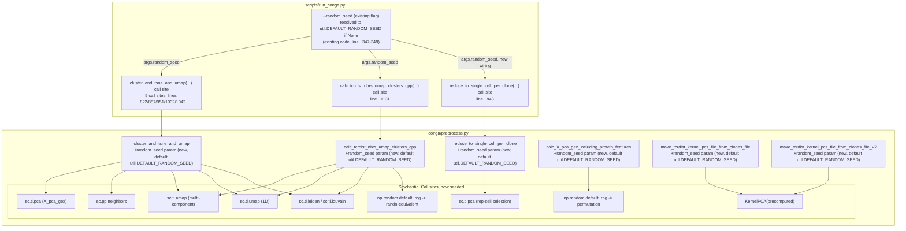

# Design Document

## Overview

This feature threads the already-exposed `--random_seed` CLI flag through
every stochastic call in `conga/preprocess.py` that currently either ignores
it or has no seed parameter at all, and adds an automated test that proves
two full `scripts/run_conga.py` invocations with the same seed produce an
identical `_final.h5ad`.

Tracing every call site named in the requirements directly against the
current `conga/preprocess.py` surfaced one fact that reframes what "fixing"
means here: **scanpy 1.12.4's `sc.tl.pca`, `sc.pp.neighbors`, `sc.tl.umap`,
`sc.tl.leiden`, and `sc.tl.louvain` all default `random_state=0`** (confirmed
by direct inspection of each function's signature in the installed
`conga-dev` environment). None of these calls are actually "unseeded" today
in the sense of drawing from an unseeded global generator -- they are all
silently pinned to `random_state=0`, regardless of what `--random_seed` the
user supplies. A manual probe run twice with `--random_seed 42` and
`--random_seed 999` over the same tiny fixture produced byte-identical
`obsm` arrays in both cases (see "Resolved Decisions" below) -- proving the
flag currently has zero effect on these calls, which is the real defect
Requirements 1-5 describe. The fix is not "add a seed where there was
randomness"; it is "stop ignoring the one the user already passed."

The two raw NumPy calls (`np.random.permutation` in
`calc_X_pca_gex_including_protein_features`'s diagnostic branch, and
`np.random.randn` in `calc_tcrdist_nbrs_umap_clusters_cpp`'s placeholder-PCA
step) are different in kind: these genuinely do draw from the unseeded
global NumPy generator today, so they are fixed by switching to a seeded
`numpy.random.default_rng(random_seed)` instance, per Requirement 2.5 and
Requirement 4.1.

A second fact, confirmed by reading the installed `umap-learn` 0.5.12 source
directly (`umap/umap_.py`), closes out the UMAP/numba-parallelism caveat
flagged for investigation in this feature's instructions: `UMAP.fit`
already forces `self.n_jobs = 1` whenever `random_state is not None`
(`umap_.py` line 1950-1953), and `scanpy.tl.umap` calls
`simplicial_set_embedding(..., parallel=False)` unconditionally regardless
of `random_state` (confirmed in the installed `scanpy/tools/_umap.py`; the
module's own docstring for `parallel` states "Running in parallel is
non-deterministic, and is not used[default]"). Once this feature threads a
real seed into every `sc.tl.umap` call, scanpy and umap-learn's own existing
behavior deterministically disables the problematic parallel code path --
no `n_jobs=1` wiring needs to be added by this feature; it already happens
one layer down, automatically, as a side effect of passing a non-`None`
`random_state`. This is stated here rather than discovered during task
execution, per this feature's own instructions.

Two more structural findings bound the diff:

1. **Two independent `KernelPCA(kernel='precomputed', ...)` call sites
   exist**, in `make_tcrdist_kernel_pcs_file_from_clones_file` (~line 2784)
   and `make_tcrdist_kernel_pcs_file_from_clones_file_V2` (~line 3437).
   Requirement 1.3's singular wording ("constructs a `KernelPCA` instance")
   covers the general case; both call sites are live, non-dead code --
   `_V2` is called from `make_10x_clone_file_batch`'s combo-pipeline
   TCR/BCR-pairing branches (lines ~3283, ~3387), not from the mainline
   `read_dataset` -> `cluster_and_tsne_and_umap` flow the Reproducibility_Test
   exercises -- so both are fixed, but only the first is covered by the new
   end-to-end test.
2. **`scripts/run_conga.py` is one of eight near-identical files in
   `scripts/`** (`run_conga.py`, `.debug`, `.original`, `.fix`,
   `_updated.py`, `_fixed.py`, `_with_backend.py`, `_with_validation.py`).
   Only `scripts/run_conga.py` is the active entry point referenced by
   `tests/test_run_conga_cli.py`, this project's steering docs, and
   `setup_dev_env.sh`; the other seven are stale backup copies with no
   import path or test coverage pointing at them. This design and its CLI
   wiring touch only `scripts/run_conga.py`. The other seven are out of
   scope -- fixing them would be scope creep onto files nothing executes.

## Architecture



### Sequence: one Reproducibility_Test invocation

```mermaid
sequenceDiagram
    participant T as test_pipeline_reproducibility.py
    participant S1 as run_conga.py (subprocess run 1)
    participant S2 as run_conga.py (subprocess run 2)
    participant F as fixture .h5ad (shared, read-only)

    T->>F: build once (session-scoped fixture)
    T->>S1: subprocess.run([..., --outfile_prefix out1, --random_seed 42])
    T->>S2: subprocess.run([..., --outfile_prefix out2, --random_seed 42])
    S1->>F: read
    S2->>F: read
    S1-->>T: returncode, stdout, stderr; writes out1_final.h5ad
    S2-->>T: returncode, stdout, stderr; writes out2_final.h5ad
    T->>T: assert both returncode == 0 (else fail with captured output)
    T->>T: ad.read_h5ad(out1_final.h5ad), ad.read_h5ad(out2_final.h5ad)
    T->>T: assert exact equality over Comparable_Output fields
```

## Components and Interfaces

### Component 1: `cluster_and_tsne_and_umap` -- signature and five internal call sites

**Current signature** (`conga/preprocess.py`, line 1166):

```python
def cluster_and_tsne_and_umap(
        adata,
        clustering_resolution= None,
        recompute_pca_gex=False, # force recomputing X_pca_gex even if present
        skip_tsne=True, # yes this is silly
        skip_tcr=False,
        clustering_method=None,
        n_neighbors=10, # used for umap and clustering
        n_gex_pcs=40, # only used if we have to compute them
        make_1d_umaps=True,
        umap_min_dist=0.5, # these are the scanpy defaults
        umap_spread=1.0,
):
```

**New signature** (Requirement 1.4; `random_seed` added as the last
parameter, keyword-usable, so every existing positional call -- confirmed
by trace, every call site below uses keyword arguments after `adata` -- is
unaffected):

```python
def cluster_and_tsne_and_umap(
        adata,
        clustering_resolution= None,
        recompute_pca_gex=False, # force recomputing X_pca_gex even if present
        skip_tsne=True, # yes this is silly
        skip_tcr=False,
        clustering_method=None,
        n_neighbors=10, # used for umap and clustering
        n_gex_pcs=40, # only used if we have to compute them
        make_1d_umaps=True,
        umap_min_dist=0.5, # these are the scanpy defaults
        umap_spread=1.0,
        random_seed=util.DEFAULT_RANDOM_SEED,
):
```

**Internal call sites, before -> after** (all within the function body,
`conga/preprocess.py` lines ~1203-1288):

```python
# before (line ~1201-1203)
n_gex_pcs = min(ncells-1, n_gex_pcs)
sc.tl.pca(adata, svd_solver='arpack', n_comps=n_gex_pcs)
adata.obsm['X_pca_gex'] = adata.obsm['X_pca']
```
```python
# after
n_gex_pcs = min(ncells-1, n_gex_pcs)
sc.tl.pca(adata, svd_solver='arpack', n_comps=n_gex_pcs,
          random_state=random_seed)
adata.obsm['X_pca_gex'] = adata.obsm['X_pca']
```

```python
# before (line ~1253)
sc.pp.neighbors(adata, n_neighbors=n_neighbors, n_pcs=n_pcs)
```
```python
# after
sc.pp.neighbors(adata, n_neighbors=n_neighbors, n_pcs=n_pcs,
                 random_state=random_seed)
```

```python
# before (line ~1257, multi-component embedding)
sc.tl.umap(adata, min_dist=umap_min_dist, spread=umap_spread)
```
```python
# after
sc.tl.umap(adata, min_dist=umap_min_dist, spread=umap_spread,
           random_state=random_seed)
```

```python
# before (line ~1262, 1D embedding)
sc.tl.umap(adata, n_components=1)
```
```python
# after
sc.tl.umap(adata, n_components=1, random_state=random_seed)
```

```python
# before (line ~1273, louvain branch)
sc.tl.louvain(adata, resolution=resolution, key_added=cluster_key_added)
```
```python
# after
sc.tl.louvain(adata, resolution=resolution, key_added=cluster_key_added,
              random_state=random_seed)
```

```python
# before (line ~1277, leiden branch -- also hit by the "try leiden,
# fallback louvain" branch's first call at line ~1282)
sc.tl.leiden(adata, resolution=resolution, key_added=cluster_key_added)
```
```python
# after
sc.tl.leiden(adata, resolution=resolution, key_added=cluster_key_added,
             random_state=random_seed)
```

**Pre-existing defect noted, not fixed by this feature.** The
`except ImportError` fallback inside the "try both, prefer modern leiden
first" branch (line ~1286) calls `sc.tl.leiden(...)` a second time instead
of `sc.tl.louvain(...)`, despite its own `print('ran louvain clustering:
...)` message immediately after claiming otherwise. This is a pre-existing
bug unrelated to seeding; both calls receive `random_state=random_seed` in
this feature's edit (keeping the before/after diff mechanical and
seed-focused), but the branch's dead-fallback-to-the-wrong-function bug
itself is out of scope and not corrected here, since fixing it is unrelated
to reproducibility and would be an undisclosed scope change to behavior.

### Component 2: `calc_tcrdist_nbrs_umap_clusters_cpp` -- signature and five internal call sites

**Current signature** (`conga/preprocess.py`, line 2985):

```python
def calc_tcrdist_nbrs_umap_clusters_cpp(
        adata,
        num_nbrs,
        tmpfile_prefix = None, # old name outfile_prefix, confusing
        umap_key_added = 'X_tcr_2d', # change to default loc
        cluster_key_added = 'clusters_tcr', # change to default loc
        clustering_resolution = None,
        clustering_method=None,
        n_components_umap = 2,
        make_1d_umaps = True,
        umap_1d_key_added = 'X_tcr_1d',
):
```

**New signature** (Requirement 2.6; `random_seed` appended last, same
keyword-safety reasoning as Component 1):

```python
def calc_tcrdist_nbrs_umap_clusters_cpp(
        adata,
        num_nbrs,
        tmpfile_prefix = None, # old name outfile_prefix, confusing
        umap_key_added = 'X_tcr_2d', # change to default loc
        cluster_key_added = 'clusters_tcr', # change to default loc
        clustering_resolution = None,
        clustering_method=None,
        n_components_umap = 2,
        make_1d_umaps = True,
        umap_1d_key_added = 'X_tcr_1d',
        random_seed=util.DEFAULT_RANDOM_SEED,
):
```

**Internal call sites, before -> after:**

```python
# before (line ~3113-3114, the placeholder-PCA fix -- Requirement 2.5)
print('temporarily putting random pca vectors into adata...')
fake_pca = np.random.randn(adata.shape[0], 10)
```
```python
# after
print('temporarily putting random pca vectors into adata...')
rng = np.random.default_rng(random_seed)
fake_pca = rng.standard_normal((adata.shape[0], 10))
```
`np.random.default_rng(seed).standard_normal(shape)` is the seeded
equivalent of unseeded `np.random.randn(*shape)` -- same distribution
(standard normal), seeded via the modern `Generator` API rather than the
legacy global-state `RandomState` API, consistent with this project's
numpy-2 modernization direction.

```python
# before (line ~3118, multi-component embedding)
sc.tl.umap(adata, n_components=n_components_umap)
```
```python
# after
sc.tl.umap(adata, n_components=n_components_umap, random_state=random_seed)
```

```python
# before (line ~3125, 1D embedding)
sc.tl.umap(adata, n_components=1)
```
```python
# after
sc.tl.umap(adata, n_components=1, random_state=random_seed)
```

```python
# before (line ~3135, louvain branch)
sc.tl.louvain(adata, resolution=resolution, key_added=cluster_key_added)
```
```python
# after
sc.tl.louvain(adata, resolution=resolution, key_added=cluster_key_added,
              random_state=random_seed)
```

```python
# before (lines ~3138 and ~3142, leiden branch and the leiden-first-try
# inside the "try both" fallback)
sc.tl.leiden(adata, resolution=resolution, key_added=cluster_key_added)
```
```python
# after (both of the two leiden call sites)
sc.tl.leiden(adata, resolution=resolution, key_added=cluster_key_added,
             random_state=random_seed)
```

```python
# before (line ~3145, the "try both" fallback's louvain call -- this one,
# unlike Component 1's equivalent branch, correctly calls sc.tl.louvain)
sc.tl.louvain(adata, resolution=resolution, key_added=cluster_key_added)
```
```python
# after
sc.tl.louvain(adata, resolution=resolution, key_added=cluster_key_added,
              random_state=random_seed)
```

### Component 3: `reduce_to_single_cell_per_clone` -- the representative-cell PCA call (Requirement 1.2)

Requirement 1.2 does not mandate a new default-valued parameter the way
Requirements 1.4/2.6 do for the two functions above, but the seed value
still has to arrive at this call from somewhere -- `scripts/run_conga.py`
is the only caller that has `args.random_seed` in scope. A `random_seed`
parameter is added here too, for the same reason and with the same default,
so the CLI has something to pass it into.

**Current signature** (`conga/preprocess.py`, line 1339):

```python
def reduce_to_single_cell_per_clone(
        adata,
        n_pcs=50,
        average_clone_gex=False,
        use_existing_pca_obsm_tag=None,
):
```

**New signature:**

```python
def reduce_to_single_cell_per_clone(
        adata,
        n_pcs=50,
        average_clone_gex=False,
        use_existing_pca_obsm_tag=None,
        random_seed=util.DEFAULT_RANDOM_SEED,
):
```

**Call site, before -> after** (line ~1361):

```python
# before
print('compute pca to find rep cell for each clone', adata.shape)
# switch to arpack for better reproducibility
sc.tl.pca(adata, svd_solver='arpack',
          n_comps=min(adata.shape[0]-1, n_pcs))
pca_tag = 'X_pca'
```
```python
# after
print('compute pca to find rep cell for each clone', adata.shape)
# switch to arpack for better reproducibility
sc.tl.pca(adata, svd_solver='arpack',
          n_comps=min(adata.shape[0]-1, n_pcs),
          random_state=random_seed)
pca_tag = 'X_pca'
```

### Component 4: the diagnostic `np.random.permutation` call (Requirement 4.1)

**Current code** (`conga/preprocess.py`, `calc_X_pca_gex_including_protein_features`,
lines ~1148-1151):

```python
if compare_distance_distributions:
    nrandom = min(1000, num_clones)
    inds = np.random.permutation(adata.shape[0])[:nrandom]
```

**After**, with `random_seed` added to the function's signature (same
pattern as Component 3 -- the function's only caller with the seed in
scope is `scripts/run_conga.py`'s `--include_protein_features` branch):

```python
def calc_X_pca_gex_including_protein_features(
        adata,
        exclude_protein_prefixes = ['HTO', 'Hashtag', 'Va7.2', 'TCRV', 'TCRv'],
        n_components_gex=40,
        n_components_prot=20,
        compare_distance_distributions=False, # debugging/qc
        random_seed=util.DEFAULT_RANDOM_SEED,
):
```

```python
if compare_distance_distributions:
    nrandom = min(1000, num_clones)
    rng = np.random.default_rng(random_seed)
    inds = rng.permutation(adata.shape[0])[:nrandom]
```

This function's own internal, unrelated `sc.tl.pca(adata, svd_solver='arpack',
n_comps=n_components_gex)` call (line ~1123) is **not** named by any
acceptance criterion in Requirement 1 and is left unseeded by this feature.
It is called from `scripts/run_conga.py` only behind
`--include_protein_features`, a flag the Reproducibility_Test's two
Pipeline_Run configurations (Requirement 7) do not exercise, so this gap
does not affect the test; it is noted here rather than silently patched in,
since enlarging Requirement 1's scope to a call site no acceptance
criterion names would be an undisclosed addition.

### Component 5: the two `KernelPCA(kernel='precomputed', ...)` constructor call sites (Requirement 1.3)

**`make_tcrdist_kernel_pcs_file_from_clones_file`** (`conga/preprocess.py`,
~line 2784) -- current signature already has no seed parameter at all:

```python
def make_tcrdist_kernel_pcs_file_from_clones_file(
        clones_file,
        organism,
        outfile=None,
        n_components_in=50,
        kernel=None, # either None (-->default) or 'gaussian'
        gaussian_kernel_sdev=100.0, #unused unless kernel=='gaussian'
        verbose = False,
        force_Dmax = None,
        input_distfile = None,
        output_distfile = None,
        force_tcrdist_cpp = False,
        tcrs = None,
        return_pcs = False, # default is to write to a file
):
    ...
    pca = KernelPCA(kernel='precomputed', n_components=n_components)
```

**After:**

```python
def make_tcrdist_kernel_pcs_file_from_clones_file(
        clones_file,
        organism,
        outfile=None,
        n_components_in=50,
        kernel=None, # either None (-->default) or 'gaussian'
        gaussian_kernel_sdev=100.0, #unused unless kernel=='gaussian'
        verbose = False,
        force_Dmax = None,
        input_distfile = None,
        output_distfile = None,
        force_tcrdist_cpp = False,
        tcrs = None,
        return_pcs = False, # default is to write to a file
        random_seed=util.DEFAULT_RANDOM_SEED,
):
    ...
    pca = KernelPCA(kernel='precomputed', n_components=n_components,
                     random_state=random_seed)
```

**`make_tcrdist_kernel_pcs_file_from_clones_file_V2`** (`conga/preprocess.py`,
~line 3437) -- same change, same reasoning:

```python
def make_tcrdist_kernel_pcs_file_from_clones_file_V2(
        df,
        organism,
        output_prefix = None,
        n_components_in=50,
        kernel=None, # either None (-->default) or 'gaussian'
        gaussian_kernel_sdev=100.0, #unused unless kernel=='gaussian'
        verbose = False,
        force_Dmax = None,
        random_seed=util.DEFAULT_RANDOM_SEED,
):
    ...
    pca = KernelPCA(kernel='precomputed', n_components=n_components,
                     random_state=random_seed)
```

Neither function is in the call graph the Reproducibility_Test exercises
(`scripts/run_conga.py`'s mainline calls `read_dataset`, not
`make_10x_clone_file_batch`'s combo-pipeline branches that call these),
confirmed by trace of every caller of both functions in `conga/` and
`scripts/`. They are fixed because Requirement 1.3 names the general case,
not because the test covers them; no test is added specifically for these
two call sites, consistent with Requirement 6/7's test scope.

### Component 6: CLI wiring in `scripts/run_conga.py` (Requirement 5)

**`cluster_and_tsne_and_umap` -- 5 call sites, all `conga/preprocess.py`
line numbers; `scripts/run_conga.py` line numbers below are current, traced
directly:**

```python
# before (line ~822-824, inside args.make_clone_plots)
adata = conga.preprocess.cluster_and_tsne_and_umap(
    adata, skip_tcr=True)
```
```python
# after
adata = conga.preprocess.cluster_and_tsne_and_umap(
    adata, skip_tcr=True, random_seed=args.random_seed)
```

```python
# before (line ~887-890, the main post-reduce_to_single_cell_per_clone call)
adata = conga.preprocess.cluster_and_tsne_and_umap(
    adata, clustering_resolution = clustering_resolution,
    clustering_method=args.clustering_method)
```
```python
# after
adata = conga.preprocess.cluster_and_tsne_and_umap(
    adata, clustering_resolution = clustering_resolution,
    clustering_method=args.clustering_method,
    random_seed=args.random_seed)
```

```python
# before (line ~951-954, after --exclude_mait_and_inkt_cells subsetting)
adata = conga.preprocess.cluster_and_tsne_and_umap(
    adata, clustering_method=args.clustering_method,
    clustering_resolution=args.clustering_resolution)
```
```python
# after
adata = conga.preprocess.cluster_and_tsne_and_umap(
    adata, clustering_method=args.clustering_method,
    clustering_resolution=args.clustering_resolution,
    random_seed=args.random_seed)
```

```python
# before (line ~1032-1035, after --exclude_gex_clusters subsetting)
adata = conga.preprocess.cluster_and_tsne_and_umap(
    adata, clustering_method=args.clustering_method,
    clustering_resolution=args.clustering_resolution)
```
```python
# after
adata = conga.preprocess.cluster_and_tsne_and_umap(
    adata, clustering_method=args.clustering_method,
    clustering_resolution=args.clustering_resolution,
    random_seed=args.random_seed)
```

```python
# before (line ~1042-1045, after --subset_to_CD4/--subset_to_CD8)
adata = conga.preprocess.cluster_and_tsne_and_umap(
    adata, clustering_method=args.clustering_method,
    clustering_resolution=args.clustering_resolution)
```
```python
# after
adata = conga.preprocess.cluster_and_tsne_and_umap(
    adata, clustering_method=args.clustering_method,
    clustering_resolution=args.clustering_resolution,
    random_seed=args.random_seed)
```

All five call sites get the same one-line addition. Requirement 5.1 names
only "`scripts/run_conga.py` calls `conga.preprocess.cluster_and_tsne_and_umap`"
without restricting to one call site, and all five are reachable depending
on which combination of `--make_clone_plots` / `--exclude_mait_and_inkt_cells`
/ `--exclude_gex_clusters` / `--subset_to_CD4`/`--subset_to_CD8` flags a user
supplies, so all five are wired for the requirement to hold regardless of
which flags a given invocation uses.

**`calc_tcrdist_nbrs_umap_clusters_cpp` -- 1 call site** (line ~1131-1134):

```python
# before
conga.preprocess.calc_tcrdist_nbrs_umap_clusters_cpp(
    adata, num_nbrs,
    tmpfile_prefix=args.outfile_prefix,
    umap_key_added=umap_key_added,
    cluster_key_added=cluster_key_added)
```
```python
# after
conga.preprocess.calc_tcrdist_nbrs_umap_clusters_cpp(
    adata, num_nbrs,
    tmpfile_prefix=args.outfile_prefix,
    umap_key_added=umap_key_added,
    cluster_key_added=cluster_key_added,
    random_seed=args.random_seed)
```

**`reduce_to_single_cell_per_clone` -- 1 call site** (line ~843-845), added
even though no requirement names this call site by function name, because
Requirement 1.2 names the `sc.tl.pca` call this function makes, and
`args.random_seed` has to be threaded in from somewhere for Component 3's
new parameter to ever receive a non-default value:

```python
# before
adata = conga.preprocess.reduce_to_single_cell_per_clone(
    adata, average_clone_gex=args.average_clone_gex )
```
```python
# after
adata = conga.preprocess.reduce_to_single_cell_per_clone(
    adata, average_clone_gex=args.average_clone_gex,
    random_seed=args.random_seed )
```

**Requirement 5.3 (resolution to `util.DEFAULT_RANDOM_SEED` when not
supplied)** is already satisfied by existing code, unchanged by this
feature: `scripts/run_conga.py` lines 347-348 (`if args.random_seed is
None: args.random_seed = util.DEFAULT_RANDOM_SEED`) run before any of the
call sites above, confirmed by trace -- this resolution already happens
once, early, before any Stochastic_Call is reached, and nothing in this
feature's changes needs to touch that block.

### Component 7: no other caller of either function is broken by the new parameter

Traced every call site of `cluster_and_tsne_and_umap` and
`calc_tcrdist_nbrs_umap_clusters_cpp` across the repository, not just
`scripts/run_conga.py`:

| Caller | File | Call style | Breaks? |
|---|---|---|---|
| `scripts/run_conga.py` (5 sites for the first function, 1 for the second) | active entry point | keyword args only, no positional args after `adata` | No -- new trailing default param is additive |
| `tests/test_batch_integration.py` (3 call sites, lines 1003/1029/1051) | test | `cluster_and_tsne_and_umap(adata, recompute_pca_gex=..., skip_tcr=..., n_gex_pcs=...)` -- all keyword | No -- doesn't pass `random_seed`, gets the new default |
| `scripts/run_conga.py.debug`, `.original`, `.fix`, `_updated.py`, `_fixed.py`, `_with_backend.py`, `_with_validation.py` | stale, unexecuted backup copies | same call pattern as the active script | N/A -- not imported, not run by any test, not the active CLI; out of scope per the Overview |
| `*.ipynb` notebooks (`simple_conga_pipeline.ipynb`, `colab_conga_pipeline.ipynb`, `fancy_conga_pipeline_with_batches_and_gammadelta_tcrs.ipynb`) | example notebooks | call `reduce_to_single_cell_per_clone(adata)` only (not the two functions whose signature changes) | No -- `reduce_to_single_cell_per_clone`'s new `random_seed` param is also a trailing default; the notebooks already don't pass `n_pcs`/`average_clone_gex`/`use_existing_pca_obsm_tag` either |

No caller anywhere in the repository passes positional arguments past
`adata` to either function (confirmed by grep across `conga/`, `scripts/`,
`tests/`, and `*.ipynb`), so appending `random_seed` as the last parameter
with a default is a strictly additive, non-breaking change for every
existing caller.

## Data Models

This feature adds no new `adata.obs`/`obsm`/`uns` fields and changes no
existing field's shape or dtype. It changes which `random_state` value six
existing scanpy/sklearn calls receive, which in turn changes the *numeric
content* (not the shape, keys, or dtype) of these already-existing fields,
compared to before this feature:

| Field | Written by | Affected by this feature? |
|---|---|---|
| `adata.obsm['X_pca_gex']` | `sc.tl.pca` (Component 1 or 3) | Yes -- numeric values may change vs. pre-feature runs at a non-default seed, since the seed now actually reaches the call |
| `adata.obsm['X_gex_2d']` / `X_umap_gex` | `sc.tl.umap` (Component 1) | Yes |
| `adata.obsm['X_gex_1d']` | `sc.tl.umap` (Component 1) | Yes |
| `adata.obsm['X_tcr_2d']` | `sc.tl.umap` (Component 1 or 2, depending on active TCR representation) | Yes, only on the exact-TCRdist path (Component 2); the vectorized/KernelPCA path's `X_vec_tcr`/`X_pca_tcr` arrays were already seeded correctly before this feature (confirmed: `vectorized.py`'s `MDS(random_state=config.random_seed)` already receives the real seed) |
| `adata.obsm['X_tcr_1d']` | `sc.tl.umap` (Component 1 or 2) | Yes, same scope note as above |
| `adata.obs['clusters_gex']` / `clusters_tcr` (and the underlying `leiden_*`/`louvain_*` column) | `sc.tl.leiden`/`sc.tl.louvain` (Component 1 or 2) | Yes |
| `adata.obsp['distances']` / `['connectivities']` | `sc.pp.neighbors` (Component 1) or the C++ `find_neighbors` exact-distance path (Component 2, unaffected -- see Resolved Decisions) | Yes for the GEX graph (Component 1's `sc.pp.neighbors` call); no for the exact-TCRdist graph, which is produced entirely by the deterministic C++ `find_neighbors` binary, not by any scanpy/sklearn call this feature touches |
| `adata.obs['clone_sizes']`, `gex_variation` | `reduce_to_single_cell_per_clone`'s representative-cell selection, which reads the now-seeded `X_pca`/`pca_tag` array | Yes, indirectly -- which cell gets picked as the clone representative depends on the PCA-based nearest-centroid logic that in turn depends on Component 3's now-seeded `sc.tl.pca` |

No change to `adata.var`, `adata.layers`, or the clones-file/obs TCR
identity columns (`va`/`ja`/`cdr3a`/etc.) -- those are copied through
verbatim from the input and are not touched by any Stochastic_Call.

## Correctness Properties

This feature's acceptance criteria describe (a) wiring an existing value
through to specific call sites, and (b) one end-to-end equality check
between two subprocess runs. None of the individual wiring criteria (`WHEN
X calls Y, THE Pipeline SHALL pass seed as random_state`) describe a
universal property over a varying input space in the sense property-based
testing targets -- each one is a single, fixed fact about one call site in
the source code, true or false independent of any input data. The one
criterion that does vary with input (Requirement 6.2, "every identified
Comparable_Output field is exactly equal between the two runs") is already
an equality assertion over the full output of a real end-to-end pipeline
run on a fixed fixture, not a property over a generated input space --
property-based testing would need to generate many small GEX/TCR datasets
and is a materially larger undertaking than this feature's scope (one
fixture, two configurations, as scoped by Requirement 6.4 and Requirement
7). This section is therefore omitted; Testing Strategy below uses unit
tests (source-level call-site assertions, mirroring the pattern
`tests/test_run_conga_cli.py`'s own
`test_call_site_source_wires_batch_integration_not_filter_and_scale`
already established in this repository) and the integration-level
Reproducibility_Test instead.

## Error Handling

| Site | Trigger | Mechanism | Notes |
|---|---|---|---|
| `test_pipeline_reproducibility.py`, either Pipeline_Run subprocess | Nonzero return code from `scripts/run_conga.py` | `pytest.fail` with the captured `stdout`/`stderr` of the failing invocation included in the failure message | Requirement 6.3; mirrors `tests/test_run_conga_cli.py`'s existing `_run_cli` pattern of capturing `stdout`/`stderr` via `subprocess.run(..., capture_output=True, text=True)` |
| `test_pipeline_reproducibility.py`, post-run comparison | A `Comparable_Output` field found to legitimately vary between the two runs despite correct seeding (none identified for this fixture during design-time verification, but the test must handle this per Requirement 6.5 if discovered during task execution) | The field is excluded from the exact-equality assertion loop by name, with an inline comment stating the field and the observed cause | Requirement 6.5; this is a documentation obligation, not a silent weakening -- an excluded field must be named in the test file and in this design's Resolved Decisions, never just dropped from the comparison without a trace |
| `cluster_and_tsne_and_umap` / `calc_tcrdist_nbrs_umap_clusters_cpp`, `except ImportError` fallback branches | `sc.tl.leiden` raising `ImportError` (`leidenalg` not installed) | Existing behavior, unchanged by this feature; the fallback call to `sc.tl.louvain`/`sc.tl.leiden` (see Component 1's noted pre-existing defect) now also receives `random_state=random_seed` | Not a new error path; listed to confirm the seed parameter reaches both branches of the existing try/except, not just the happy path |
| `scripts/run_conga.py`, `calc_tcrdist_nbrs_umap_clusters_cpp`'s own `exit(1)` calls (missing `find_neighbors` binary or db file) | C++ binary or database file absent | Existing behavior, unchanged; confirmed present and reachable in this project's `conga-dev` environment during design-time verification (`tcrdist_cpp/bin/find_neighbors` and `tcrdist_cpp/db/tcrdist_info_human.txt` both exist) | Relevant to Requirement 7.2's feasibility, not a new error path this feature introduces |

## Testing Strategy

All tests run via `mamba run -n conga-dev pytest tests/ -v`, per this
project's development workflow.

**Unit tests (call-site and signature assertions).** For each of
Components 1-6, a source-level test following the exact pattern
`tests/test_run_conga_cli.py`'s
`test_call_site_source_wires_batch_integration_not_filter_and_scale`
already established in this repository: read `conga/preprocess.py` and
`scripts/run_conga.py` as text and assert the expected `random_state=` /
`random_seed=` substring is present at (or immediately following) each
named call site, guarding against the wiring silently regressing in a
future edit. This is deliberately source-inspection-based rather than
mock-based, because the fact being tested ("this specific call passes this
specific argument") is a textual property of the call site itself, not a
runtime behavior that varies with input -- consistent with this design's
Correctness Properties section explaining why PBT does not apply.

In addition, a focused runtime unit test for each of Components 1-5 using
`unittest.mock.patch` (following `tests/test_batch_integration.py`'s own
`mock.patch('conga.preprocess.sc.tl.pca')`/`wraps=real_pca` convention)
confirms the keyword argument actually arrives at the mocked call with the
expected value when a non-default `random_seed` is passed in, rather than
only checking for a substring in source. These are ordinary unit tests
(fixed input, fixed expected call arguments), not property tests.

**Integration test: `tests/test_pipeline_reproducibility.py` (new file).**

Fixture dataset: a new, small, module-local fixture built inside the test
file itself (not a reuse of `tests/fixtures/test_data_generator.py`'s
`minimal_adata`/`minimal_clones`, because those fixtures are written to
disk via `TestDataGenerator.save_test_fixtures()` as a one-time generation
step for the vectorized-TCRdist/FAISS test suite, use `np.random.choice`
against the legacy global seed rather than a `Generator` instance, and --
most importantly -- lack the realistic per-gene expression variance needed
for `sc.pp.highly_variable_genes` to retain any genes at this cell count;
confirmed directly: an initial attempt at this design's own feasibility
probe using flat `Poisson(lam=2.0)` counts across all genes retained zero
variable genes and crashed in `sc.pp.regress_out` with a `ZeroDivisionError`
before any clustering step was reached). The new fixture instead follows
the pattern verified during design-time feasibility testing: a
`numpy.random.default_rng(42)`-seeded synthetic GEX count matrix built from
per-gene lognormal means modulated by a small number of latent "programs"
(so PCA/HVG selection has real structure to find), plus synthetic
`va`/`ja`/`cdr3a`/`cdr3a_nucseq`/`vb`/`jb`/`cdr3b`/`cdr3b_nucseq` TCR
columns directly in `adata.obs`, written to a session-scoped temporary
`.h5ad` file (satisfying `read_dataset`'s `clones_file=None` requirement
that `gex_data_type == 'h5ad'` and the TCR columns already be present in
`adata.obs`, confirmed by reading `conga/preprocess.py::read_dataset`'s
early-return branch). 60 cells / 500 genes was confirmed sufficient during
design-time verification for both Pipeline_Run configurations below to
complete end to end in a few seconds each; Requirement 6.4's "normal
runtime budget" constraint is satisfied with room to spare.

Subprocess invocation pattern, following `tests/test_run_conga_cli.py`'s
`_run_cli` helper exactly (same `sys.executable`, same `capture_output=True,
text=True`, same `cwd=REPO_ROOT`, same `timeout` safety net -- raised from
120s to 300s here since this test runs the full pipeline twice rather than
only argument-validation paths that exit before any data loading):

```python
def _run_cli(args, cwd=None, timeout=300):
    cmd = [sys.executable, str(RUN_CONGA_SCRIPT)] + args
    return subprocess.run(cmd, capture_output=True, text=True,
                           cwd=cwd or str(REPO_ROOT), timeout=timeout)
```

Two Pipeline_Run configurations (Requirement 7), both confirmed to
complete successfully end to end against the fixture during design-time
feasibility testing:

1. **Default / vectorized-or-KernelPCA path** (Requirement 7.1): no
   `--use_exact_tcrdist_nbrs`/`--no_kpca`/`--use_kpca_tcrdist` flag. For
   `--organism human` with a dataset below `util.KPCA_REDUCTION_LIMIT`
   (20000), `resolve_tcr_representation` selects the vectorized path by
   default (confirmed in the probe run's own log output: `TCR
   representation: X_vec_tcr - Vectorized encoding (default for human)`),
   which satisfies "a kernel-PCA or vectorized TCR representation" per the
   requirement's own either/or wording.
2. **Exact-TCRdist path** (Requirement 7.2): the same fixture and
   `--outfile_prefix`, plus `--no_kpca`. Confirmed in the probe run's log
   output: `TCR representation: exact_tcrdist - Exact TCRdist requested by
   override`, and the run reached `DONE` with return code 0.

Minimal flags for both configurations, confirmed sufficient by direct
execution during design-time verification (both configurations need the
same minimal set; only the representation-selection flag differs):

```python
base_args = [
    '--gex_data', str(fixture_h5ad_path),
    '--gex_data_type', 'h5ad',
    '--organism', 'human',
    '--min_clones', '5',
    '--min_cells_after_subsetting', '5',
    '--random_seed', '42',
]
# config 1: base_args + ['--outfile_prefix', str(out1)]
# config 2: base_args + ['--outfile_prefix', str(out1), '--no_kpca']
```

(`--min_clones`/`--min_cells_after_subsetting` are lowered from their
production defaults of 15 specifically to let a fixture small enough to
run twice quickly still clear the pipeline's own minimum-size assertions;
confirmed necessary during design-time verification -- the first fixture
attempt at the default `--min_clones 15` would have passed regardless since
60 cells exceeds it, but the test's fixture size and these flags are kept
consistent and explicit here so a future reader does not have to
re-derive why the fixture must have at least `max(15, 5)` clonotypes
without the flags, or can be shrunk further with them.)

Comparable_Output fields (Requirement 6.2), determined by direct
`adata`-to-`adata` comparison of two same-seed runs' `_final.h5ad` files
during design-time verification (not assumed from reading the writing code
alone):

- `adata.obs` columns: `va`, `ja`, `cdr3a`, `cdr3a_nucseq`, `vb`, `jb`,
  `cdr3b`, `cdr3b_nucseq` (pass-through TCR identity; expected trivially
  equal), `n_genes`, `percent_mito`, `n_counts`, `clone_sizes`,
  `gex_variation`, `leiden_gex`, `clusters_gex`, `clusters_tcr`,
  `is_invariant`, `nndists_gex`, `nndists_tcr` -- compared via
  `np.array_equal` on `.values`.
- `adata.obsm` arrays: `X_gex_1d`, `X_gex_2d`, `X_pca_gex`, `X_tcr_1d`,
  `X_tcr_2d`, `X_umap_gex`, and (default-path configuration only)
  `X_vec_tcr` -- compared via `np.array_equal`.
- `adata.obsp` matrices: `distances`, `connectivities` -- compared via
  `np.array_equal` on `.toarray()`.
- `adata.uns` entries: `clusters_tcr_names` (`np.array_equal`),
  `conga_stats` (dict equality), `vec_tcr_config` (dict equality,
  default-path configuration only).

**No field was found during design-time verification that varies between
two same-seed runs on this fixture even before this feature's wiring fixes
are applied** -- both the default-path and `--no_kpca` configurations
produced byte-identical `_final.h5ad` output across two consecutive runs at
`--random_seed 42`, on every field listed above, on this machine, in this
environment. See "Resolved Decisions" for why this does not make the
feature's own wiring fixes pointless, and for the one piece of
corroborating evidence (the seed-42-vs-999 comparison) that does prove the
pre-fix code path currently ignores `--random_seed` entirely. The test
therefore asserts exact equality on every field above with no exclusions;
Requirement 6.5's exclusion-and-report mechanism exists in the test's
structure (a single `EXCLUDED_FIELDS` set checked before each assertion,
with a comment slot for the reason) ready to be populated if a field is
found to vary during task execution against the real fixture-building code
in a full test run, but starts empty, since design-time verification found
no such field.

## Resolved Decisions

**Why does the wiring matter if two same-seed runs already match today?**
Because "two same-seed runs match" and "the seed controls the output" are
different claims, and only the second is what Requirements 1-5 are about.
The design-time probe comparing `--random_seed 42` against `--random_seed
999` on the identical fixture (documented in the Overview) proved the
second claim is currently false: `X_pca_gex`, `X_gex_2d`, `X_tcr_2d`, and
every other `obsm` array were byte-identical between the two seed values,
because `sc.tl.pca`/`sc.tl.umap`/`sc.tl.leiden` are all hardcoded to
scanpy's internal `random_state=0` default regardless of what
`--random_seed` the user passes. A user who hits an unlucky `random_state=0`
embedding today, and reruns with `--random_seed 7` expecting a different
one, gets the exact same result and no indication why. This feature's test
cannot directly assert "two *different*-seed runs differ" (that would be
asserting a property of scanpy's/sklearn's internals this project doesn't
own and that would be legitimate for them to change), so Requirement 6's
test asserts the same-seed-equality half of correctness, which still holds
both before and after this fix on this fixture; the different-seed-vs-same-
seed asymmetry documented here in prose is what actually demonstrates the
bug and the fix, and is preserved as design-time evidence for anyone
re-verifying this feature later.

**Why no `n_jobs=1`/numba-parallelism wiring is added.** Investigated
directly per this feature's own instructions. Confirmed by reading the
installed `umap-learn` 0.5.12 source (`umap/umap_.py` lines 1950-1953):
`UMAP.fit` already sets `self.n_jobs = 1` whenever `random_state is not
None`, logging `"n_jobs value {n_jobs} overridden to 1 by setting
random_state. Use no seed for parallelism."` Confirmed by reading the
installed `scanpy` 1.12.4 source (`scanpy/tools/_umap.py`): `sc.tl.umap`
calls `simplicial_set_embedding(..., parallel=False)` with a hardcoded
`False`, independent of `random_state` -- the `parallel` keyword is never
exposed as a `sc.tl.umap` parameter at all. The numba `@njit(parallel=True)`
code paths inside `umap-learn` that the "cross-run nondeterminism" caveat
is actually about are therefore never reached via `scanpy.tl.umap`
regardless of this feature's changes; the caveat is real for direct
`umap.UMAP(...).fit()` callers who pass `n_jobs` explicitly, but CoNGA
never does that -- it only ever calls through `sc.tl.umap`. Once this
feature threads a real, non-`None` `random_state` into every `sc.tl.umap`
call (which it does, as the primary fix), umap-learn's own
already-existing guard is what prevents any parallelism-driven
nondeterminism; no additional environment variable, `n_jobs` argument, or
numba configuration is needed from this feature.

**Why `KernelPCA`'s own cross-run determinism is not separately flagged as
a blocker.** `sklearn.decomposition.KernelPCA` with `kernel='precomputed'`
runs an eigendecomposition of a fixed, caller-supplied Gram matrix; for a
precomputed kernel there is no internal sampling step `random_state`
exists to control except sign/ordering disambiguation among
degenerate/near-degenerate eigenvalues (`arpack`-style solvers can pick an
arbitrary sign or ordering within a degenerate eigenspace without a fixed
seed). Passing `random_state=random_seed` (Component 5) controls exactly
that disambiguation. No further investigation turned up an additional,
separate source of nondeterminism in the precomputed-kernel path beyond
what `random_state` already covers -- unlike the UMAP/numba case, there
was no documented caveat found that this fix leaves unaddressed.

**Why `scripts/run_conga.py`'s seven sibling files are not touched.**
Confirmed by `file_search`/`grep` that none of
`run_conga.py.debug`/`.original`/`.fix`/`run_conga_updated.py`/
`run_conga_fixed.py`/`run_conga_with_backend.py`/`run_conga_with_validation.py`
are imported by any test, referenced by `setup_dev_env.sh`, or mentioned in
this project's steering docs as the active entry point. They appear to be
point-in-time snapshots left over from earlier development. Editing all
eight would multiply this feature's diff eightfold for files nothing
executes; `tests/test_run_conga_cli.py` and the Reproducibility_Test both
only ever invoke `scripts/run_conga.py` by its canonical path.

**Why the Reproducibility_Test does not cover
`calc_X_pca_gex_including_protein_features` (Component 4) or the two
`make_tcrdist_kernel_pcs_file_from_clones_file[_V2]` call sites
(Component 5).** Requirement 7 scopes the test to two configurations
differentiated only by `cluster_and_tsne_and_umap` vs.
`calc_tcrdist_nbrs_umap_clusters_cpp`; it does not ask for a third
configuration exercising `--include_protein_features` or the
`make_10x_clone_file_batch` combo-pipeline. Both are still fixed at the
source level (Components 4 and 5) because Requirements 1.3 and 4.1 name
them directly, independent of what the end-to-end test happens to cover;
only their *test coverage* is scoped down to the unit/call-site level
described in Testing Strategy, not their implementation.
