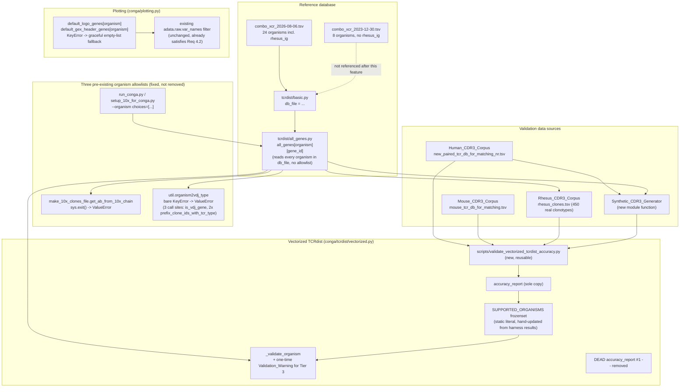
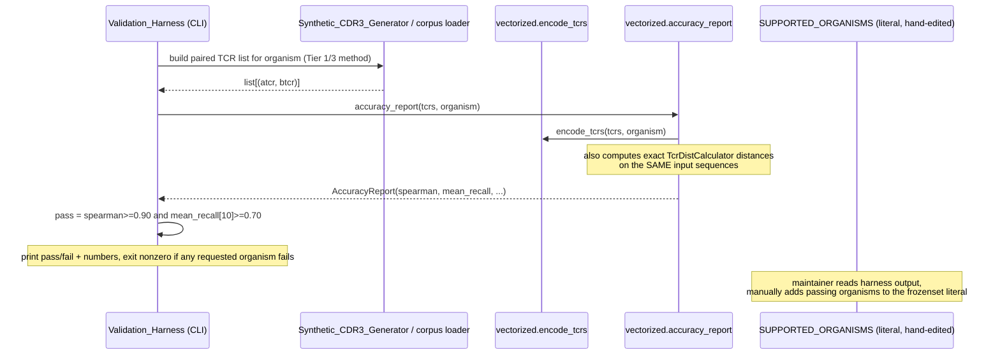

## Overview

This feature repoints CoNGA's active tcrdist reference database from `combo_xcr_2023-12-30.tsv` to `combo_xcr_2026-08-06.tsv` and wires up usable support for 13 new organism strings this unlocks (`cat`, `cat_gd`, `cat_ig`, `dog`, `dog_gd`, `dog_ig`, `ferret`, `ferret_gd`, `ferret_ig`, `rabbit`, `rabbit_gd`, `rabbit_ig`, `sheep`), plus `rhesus_ig`, which the new file populates for the first time for an already-supported species. Three pre-existing hardcoded organism allowlists currently block every one of these strings even after the file swap: `conga.tcrdist.make_10x_clones_file.get_ab_from_10x_chain` (hard `sys.exit()`), `conga.util.organism2vdj_type` (bare `KeyError` at three lookup sites), and the `--organism choices=` lists in `scripts/run_conga.py`/`scripts/setup_10x_for_conga.py`. This design extends all three allowlists and converts the two code-level crashes into `ValueError`s.

Separately, this feature attempts to extend `conga.tcrdist.vectorized.SUPPORTED_ORGANISMS` to cover the newly-reachable organisms, since nothing in the vectorizer's own encoding logic is alpha-beta-specific — only the CDR3 gap-position heuristic's *validated range* is. Each candidate organism-and-receptor-type combination is run once through a new, reusable accuracy-validation script against the best available sequence data for that organism, and only combinations that pass a documented accuracy threshold are added to the frozenset. `combo_xcr` itself holds only germline V/J gene segments for every species, but real paired junctional CDR3 sequence data is available in this repository for `human`, `mouse`, and `rhesus` — the newly-added `conga/data/rhesus_clones.tsv` supplies 450 real, species-matched rhesus alpha-beta clonotypes with complete paired CDR3 data, confirmed by direct inspection to have zero null/empty values across its `va_gene`/`ja_gene`/`vb_gene`/`jb_gene`/`cdr3a`/`cdr3b` columns and gene ids that all resolve against `all_genes['rhesus']`. Only the five fully-new species (`cat`, `dog`, `ferret`, `rabbit`, `sheep`) — and `rhesus`'s own gamma-delta and Ig receptor types, for which `rhesus_clones.tsv` has no coverage — rely on fully synthetic sequences modeled on real human CDR3 content. This is stated as a limitation of the validation method itself in Component 4 below, not glossed over.

While tracing `conga.tcrdist.vectorized.py` to implement the accuracy-validation path, two pre-existing defects were found that this design must also address, because the feature cannot be implemented correctly around them:

1. **Two `accuracy_report` function definitions exist in the same module** (`conga/tcrdist/vectorized.py`, roughly lines 1656–1881 and lines 1991–2203). Python keeps only the second at module scope, so the first is dead, unreachable code today — but it is also broken: it calls `calculator.tcr_distance(tcr_list[i], tcr_list[j])` on a `TcrDistCalculator` instance, and `TcrDistCalculator` (confirmed directly in `conga/tcrdist/tcr_distances.py`) has no `tcr_distance` method; its only comparable method is `__call__`. The dead copy is removed in this design (Component 4) so that the Validation_Harness script and anyone reading the module see one unambiguous `accuracy_report`.
2. **`conga/plotting.py`'s `make_logo_plots` has a hard assertion that constrains the Requirement 4 fix.** `default_logo_genes[organism]` is read at line ~504, then `assert len(logo_genes) == 3*gene_width - 2` runs shortly after (`gene_width` defaults to the caller's `gene_logo_width=6`, so the assert currently requires exactly 16 curated genes). A caller-missing-organism fallback cannot simply be an empty list without also adjusting `gene_width`, or the assert fails for every Newly_Supported_Organism's first logo plot. Component 3 below covers the exact fix.

Also discovered during tracing, and worth flagging precisely because it changes what Requirement 4.2 actually requires implementing: `make_logo_plots` **already** filters `logo_genes`/`header2_genes` down to genes present in `adata.raw.var_names` before using them (`X_igex_genes = sorted(set(x for x in logo_genes+header2_genes if x in raw_var_names))`, line ~520). Requirement 4.2 (omit a gene absent from the user's GEX reference) is therefore already satisfied by existing code for any organism that successfully reaches that line; the only gap is Requirement 4.1 (organism absent from the dict entirely, which crashes one line earlier at the dict subscript itself, before the existing filter ever runs).

## Architecture



### Sequence: accuracy-gated inclusion for one new species



## Components and Interfaces

### Component 1: Active database swap and the two organism-crash fixes

**`conga/tcrdist/basic.py`** (currently line 15):

```python
db_file = 'combo_xcr_2023-12-30.tsv' # now including mouse_ig
```

becomes

```python
db_file = 'combo_xcr_2026-08-06.tsv' # adds cat/dog/ferret/rabbit/sheep + rhesus_ig
```

No other change to this file. `conga/tcrdist/all_genes.py` already loads `all_genes[organism][gene_id]` generically for every organism string present in whichever file `basic.db_file` names (confirmed: the loop at the top of `all_genes.py` has no organism allowlist of its own), so this one-line change alone makes every organism in `combo_xcr_2026-08-06.tsv` — including `rainbowtrout` and the other Chain_Completeness_Rule-excluded strings — loadable via `all_genes`. Requirement 1.3 is satisfied by this fact alone; the Chain_Completeness_Rule and the New_Species scope decision apply only to the three consumer allowlists below, not to this loading step.

**`conga/tcrdist/make_10x_clones_file.py::get_ab_from_10x_chain`** (currently lines 56–76):

```python
def get_ab_from_10x_chain(chain, organism):
    ''' Returns None if the chain is not valid for this 'organism'
    '''
    if organism in ['human', 'mouse', 'rhesus']:
        if chain in ['TRA','TRB']:
            return chain[2]
        else:
            return None
    elif organism in ['human_gd','mouse_gd', 'rhesus_gd']:
        if chain in ['TRA','TRG','TRD']:
            return 'A' if chain=='TRG' else 'B'
        else:
            return None
    elif organism in ['human_ig','mouse_ig']:
        if chain in ['IGH', 'IGK', 'IGL']:
            return 'B' if chain=='IGH' else 'A'
        else:
            return None
    else:
        print('unrecognized organism in get_ab_from_10x_chain:', organism)
        sys.exit()
```

The three organism tuples become three organism tuples with every Newly_Supported_Organism appended to the list matching its receptor type, and the `else` branch's `print(...); sys.exit()` becomes a `ValueError`:

```python
def get_ab_from_10x_chain(chain, organism):
    ''' Returns None if the chain is not valid for this 'organism'
    '''
    if organism in ['human', 'mouse', 'rhesus', 'cat', 'dog', 'ferret', 'rabbit', 'sheep']:
        if chain in ['TRA','TRB']:
            return chain[2]
        else:
            return None
    elif organism in ['human_gd', 'mouse_gd', 'rhesus_gd', 'cat_gd', 'dog_gd', 'ferret_gd', 'rabbit_gd']:
        if chain in ['TRA','TRG','TRD']:
            return 'A' if chain=='TRG' else 'B'
        else:
            return None
    elif organism in ['human_ig', 'mouse_ig', 'rhesus_ig', 'cat_ig', 'dog_ig', 'ferret_ig', 'rabbit_ig']:
        if chain in ['IGH', 'IGK', 'IGL']:
            return 'B' if chain=='IGH' else 'A'
        else:
            return None
    else:
        raise ValueError(
            f"Unrecognized organism {organism!r} in get_ab_from_10x_chain. "
            f"Supported organisms: ['human', 'mouse', 'rhesus', 'cat', 'dog', "
            f"'ferret', 'rabbit', 'sheep', 'human_gd', 'mouse_gd', 'rhesus_gd', "
            f"'cat_gd', 'dog_gd', 'ferret_gd', 'rabbit_gd', 'human_ig', "
            f"'mouse_ig', 'rhesus_ig', 'cat_ig', 'dog_ig', 'ferret_ig', 'rabbit_ig']"
        )
```

`sheep_gd`/`sheep_ig`/every `rainbowtrout` variant are deliberately absent from all three lists per the Chain_Completeness_Rule — calling this function with one of those strings now raises the same clear `ValueError` as any other unrecognized organism, rather than being silently accepted into the wrong branch.

**`conga/util.py::organism2vdj_type` and its three call sites.** The dict (currently lines 75–84) gains one entry per Newly_Supported_Organism:

```python
organism2vdj_type = {
    'human':TCR_AB_VDJ_TYPE,
    'mouse':TCR_AB_VDJ_TYPE,
    'cat':TCR_AB_VDJ_TYPE,
    'dog':TCR_AB_VDJ_TYPE,
    'ferret':TCR_AB_VDJ_TYPE,
    'rabbit':TCR_AB_VDJ_TYPE,
    'sheep':TCR_AB_VDJ_TYPE,
    'human_gd':TCR_GD_VDJ_TYPE,
    'mouse_gd':TCR_GD_VDJ_TYPE,
    'cat_gd':TCR_GD_VDJ_TYPE,
    'dog_gd':TCR_GD_VDJ_TYPE,
    'ferret_gd':TCR_GD_VDJ_TYPE,
    'rabbit_gd':TCR_GD_VDJ_TYPE,
    'human_ig':IG_VDJ_TYPE,
    'mouse_ig':IG_VDJ_TYPE,
    'cat_ig':IG_VDJ_TYPE,
    'dog_ig':IG_VDJ_TYPE,
    'ferret_ig':IG_VDJ_TYPE,
    'rabbit_ig':IG_VDJ_TYPE,
    'rhesus':TCR_AB_VDJ_TYPE,
    'rhesus_gd':TCR_GD_VDJ_TYPE,
    'rhesus_ig':IG_VDJ_TYPE,
}
```

Three call sites currently do a bare `organism2vdj_type[organism]` and would raise an unguarded `KeyError` for any string absent from the dict (confirmed by direct trace, not assumed):

1. `conga/util.py::is_vdj_gene` (currently line ~199): `vdj_type = organism2vdj_type[organism]`.
2. `conga/tcrdist/make_10x_clones_file.py::read_tcr_data` (currently line ~104): `if organism2vdj_type[organism] == IG_VDJ_TYPE:`.
3. `conga/tcrdist/make_10x_clones_file.py::read_tcr_data_batch` (currently line ~296): the same pattern.

A single private helper added to `conga/util.py`, next to the dict, replaces all three bracket lookups:

```python
def get_vdj_type(organism: str) -> str:
    """Look up the VDJ_Type for an organism string.

    Raises
    ------
    ValueError
        If `organism` is not a key in `organism2vdj_type`, naming the
        organism and the supported set -- replacing the bare `KeyError`
        every direct-subscript call site previously risked.
    """
    try:
        return organism2vdj_type[organism]
    except KeyError:
        raise ValueError(
            f"Organism {organism!r} is not supported. "
            f"Supported organisms: {sorted(organism2vdj_type)}"
        ) from None
```

All three call sites switch from `organism2vdj_type[organism]` to `get_vdj_type(organism)`. `is_vdj_gene`'s own trailing `else: print('unrecognized vdj_type:', vdj_type); exit()` branch (for an unrecognized *VDJ_Type* value, not organism string) is unreachable once `get_vdj_type` only ever returns one of the three known constants, and is left as-is since it is not an organism-string validation path and is out of this feature's scope.

### Component 2: CLI `--organism` choices

**`scripts/run_conga.py`** (currently lines 66–68):

```python
parser.add_argument('--organism',
                    choices=['mouse', 'human', 'mouse_gd', 'human_gd',
                             'human_ig', 'rhesus', 'rhesus_gd'])
```

becomes

```python
parser.add_argument('--organism',
                    choices=['mouse', 'human', 'mouse_gd', 'human_gd',
                             'human_ig', 'rhesus', 'rhesus_gd', 'rhesus_ig',
                             'cat', 'cat_gd', 'cat_ig',
                             'dog', 'dog_gd', 'dog_ig',
                             'ferret', 'ferret_gd', 'ferret_ig',
                             'rabbit', 'rabbit_gd', 'rabbit_ig',
                             'sheep'])
```

**`scripts/setup_10x_for_conga.py`** (currently line 12):

```python
parser.add_argument('--organism', choices=['mouse', 'human', 'mouse_gd', 'human_gd', 'human_ig','rhesus','rhesus_gd'], default = None)
```

becomes

```python
parser.add_argument('--organism', choices=[
    'mouse', 'human', 'mouse_gd', 'human_gd', 'human_ig', 'rhesus', 'rhesus_gd', 'rhesus_ig',
    'cat', 'cat_gd', 'cat_ig',
    'dog', 'dog_gd', 'dog_ig',
    'ferret', 'ferret_gd', 'ferret_ig',
    'rabbit', 'rabbit_gd', 'rabbit_ig',
    'sheep',
], default = None)
```

No other script's `--organism` is touched, per Requirement 3.3.

### Component 3: Graceful marker-gene omission in `conga/plotting.py`

**The crash site** (currently lines 503–510, inside `make_logo_plots`):

```python
    if logo_genes is None:
        logo_genes = default_logo_genes[organism]

    if gex_header_genes is None:
        header2_genes = default_gex_header_genes[organism]
    else:
        header2_genes = gex_header_genes[:]
```

**The constraint this fix must satisfy** (currently line ~543, a few lines later in the same function):

```python
    gene_width = gene_logo_width

    assert len(logo_genes) == 3*gene_width - 2
```

`gene_logo_width` defaults to 6, so this assert currently requires `logo_genes` to have exactly 16 entries whenever the caller does not pass an explicit `logo_genes` list — true for every curated organism today (`default_logo_genes['human']` etc. all have exactly 16 entries, confirmed by inspection). An empty-list fallback for a missing organism cannot satisfy `len([]) == 3*6-2 == 16`, so the fallback must also adjust `gene_width` to match whatever `logo_genes` ends up being:

```python
    if logo_genes is None:
        logo_genes = default_logo_genes.get(organism, [])
        if not logo_genes:
            logger.warning(
                f"No default logo genes configured for organism {organism!r}; "
                f"logo gene panel will be empty for this plot."
            )

    if gex_header_genes is None:
        header2_genes = default_gex_header_genes.get(organism, [])
        if not header2_genes:
            logger.warning(
                f"No default GEX header genes configured for organism "
                f"{organism!r}; header gene panel will be empty for this plot."
            )
    else:
        header2_genes = gex_header_genes[:]
```

and the shape assert's companion `gene_width` computation becomes conditional on whether the caller (or the fallback above) supplied a non-empty, pre-curated list versus an empty fallback:

```python
    if logo_genes:
        gene_width = gene_logo_width
        assert len(logo_genes) == 3*gene_width - 2
    else:
        gene_width = 1  # smallest valid width; logo panel renders empty
```

This satisfies Requirement 4.1 (an organism absent from either dict degrades to an empty, non-crashing gene panel rather than raising `KeyError`) without touching Requirement 4.2's already-correct behavior: the existing `X_igex_genes = sorted(set(x for x in logo_genes+header2_genes if x in raw_var_names))` filter at line ~520 is untouched, continues to run unconditionally, and already drops any gene absent from `adata.raw.var_names` for every organism, curated or not. `conga/plotting.py` needs a module-level `logger = logging.getLogger(__name__)` added if one is not already present (confirmed by inspection: `plotting.py` currently uses bare `print(...)` throughout, not the `logging` module, so this is a new import for this file specifically — matching the convention `vectorized.py` already uses, not introducing a third style).

No entries are added to `default_logo_genes` or `default_gex_header_genes` for any Newly_Supported_Organism, per Requirement 4.4.

### Component 4: Vectorized TCRdist — dead-code removal, validation data sources, the Validation_Harness, and the Tier 3 warning

**Dead-code removal.** The first `accuracy_report` definition in `conga/tcrdist/vectorized.py` (the one spanning roughly lines 1656–1881, which calls the nonexistent `TcrDistCalculator.tcr_distance` method and is unreachable because the second definition at module scope replaces it) is deleted in full. The second definition (roughly lines 1991–2203, the one every docstring example in the module already documents and the one that actually runs today) is retained unmodified except where noted below. This is a pre-existing defect unrelated to any requirement in this feature by itself, but it blocks Requirement 5 (the Validation_Harness calls `accuracy_report` and must get the working implementation, not accidentally end up relying on dead code that a future edit might resurrect) and is removed for that reason.

**Validation data source implementations (Requirement 6).** Four new module-level functions in `conga/tcrdist/vectorized.py`, placed near `accuracy_report`:

```python
def _load_human_cdr3_corpus() -> pd.DataFrame:
    """Load conga/data/new_paired_tcr_db_for_matching_nr.tsv, filtered to
    rows where both cdr3a and cdr3b are non-empty (paired rows only).
    Columns used: cdr3a, cdr3b, va, vb, ja, jb. Path resolved via
    conga.util.path_to_data, not a hardcoded string, matching the existing
    convention `conga/util.py` already uses for every other bundled file.
    """

def _load_mouse_cdr3_corpus() -> pd.DataFrame:
    """Load conga/data/mouse_tcr_db_for_matching.tsv, filtered the same way
    as _load_human_cdr3_corpus. This file has one extra leading unnamed
    index column (confirmed by direct inspection of the file header) that
    pandas' default read_csv(sep='\\t') already assigns a positional name
    to; it is dropped along with every other column this function does
    not use.
    """

def _load_rhesus_cdr3_corpus() -> pd.DataFrame:
    """Load conga/data/rhesus_clones.tsv (Rhesus_CDR3_Corpus, Requirement 6.3).
    Columns used: cdr3a, cdr3b, va_gene, ja_gene, vb_gene, jb_gene (note:
    this file uses the clones-file column-naming convention --
    `va_gene`/`vb_gene`/`ja_gene`/`jb_gene` -- not the `va`/`vb`/`ja`/`jb`
    convention _load_human_cdr3_corpus and _load_mouse_cdr3_corpus use
    for the matching-db file schema; callers normalize to a common
    tuple shape before use). Confirmed by direct inspection: all 450
    rows have complete va_gene/ja_gene/vb_gene/jb_gene/cdr3a/cdr3b (no
    filtering for paired-only rows is needed, unlike the mouse corpus,
    because every row in this file is already a complete alpha-beta
    pair). All unique gene ids in these four columns were confirmed to
    exist as keys in all_genes['rhesus'] built from
    combo_xcr_2026-08-06.tsv, so no gene-name cross-species mapping or
    row-dropping is required -- this is real, directly species-matched
    data, not a substitution. Path resolved via conga.util.path_to_data,
    matching the existing convention.
    """

def _build_synthetic_cdr3_corpus(organism: str, n: int, random_seed: int) -> list[tuple[tuple, tuple]]:
    """Synthetic_CDR3_Generator (Requirement 6.4) for cat/dog/ferret/rabbit/sheep.
    See 'Synthetic_CDR3_Generator algorithm' below for the exact method.
    Samples V/J genes uniformly from all_genes[organism] filtered to the
    requested chain and region, and samples a synthetic CDR3 for each
    chain from the human-derived frequency model.
    """
```

**Synthetic_CDR3_Generator algorithm — resolved precisely, correcting the requirements' "germline-implied CDR3 length distribution" language.** Tracing `conga/tcrdist/all_genes.py::TCR_Gene` and `conga/tcrdist/vectorized.py::germline_code_table` directly confirms that a V gene's `cdrs` field is `[CDR1, CDR2, CDR2.5, CDR3-Nterm-stub]`, and every consumer (`germline_code_table`, `tcr_distances.compute_all_v_region_distances`) explicitly excludes the final entry (`g.cdrs[:-1]`) specifically because it is not the observed junctional CDR3 — it is a few residues of germline-encoded V-region sequence immediately before the junction, not the junction itself. No file read for this feature contains an observed junctional CDR3 length for any species' germline data, because germline V/J segments do not determine junction length — that length is set by V(D)J recombination (N-nucleotide insertion, exonuclease trimming), which is a cellular process, not a germline sequence property. There is therefore no way to derive a species-specific CDR3 length distribution from `combo_xcr` at all, for any species, including human.

Given that, the Synthetic_CDR3_Generator samples CDR3 **length** directly from the empirical length distribution observed in `_load_human_cdr3_corpus()` (the one real length distribution available in this repository), for every one of the five fully-synthetic species. This is already consistent with "model codon usage on human TCRs," since the length distribution is drawn from the same real human corpus the amino-acid content model is drawn from; it does not claim species-specific length fidelity, and Component 4's design-documentation requirement (Requirement 9) states this explicitly rather than letting the requirements document's imprecise phrasing stand uncorrected.

The amino-acid content model: for each of `cdr3a`/`cdr3b` in `_load_human_cdr3_corpus()`, build one aggregate per-residue amino-acid frequency table (20 amino acids, normalized counts) pooled across all positions and all lengths. Per-position modeling was considered and rejected for this feature: CDR3s do not have a natural fixed-position correspondence across different lengths (an interior position in a 10-residue CDR3 does not correspond to the same structural position in a 14-residue CDR3), and the repository has no existing alignment machinery for junction sequences specifically (as opposed to the fixed-position germline V-loop codes `germline_code_table` already builds, which align by shared position within one length-matched germline table, not by arbitrary input length). A synthetic CDR3 of sampled length `L` is built by sampling `L` independent draws from the pooled frequency table. V and J gene identifiers are sampled uniformly, independently, from `all_genes[organism]` filtered to `chain='A'/'B'`, `region='V'/'J'` respectively — this guarantees every sampled gene ID is a real key in `germline_code_table`'s own gene list for that organism, which `encode_tcrs` requires (confirmed: `encode_tcrs` does `gene_to_row[v_gene]`, a bare dict lookup with no fallback, against exactly the `gene_ids` list `germline_code_table` returns).

**The Validation_Harness: `scripts/validate_vectorized_tcrdist_accuracy.py` (new file).** Structurally modeled on `scripts/validate_faiss_accuracy.py` (argparse CLI, `logging.basicConfig`, printed pass/fail with the measured numbers), but organism-indexed rather than backend-indexed:

```python
#!/usr/bin/env python3
"""
Vectorized TCRdist accuracy validation script (Requirement 5).

Usage:
    python scripts/validate_vectorized_tcrdist_accuracy.py --organism cat
    python scripts/validate_vectorized_tcrdist_accuracy.py --organism all
"""
# argparse: --organism (one of the 14 evaluated strings, or 'all'),
# --n-synthetic (default e.g. 1000, only used for Tier 3 organisms),
# --random-seed (default util.DEFAULT_RANDOM_SEED), --verbose.
#
# For each requested organism:
#   1. dispatch to _load_human_cdr3_corpus / _load_mouse_cdr3_corpus /
#      _load_rhesus_cdr3_corpus / _build_synthetic_cdr3_corpus
#      per the Validation_Tier table below
#   2. report = conga.tcrdist.vectorized.accuracy_report(tcrs, organism)
#   3. passed = report.spearman >= 0.90 and report.mean_recall[10] >= 0.70
#   4. print organism, Validation_Tier, spearman, mean_recall[10], PASS/FAIL
# Exit code 0 if every requested organism passed, 1 otherwise.
```

### The `_skip_validation` bypass (discovered during implementation)

`_validate_organism` — called internally by `germline_code_table`, `_validate_input`, `vector_length`, `encode_tcrs`, and `accuracy_report` — raises `ValueError` for any organism string not already present in `SUPPORTED_ORGANISMS`. This blocks the Validation_Harness from doing the one thing it exists to do: measure accuracy for a candidate organism that, by definition, is not yet in `SUPPORTED_ORGANISMS`. Without a bypass, the harness cannot evaluate any of the Newly_Supported_Organism candidates or the `rhesus_gd`/`rhesus_ig` re-evaluation, since every one of those organism strings would be rejected before `accuracy_report` could compute anything.

The fix is a private, keyword-only `_skip_validation: bool = False` parameter added to all six functions named above (`_validate_organism`, `germline_code_table`, `_validate_input`, `vector_length`, `encode_tcrs`, `accuracy_report`), threaded through each function's internal calls to the others so that a caller passing `_skip_validation=True` into `accuracy_report` propagates that flag down through `encode_tcrs`, `_validate_input`, `vector_length`, and `germline_code_table` to the `_validate_organism` check itself, which skips its `SUPPORTED_ORGANISMS` membership check entirely when the flag is set. The default is `False` on every one of the six functions, so every existing production call site — none of which pass this new parameter — observes zero behavior change. Only `scripts/validate_vectorized_tcrdist_accuracy.py` ever passes `_skip_validation=True`, and it does so only at its own call into `accuracy_report`.

This parameter is deliberately leading-underscore/private: it is not part of any of the six functions' public API, is not listed in any function's docstring "Parameters" section, and gets only a single one-line mention in `accuracy_report`'s "Notes" section pointing at the Validation_Harness as its sole intended caller. `SUPPORTED_ORGANISMS` remains the sole production-facing gate for every normal caller of these six functions; this bypass exists only to let the one tool whose job is deciding `SUPPORTED_ORGANISMS` membership operate before that membership is decided.

The 14 organism-and-receptor-type combinations this harness is run against for this feature (Requirement 5.5): `human`, `mouse`, `rhesus` (re-validated, not assumed), `rhesus_gd`, `rhesus_ig`, `cat`, `cat_gd`, `cat_ig`, `dog`, `dog_gd`, `dog_ig`, `ferret`, `ferret_gd`, `ferret_ig`, `rabbit`, `rabbit_gd`, `rabbit_ig`, `sheep` — every Newly_Supported_Organism plus every existing `rhesus` variant, since `rhesus`'s alpha-beta entry is explicitly re-validated per Requirement 7.5 and `rhesus_gd`/`rhesus_ig` are new candidates in their own right. (`human_gd`, `mouse_gd`, `human_ig`, `mouse_ig` are already excluded from `SUPPORTED_ORGANISMS` today and this feature does not change that scope decision — they are not re-litigated here.)

| Organism | Validation_Tier | Data source function |
|---|---|---|
| `human` | Tier_1 | `_load_human_cdr3_corpus` |
| `mouse` | Tier_1 | `_load_mouse_cdr3_corpus` |
| `rhesus` | Tier_1 | `_load_rhesus_cdr3_corpus` (real alpha-beta data from `rhesus_clones.tsv`) |
| `rhesus_gd` | Tier_3 | `_build_synthetic_cdr3_corpus` (no real rhesus gamma-delta data exists; `rhesus_clones.tsv` is alpha-beta only, so `rhesus_gd` falls back to the synthetic generator, same as the five new species) |
| `rhesus_ig` | Tier_3 | `_build_synthetic_cdr3_corpus` (same reasoning: `rhesus_clones.tsv` has no Ig data) |
| `cat`, `cat_gd`, `cat_ig`, `dog`, `dog_gd`, `dog_ig`, `ferret`, `ferret_gd`, `ferret_ig`, `rabbit`, `rabbit_gd`, `rabbit_ig`, `sheep` | Tier_3 | `_build_synthetic_cdr3_corpus` |

`rhesus_clones.tsv` contains only real alpha-beta paired clonotype data, so only plain `rhesus` benefits from Tier_1 real-data validation; `rhesus_gd` and `rhesus_ig` remain Tier_3 synthetic candidates exactly like the five new species, since no real rhesus gamma-delta or Ig junctional sequence data is available in this repository.

**Results table.** This design document records the measured Spearman correlation, mean recall@10, and pass/fail outcome for every row in the table above once the Validation_Harness has actually been run (Requirement 5.5, Requirement 9.3). That run happens during implementation of this feature's tasks, not during design — the table below is a placeholder with the exact schema it will be filled in with:

| Organism | Validation_Tier | Spearman | Mean recall@10 | Accuracy_Gate | Added to SUPPORTED_ORGANISMS? |
|---|---|---|---|---|---|
| `human` | Tier_1 | 0.9988 | 0.9400 | PASS | Yes |
| `mouse` | Tier_1 | 0.9986 | 0.9150 | PASS | Yes |
| `rhesus` | Tier_1 | 0.9979 | 0.9478 | PASS | Yes |
| `rhesus_gd` | Tier_3 | 0.9987 | 0.9450 | PASS | Yes |
| `rhesus_ig` | Tier_3 | 0.9986 | 0.9307 | PASS | Yes |
| `cat` | Tier_3 | 0.9983 | 0.9467 | PASS | Yes |
| `cat_gd` | Tier_3 | 0.9988 | 0.9454 | PASS | Yes |
| `cat_ig` | Tier_3 | 0.9987 | 0.9315 | PASS | Yes |
| `dog` | Tier_3 | 0.9983 | 0.9405 | PASS | Yes |
| `dog_gd` | Tier_3 | 0.9987 | 0.9411 | PASS | Yes |
| `dog_ig` | Tier_3 | 0.9987 | 0.9219 | PASS | Yes |
| `ferret` | Tier_3 | 0.9983 | 0.9389 | PASS | Yes |
| `ferret_gd` | Tier_3 | 0.9987 | 0.9380 | PASS | Yes |
| `ferret_ig` | Tier_3 | 0.9986 | 0.9297 | PASS | Yes |
| `rabbit` | Tier_3 | 0.9985 | 0.9444 | PASS | Yes |
| `rabbit_gd` | Tier_3 | 0.9989 | 0.9451 | PASS | Yes |
| `rabbit_ig` | Tier_3 | 0.9989 | 0.9304 | PASS | Yes |
| `sheep` | Tier_3 | 0.9985 | 0.9392 | PASS | Yes |

**Populating `SUPPORTED_ORGANISMS`.** The frozenset stays a static literal (matching the existing convention — `human`/`mouse`/`rhesus` are themselves a hand-written literal today, not computed at import time). Once the table above is filled in, `SUPPORTED_ORGANISMS` is hand-edited to add exactly the organisms whose `Accuracy_Gate` column reads pass; this is a one-time edit performed as an implementation task, not a mechanism that runs on every import. `rhesus` is included in the re-validation on equal footing with every new candidate; if its row shows a fail, `rhesus` is removed from the frozenset in the same edit, per Requirement 7.5.

**The Tier 3 Validation_Warning.** Added inside `encode_tcrs`, immediately after the existing `_validate_organism(organism)` call at its top:

```python
_TIER_3_ORGANISMS: frozenset[str] = frozenset({
    # filled in from the results table above: every organism that both
    # (a) passed the Accuracy_Gate and (b) is Tier_3
})
_already_warned_organisms: set[str] = set()

def encode_tcrs(tcrs, organism, config=None, ...):
    _validate_organism(organism)
    if organism in _TIER_3_ORGANISMS and organism not in _already_warned_organisms:
        _already_warned_organisms.add(organism)
        logger.warning(
            f"Vectorized TCRdist for organism {organism!r} was validated "
            f"using synthetic sequence data modeled on human CDR3 content, "
            f"not species-matched real repertoire data for {organism!r}. "
            f"Consider the KernelPCA representation (X_pca_tcr) or the "
            f"exact TCRdist path for a more conservative alternative."
        )
    ...
```

`_already_warned_organisms` is a plain module-level `set()`, not a `threading`-synchronized structure — matching the rest of the module, which has no other concurrency guards, and matching this project's existing assumption that one `conga` process runs one analysis at a time. The warning fires once per organism per process, not once per `encode_tcrs` call, so a large analysis encoding the same organism's clonotypes repeatedly (e.g. once in `batch_integration()`-adjacent code paths, once in the main pipeline) does not flood logs. `human`, `mouse`, and `rhesus` are never added to `_TIER_3_ORGANISMS` regardless of their validation results, since they are Tier_1 by definition (Requirement 8.4) — this is a hardcoded tier classification, not a function of pass/fail.

## Data Models

This feature does not introduce any new persistent storage format or AnnData schema change; the data shapes below are either in-memory values passed between the new functions described in Component 4, or existing dict/frozenset structures extended with new keys/members per Components 1 and 4.

**`AccuracyReport`** (`conga.tcrdist.vectorized.accuracy_report`'s return value, sole surviving copy after the dead-code removal in Component 4). This feature does not change the shape of `AccuracyReport` itself — it is an existing type this feature consumes, not defines. At the level of detail Component 4 already relies on: it carries a Spearman correlation value (`report.spearman`) between vectorized-encoding distance and exact `TcrDistCalculator` distance computed on the same input sequences, and a mean-recall-at-k value (`report.mean_recall[10]`) for the `k=10` nearest-neighbor case, since both of these fields are read directly by the Accuracy_Gate check (`report.spearman >= 0.90 and report.mean_recall[10] >= 0.70`) in the Validation_Harness. No field of `AccuracyReport` not already named in Component 4 is introduced or assumed by this design.

**Validation corpus loader outputs.** The three real-data loaders (`_load_human_cdr3_corpus`, `_load_mouse_cdr3_corpus`, `_load_rhesus_cdr3_corpus`) each return a `pd.DataFrame`, but are read from source files with two different column-naming conventions (`va`/`vb`/`ja`/`jb`/`cdr3a`/`cdr3b` for the human and mouse matching-db files, versus `va_gene`/`vb_gene`/`ja_gene`/`jb_gene`/`cdr3a`/`cdr3b` for `rhesus_clones.tsv`, as already noted in Component 4). This design pins down the normalization Component 4 mentions but leaves implicit: the Validation_Harness, not the loader functions themselves, is responsible for projecting each loader's `DataFrame` into one common tuple shape — `list[tuple[tuple[str, str, str], tuple[str, str, str]]]`, i.e. a list of `(a_chain, b_chain)` pairs where each chain is itself a `(v_gene, j_gene, cdr3)` tuple — before calling `accuracy_report`. `_build_synthetic_cdr3_corpus` returns this same common shape directly (`list[tuple[tuple, tuple]]`, as already typed in its Component 4 signature), so the harness applies the loader-to-common-shape projection only to the three `DataFrame`-returning functions, and passes `_build_synthetic_cdr3_corpus`'s output straight through unchanged. This gives `accuracy_report` one uniform input shape regardless of which of the four data-source functions produced it.

**`organism2vdj_type`** (`conga/util.py`, extended in Component 1): a `dict[str, str]` mapping an organism string to one of the three VDJ_Type constants `TCR_AB_VDJ_TYPE`, `TCR_GD_VDJ_TYPE`, or `IG_VDJ_TYPE`. This feature adds one key per Newly_Supported_Organism to the existing dict shape; no new VDJ_Type constant is introduced.

**`SUPPORTED_ORGANISMS`** (`conga/tcrdist/vectorized.py`, extended in Component 4): a `frozenset[str]` of organism strings accepted by the TCR_Vectorizer. Its shape is unchanged (a flat frozenset of strings, no nesting); only its membership changes, and only via the hand-edit described in Component 4 once the Results table is filled in.

**Results table schema.** The authoritative schema for recorded validation evidence is the table already defined in Component 4: `Organism | Validation_Tier | Spearman | Mean recall@10 | Accuracy_Gate | Added to SUPPORTED_ORGANISMS?`. This design does not duplicate that table; it is referenced here as the data model that backs Correctness Property 2 below (every `SUPPORTED_ORGANISMS` member must have a corresponding passing row in this exact table).

## Error Handling

This feature changes exactly two call sites from a hard crash to a raised `ValueError`, leaves one existing `ValueError` path's mechanism unchanged while its effective organism set grows, treats one script's exit code as operational signaling rather than an exception, and deliberately leaves one path as a non-error graceful degradation. All four are already specified in full in Components 1, 3, and 4; this section consolidates them for reference rather than re-specifying them.

| Site | Trigger | Exception | Message (see Component for exact text) |
|---|---|---|---|
| `make_10x_clones_file.get_ab_from_10x_chain` | organism string not in any of the three updated organism lists | `ValueError` | Names the unrecognized organism and lists every supported organism string (Component 1) |
| `util.get_vdj_type` (new helper, replaces three bare `organism2vdj_type[organism]` subscripts) | organism string absent from `organism2vdj_type` | `ValueError` | Names the organism and `sorted(organism2vdj_type)` as the supported set (Component 1) |
| `vectorized._validate_organism` | organism string absent from `SUPPORTED_ORGANISMS` | `ValueError` | Unchanged mechanism (pre-existing); directs the caller to `X_pca_tcr` or exact TCRdist, per Requirement 7.2. The set of organisms this fires for shrinks or grows only as a side effect of the Component 4 hand-edit to `SUPPORTED_ORGANISMS`, not a change to `_validate_organism` itself |

**Not an exception.** `scripts/validate_vectorized_tcrdist_accuracy.py`'s nonzero exit code when any requested organism fails the Accuracy_Gate (Component 4) is operational/CI-style signaling for a maintainer or automation to detect a failed validation run — it is not a raised Python exception, and no caller is expected to catch it.

**Not an error path at all.** The Component 3 plotting fallback (`default_logo_genes.get(organism, [])` / `default_gex_header_genes.get(organism, [])`) is explicitly excluded from this table because it is not an error-handling change — it is a graceful-degradation change. An organism absent from either dict now produces an empty gene list plus a `logger.warning(...)` call and a plot that still renders, not a raised exception. It is noted here only to contrast it with the three genuine `ValueError` paths above: Requirement 4 deliberately avoids introducing a fourth exception path where the other three components introduce one each.

## Testing Strategy

All tests run via `mamba run -n conga-dev pytest tests/ -v`, per this project's development workflow. Property-based tests use the project's existing PBT library convention (`hypothesis`, matching other property tests already configured in this repo) at a minimum of 100 iterations each.

**Component 1 — organism allowlists.**
- Unit tests for `get_ab_from_10x_chain`: for every Newly_Supported_Organism, assert the correct `Chain_Label` is returned for each of that organism's valid 10x chain labels (e.g. `TRA`/`TRB` for `cat`, `TRG`/`TRD` for `dog_gd`, `IGH`/`IGK`/`IGL` for `rabbit_ig`). A second set of unit tests calls it with each of `rainbowtrout`, `rainbowtrout_gd`, `rainbowtrout_ig`, `sheep_gd`, and `sheep_ig` — the Chain_Completeness_Rule-excluded strings — and asserts a `ValueError` is raised whose message contains the organism string.
- Unit tests for `get_vdj_type`: for every Newly_Supported_Organism, assert the correct VDJ_Type constant is returned; for `rainbowtrout` (and the other excluded strings), assert `ValueError` with the organism name in the message.

**Component 2 — CLI `--organism` choices.**
- A smoke test per CLI script (`run_conga.py`, `setup_10x_for_conga.py`) that constructs the script's `argparse.ArgumentParser` (or invokes `parse_args` with a minimal required-argument stub) with `--organism` set to a representative sample of Newly_Supported_Organism values (e.g. `cat`, `dog_gd`, `rabbit_ig`, `sheep`) and asserts no `SystemExit` is raised by argparse itself. This verifies only that argparse's `choices=` list accepts the string; it does not execute the scripts' runtime pipeline, which is out of scope for this unit test.

**Component 3 — plotting fallback.**
- A unit test calling `make_logo_plots` (or the extracted gene-selection logic, if isolating it from the full plotting call is cleaner) with an organism string absent from `default_logo_genes` and `default_gex_header_genes`, asserting no exception is raised and the resulting logo/header gene lists are empty.
- A regression test confirming an existing curated organism (e.g. `human`) still resolves to exactly 16 genes via `default_logo_genes['human']` and still satisfies the unchanged `assert len(logo_genes) == 3*gene_width - 2` for the default `gene_logo_width=6`, confirming Component 3's conditional `gene_width` branch did not alter existing behavior.

**Component 4 — vectorized TCRdist validation plumbing.**
- A property-based test, parameterized over every organism in the Validation_Harness's dispatch table (the table in Component 4), asserting that for every gene id present in that organism's data-source output (real or synthetic), the gene id is a valid key in that organism's `germline_code_table` gene list. This is the exact invariant `encode_tcrs`'s bare `gene_to_row[v_gene]` lookup depends on (Component 4), and is a good PBT target since many sampled synthetic rows should be checked, not one hand-picked example.
- A unit test asserting the module exposes exactly one `accuracy_report` symbol at `conga.tcrdist.vectorized` module scope, confirming the dead first definition was actually deleted and not merely shadowed.
- A unit test confirming the Tier_3 Validation_Warning fires exactly once per organism per process: call `encode_tcrs` twice in the same test for the same Tier_3 organism and assert the warning is logged on the first call only (via `caplog` or an equivalent log-capture fixture); call it for `human`, `mouse`, and `rhesus` and assert the warning never fires for any of them, regardless of call count.
- `scripts/validate_vectorized_tcrdist_accuracy.py` itself is **not** wired into the automated pytest suite as a per-commit gate. It is the acceptance-level verification for the one-time Accuracy_Gate decision described in Component 4, run manually (or once per future Active_Database update) by a maintainer, and its Tier_3 synthetic-data generation is randomized by design — it is a decision-support tool, not a continuous-regression check. This is stated explicitly so the absence of a corresponding `test_validate_vectorized_tcrdist_accuracy.py` is a deliberate scope decision, not an oversight.

## Correctness Properties

*A property is a characteristic or behavior that should hold true across all valid executions of a system — essentially, a formal statement about what the system should do.*

### Property 1: Allowlist agreement with the Chain_Completeness_Rule

For all organism strings accepted (without raising) by either `get_ab_from_10x_chain` or `get_vdj_type`, that organism string is a member of the Chain_Completeness_Rule-filtered Newly_Supported_Organism set, or is one of the pre-existing `human`/`mouse`/`rhesus` (and their `_gd`/`_ig` variants already supported before this feature). The three allowlists in Component 1 never accept an organism string the Chain_Completeness_Rule excludes.

**Validates: Requirements 2.1, 2.3**

### Property 2: No unsupported organism in SUPPORTED_ORGANISMS without recorded evidence

For every organism string in `SUPPORTED_ORGANISMS` after this feature's implementation, there exists a row in the Results table (Component 4) recording that organism's Accuracy_Gate outcome as a pass. No organism is ever added to `SUPPORTED_ORGANISMS` without a corresponding recorded, passing measurement.

**Validates: Requirements 7.1, 7.2, 7.3**

### Property 3: Validation corpus gene ids always resolve

For every gene id produced by any of the four validation data-source functions (`_load_human_cdr3_corpus`, `_load_mouse_cdr3_corpus`, `_load_rhesus_cdr3_corpus`, `_build_synthetic_cdr3_corpus`), that gene id is a valid key in `germline_code_table` for the corresponding organism. No validation corpus, real or synthetic, ever supplies a gene id that would cause `encode_tcrs`'s bare dict lookup to raise `KeyError`.

**Validates: Requirements 5.2, 6.4**

### Property 4: Validation_Warning fires if and only if Tier_3

For all organisms, the Tier_3 Validation_Warning is emitted by `encode_tcrs` if and only if that organism's Validation_Tier is Tier_3. `human`, `mouse`, and `rhesus` never emit it, regardless of their Accuracy_Gate pass/fail outcome or any future change to `SUPPORTED_ORGANISMS` membership, since tier classification is independent of pass/fail (Resolved Decision 5).

**Validates: Requirements 8.1, 8.2, 8.3**

### Property 5: Logo/header gene lookup never raises

For all organism strings, calling `make_logo_plots` never raises `KeyError` from the `default_logo_genes` or `default_gex_header_genes` dict lookups, whether or not the organism is a Newly_Supported_Organism or has a curated entry.

**Validates: Requirements 4.1, 4.3**

## Resolved Decisions

1. **Combo_xcr.tsv (no date suffix) and combo_xcr_2023-12-30.tsv are both left on disk, untouched, unreferenced.** Only the one `db_file` string in `basic.py` changes. No file is deleted, renamed, or modified as part of this feature, per Requirement 1.2.
2. **The Chain_Completeness_Rule is enforced as hardcoded literal organism-string lists, not a runtime check against the loaded database.** This matches the pre-existing convention (the `human`/`mouse`/`rhesus`-style lists in `get_ab_from_10x_chain` and `organism2vdj_type` are already literals, computed once by a human reading the reference data, not derived programmatically at import time). `rainbowtrout` and its two variants, plus `sheep_gd`/`sheep_ig`, are simply never added to any of the three lists; calling any of the three gated functions with one of those strings produces the same `ValueError` as a genuinely unrecognized organism, because from the consumer code's point of view, that is exactly what it is under this feature's scope decision.
3. **The two dead/duplicate `accuracy_report` definitions are a pre-existing defect, found incidentally while tracing the module to implement this feature's Validation_Harness, and are fixed as part of this feature rather than filed separately.** The fix (delete the first, broken definition) has no behavioral effect on any code that calls `accuracy_report` today, since the second definition is the one that has always actually run at module scope; this is pure dead-code removal, not a behavior change requiring its own requirement.
4. **The CDR3-length-distribution gap in the requirements' phrasing is corrected in this design, not implemented as literally stated.** "That organism's own germline-implied CDR3 length distribution" is not a quantity that exists in `combo_xcr` for any species, confirmed by tracing exactly how `cdrs` is populated and consumed; the Synthetic_CDR3_Generator instead draws CDR3 length from the real human corpus's empirical length distribution for every Tier_3 species, and Requirement 9's design-documentation obligation states this plainly as a property of the validation method, not a per-species shortfall.
5. **`rhesus` was reclassified from a cross-species-substitution validation method to Tier_1, based on the newly-added, newly-inspected `conga/data/rhesus_clones.tsv` (450 real, species-matched alpha-beta clonotypes with complete paired CDR3 data and gene ids fully resolvable against `all_genes['rhesus']`).** The intermediate validation method this reclassification replaces is removed outright rather than retained as a fallback, since real species-matched data is strictly better evidence and there is no scenario in this feature where the removed method would still be preferred. As a direct consequence, the two-tier model collapses from three provenance levels to two: Tier_1 (`human`, `mouse`, `rhesus` — real, species-matched data, silent/no warning) and Tier_3 (`cat`, `dog`, `ferret`, `rabbit`, `sheep`, plus `rhesus_gd` and `rhesus_ig` — fully synthetic, warned). The Validation_Warning now fires only for Tier_3 organisms; it does not fire for any Tier_1 organism, including `rhesus`.
6. **`conga/plotting.py` gains a `logging.getLogger(__name__)` logger for exactly the two new warning call sites added by this feature.** The rest of `make_logo_plots` and the rest of `plotting.py` continue to use `print(...)`, unchanged; this feature does not undertake a broader print-to-logging migration of that file, which is out of scope.
7. **`rhesus_gd` and `rhesus_ig` were considered for Tier_1 promotion alongside `rhesus` but remain Tier_3.** `rhesus_clones.tsv` contains only real alpha-beta paired clonotype data; no real rhesus gamma-delta or Ig junctional CDR3 sequence data exists anywhere in this repository, so both receptor types continue to rely on the Synthetic_CDR3_Generator and receive the Tier_3 Validation_Warning if they pass the Accuracy_Gate.
8. **The `_skip_validation` bypass (discovered during implementation of Requirement 5) was chosen over an alternative of having the Validation_Harness temporarily monkeypatch `SUPPORTED_ORGANISMS` for the duration of its own run.** The user explicitly chose the keyword-only parameter approach because it keeps the production gate's behavior change surface at zero — every existing call site is untouched and the default is `False` everywhere — and makes the harness's bypass an explicit, auditable detail visible at its own call site, rather than a global mutable-state change that would affect every concurrent caller of `SUPPORTED_ORGANISMS`-gated functions for the duration of the harness run.
