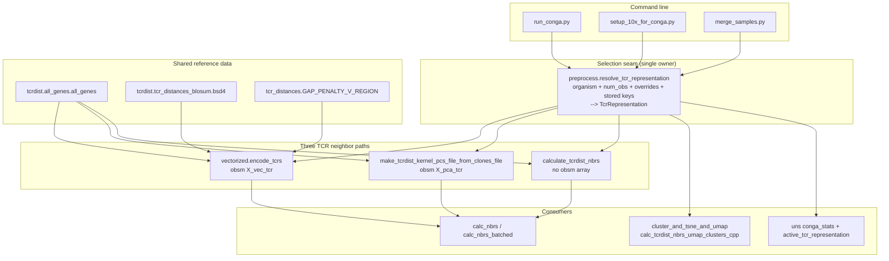
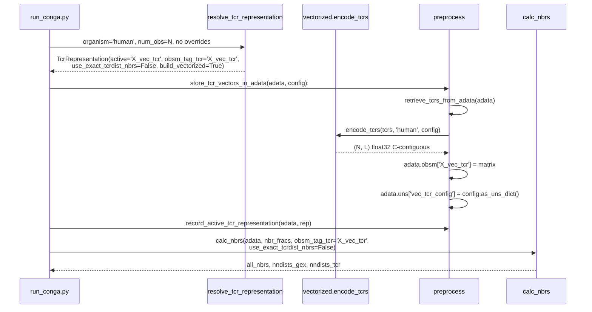
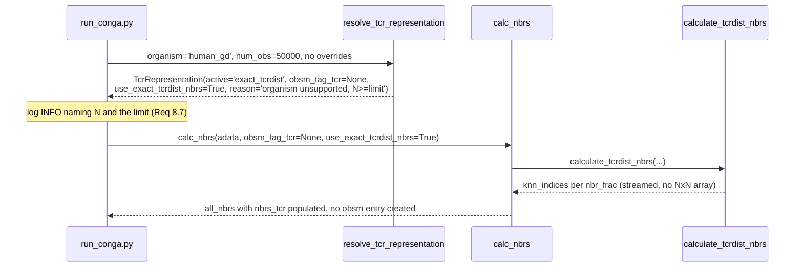

# Design Document: Vectorized TCRdist

## Overview

This feature replaces CoNGA's default TCR representation for alpha-beta receptors. Today the only representation that lands in `adata.obsm` is `X_pca_tcr`, built by `conga.preprocess.make_tcrdist_kernel_pcs_file_from_clones_file`, which materializes a dense N×N TCRdist matrix and then a second dense N×N Gram matrix before calling `KernelPCA.fit_transform`. This design adds a third representation, `X_vec_tcr`, produced by a new module `conga/tcrdist/vectorized.py` that encodes each clonotype directly as a fixed-length `float32` vector whose Euclidean distance approximates TCRdist. It also promotes the pre-existing exact-TCRdist neighbor route to a named, first-class path, and introduces one resolver function that decides among the three.

The encoder embeds the TCRdist amino-acid dissimilarity matrix into `aa_mds_dim` Euclidean dimensions with SMACOF multidimensional scaling, then builds each chain vector by concatenating per-position embedding vectors for the three germline V loops and a trimmed-and-gapped CDR3. Squared Euclidean distance in the encoded space reproduces the TCRdist sum structure: the substitution matrix is square-rooted before embedding so that squared distances, not distances, are the additive quantity, and the CDR3 block is pre-scaled by `sqrt(cdr3_weight)` so the CDR3 weighting falls out of the squaring.

Measured live during design on 1000 real human paired TCRs drawn from `conga/data/new_paired_tcr_db_for_matching_nr.tsv`, against `TcrDistCalculator`. Two MDS initialization strategies were compared, because scikit-learn 1.9.1 exposes `init` as an explicit parameter and the choice turns out to dominate accuracy:

| `init` | `aa_mds_dim` | MDS stress | Spearman | Pearson (d²) | recall@10 | recall@100 | L | Requirement 6.6 |
|---|---|---|---|---|---|---|---|---|
| `random` | 8 (prototype default) | 17.72 | 0.953 | 0.969 | 0.796 | 0.843 | 568 | fails recall gate |
| `random` | 12 | 10.26 | 0.969 | 0.969 | 0.798 | 0.844 | 852 | fails recall gate |
| `random` | 16 | 8.03 | 0.973 | 0.982 | 0.845 | 0.882 | 1136 | passes, thin margin |
| `classical_mds` | 8 | 12.48 | 0.938 | 0.959 | 0.766 | 0.819 | 568 | fails both gates |
| `classical_mds` | 12 | 4.82 | 0.992 | 0.995 | 0.887 | 0.927 | 852 | passes |
| **`classical_mds`** | **16 (design default)** | **0.45** | **0.999** | **0.999** | **0.953** | **0.971** | **1136** | **passes, large margin** |

The prototype leaves `init` unset, which on scikit-learn 1.9.1 means `random`. Pinning `init='classical_mds'` at `aa_mds_dim = 16` drops MDS stress from 8.03 to 0.45 and lifts recall@10 from 0.845 to 0.953 — the encoding becomes near-exact rather than merely adequate. `n_init` is ignored under this initialization, which removes a parameter from the reproducibility surface, and `classical_mds` is also the value scikit-learn makes the default in 1.10, so the pin runs with the library's direction rather than against it.

Encoding 20000 clonotypes takes 0.10 s and produces a 91 MB array, against roughly 6.4 GB of transient dense `float64` for the KernelPCA route at the same N.

The design is scoped to encoding, storage, path selection, and accuracy validation. FAISS backends, batch integration, gamma-delta and Ig vectorization, containerization, and MuData remain out of scope per the requirements; this design only guarantees the output array is directly consumable by a future vector index.

## Architecture



The single most important structural decision is that **one function owns the three-way branch**. `resolve_tcr_representation` is pure: it takes an organism string, an observation count, two override booleans, a limit, and the set of `obsm` keys already present, and returns an immutable `TcrRepresentation`. It reads nothing from disk, computes no distances, and mutates no AnnData. Every downstream decision — which `obsm` key to hand `calc_nbrs`, whether to set `use_exact_tcrdist_nbrs`, whether projection and clustering go through the C++ route, what to record in `uns` — reads fields off that one object. The branch is not repeated anywhere else.

### Why the seam lands where it does

`calc_nbrs` and `calc_nbrs_batched` already accept exactly the two parameters the resolver needs to drive: `obsm_tag_tcr` (a key or `None`) and `use_exact_tcrdist_nbrs`. Their signatures do not change. `TcrRepresentation` carries those two values as fields, so the call site becomes a spread of resolver output rather than an inline conditional. This keeps the diff in `calc_nbrs` at zero and confines new logic to the resolver plus the call sites that currently test `'X_pca_tcr' in adata.obsm_keys()`.

### Sequence: default alpha-beta run



### Sequence: unsupported organism at or above the limit



## Components and Interfaces

### Component 1: `conga/tcrdist/vectorized.py` (new) — the TCR_Vectorizer

**Purpose**: turn clonotypes into a fixed-length `float32` matrix, and measure how well it approximates TCRdist.

**Responsibilities**
- Build the 21-symbol dissimilarity matrix from CoNGA's own `bsd4` table and gap penalty constant, not from a re-hardcoded BLOSUM62 copy.
- Embed it deterministically with SMACOF.
- Assemble per-organism, per-chain germline code tables from `all_genes`.
- Validate input, then encode without any N² allocation.
- Produce an `AccuracyReport` against `TcrDistCalculator`.

**Module-level constants**

```python
SUPPORTED_ORGANISMS: frozenset[str] = frozenset({'human', 'mouse', 'rhesus'})
VECTORIZER_VERSION: str = 'conga.vectorized/1'

DEFAULT_AA_MDS_DIM: int = 16      # raised from the prototype's 8; see Overview table
DEFAULT_NUM_POS_CDR3: int = 16
DEFAULT_CDR3_WEIGHT: float = 3.0  # == tcr_distances.WEIGHT_CDR3_REGION
DEFAULT_N_TRIM: int = 3           # == the ntrim in sequence_distance_with_gappos
DEFAULT_C_TRIM: int = 2           # == the ctrim in sequence_distance_with_gappos

# Pinned SMACOF settings. Not EncodingConfig fields: they are not tunable,
# because the measured accuracy in Requirement 6.6 depends on them. Every one
# is a scikit-learn default that has moved or is scheduled to move, so each is
# stated rather than inherited. See Deterministic embedding under 1.9.1.
_MDS_KWARGS: dict[str, object] = {
    'metric': 'precomputed',    # replaces dissimilarity=, deprecated in 1.8
    'metric_mds': True,         # 1.8 rename of the old boolean metric=
    'init': 'classical_mds',    # added in 1.8; becomes the default in 1.10
    'n_init': 1,                # ignored under classical_mds; default fell 4->1 in 1.9
    'max_iter': 300,
    'eps': 1e-3,                # default moved 1e-3 -> 1e-6 in 1.7
    'n_jobs': None,             # no thread-count-dependent reduction order
    'normalized_stress': False, # what 'auto' resolves to for metric MDS
}
```

**Interfaces**

```python
@dataclass(frozen=True)
class EncodingConfig:
    """Tunable parameters that fully determine an encoding."""
    aa_mds_dim: int = DEFAULT_AA_MDS_DIM
    num_pos_cdr3: int = DEFAULT_NUM_POS_CDR3
    cdr3_weight: float = DEFAULT_CDR3_WEIGHT
    n_trim: int = DEFAULT_N_TRIM
    c_trim: int = DEFAULT_C_TRIM
    random_seed: int = util.DEFAULT_RANDOM_SEED   # 42

    def as_uns_dict(self) -> dict[str, int | float | str]: ...
    @classmethod
    def from_uns_dict(cls, d: Mapping[str, object]) -> 'EncodingConfig': ...


def symbol_dissimilarity_matrix() -> np.ndarray:
    """(21, 21) float64 pre-MDS dissimilarities over amino_acids + gap."""

def aa_embedding(config: EncodingConfig) -> np.ndarray:
    """(21, aa_mds_dim) float64 embedding. Cached; see Determinism."""

def germline_code_table(
    organism: str,
    chain: str,
) -> tuple[list[str], np.ndarray]:
    """V gene ids (sorted) and their (n_genes, n_kept_positions) int32 symbol codes."""

def trim_and_gap_cdr3(
    cdr3: str,
    num_pos: int = DEFAULT_NUM_POS_CDR3,
    n_trim: int = DEFAULT_N_TRIM,
    c_trim: int = DEFAULT_C_TRIM,
) -> str:
    """Fixed-length CDR3 string of exactly num_pos characters."""

def vector_length(organism: str, config: EncodingConfig | None = None) -> int:
    """L for the given organism and config, without encoding any clonotype."""

def encode_tcrs(
    tcrs: Sequence[tuple[tuple, tuple]] | pd.DataFrame,
    organism: str,
    config: EncodingConfig | None = None,
    *,
    va_column: str = 'va',
    cdr3a_column: str = 'cdr3a',
    vb_column: str = 'vb',
    cdr3b_column: str = 'cdr3b',
) -> np.ndarray:
    """(N, L) float32 C-contiguous Vector_Matrix, rows in input order."""


@dataclass(frozen=True)
class AccuracyReport:
    organism: str
    config: EncodingConfig
    num_clonotypes: int
    num_pairs_sampled: int
    pearson_distance: float          # corr(euclidean, tcrdist)
    pearson_squared_distance: float  # corr(euclidean**2, tcrdist) -- the additive form
    spearman: float
    neighbor_counts: tuple[int, ...]
    mean_recall: dict[int, float]
    vectorizer_version: str
    def as_dict(self) -> dict[str, object]: ...


def accuracy_report(
    tcrs: Sequence[tuple[tuple, tuple]] | pd.DataFrame,
    organism: str,
    config: EncodingConfig | None = None,
    *,
    neighbor_counts: Sequence[int] = (10, 100),
    max_pairs: int = 1_000_000,
    random_seed: int = util.DEFAULT_RANDOM_SEED,
) -> AccuracyReport: ...
```

### Component 2: `conga/util.py` additions — shared constants

**Purpose**: one home for the names that `preprocess` and all three CLI scripts must agree on, in a module that imports nothing from `conga` (its own header already states that rule), so no circular import is possible.

```python
DEFAULT_RANDOM_SEED: int = 42

KPCA_REDUCTION_LIMIT: int = 20000        # Requirement 8.1, 8.2

OBSM_KEY_VEC_TCR: str = 'X_vec_tcr'
OBSM_KEY_PCA_TCR: str = 'X_pca_tcr'
ACTIVE_REP_EXACT: str = 'exact_tcrdist'  # sentinel; not an obsm key

UNS_KEY_ACTIVE_TCR_REP: str = 'active_tcr_representation'
UNS_KEY_VEC_TCR_CONFIG: str = 'vec_tcr_config'
```

### Component 3: `conga/preprocess.py` additions — the selection seam and AnnData storage

```python
@dataclass(frozen=True)
class TcrRepresentation:
    active: str                    # OBSM_KEY_VEC_TCR | OBSM_KEY_PCA_TCR | ACTIVE_REP_EXACT
    obsm_tag_tcr: str | None       # fed straight to calc_nbrs; None for the exact path
    use_exact_tcrdist_nbrs: bool   # fed straight to calc_nbrs
    build_vectorized: bool         # encode now?
    build_kpca: bool               # reduce now?
    reason: str                    # human-readable, logged and stored in conga_stats


def resolve_tcr_representation(
    *,
    organism: str,
    num_obs: int,
    request_kpca: bool = False,
    request_exact_nbrs: bool = False,
    kpca_reduction_limit: int | None = None,
    stored_obsm_keys: Collection[str] = (),
) -> TcrRepresentation:
    """Pure resolver. Implements the Requirement 8 selection table and the
    restart rules. Raises ValueError for the two illegal combinations."""


def store_tcr_vectors_in_adata(
    adata: AnnData,
    config: EncodingConfig | None = None,
    obsm_key: str = util.OBSM_KEY_VEC_TCR,
) -> np.ndarray: ...

def record_active_tcr_representation(
    adata: AnnData,
    rep: TcrRepresentation,
) -> None: ...

def get_active_tcr_representation(adata: AnnData) -> str: ...
```

## Data Models

### `EncodingConfig` validation rules

| Field | Rule |
|---|---|
| `aa_mds_dim` | integer, `1 <= aa_mds_dim <= 21` |
| `num_pos_cdr3` | integer, `>= 1` |
| `cdr3_weight` | float, `> 0` |
| `n_trim`, `c_trim` | integers, `>= 0` |
| `random_seed` | integer |

### `uns` layout

```python
adata.uns['active_tcr_representation'] = 'X_vec_tcr'   # or 'X_pca_tcr' or 'exact_tcrdist'
adata.uns['vec_tcr_config'] = {
    'aa_mds_dim': 16, 'num_pos_cdr3': 16, 'cdr3_weight': 3.0,
    'n_trim': 3, 'c_trim': 2, 'random_seed': 42,
    'organism': 'human', 'vectorizer_version': 'conga.vectorized/1',
}
```

Both are flat dicts of scalars and plain strings, which is what `anndata` 0.13.4 round-trips through `.h5ad` losslessly. No nested containers, no numpy scalar types, no `None` values — `None` in particular does not survive the HDF5 round-trip cleanly, so absent fields are omitted rather than stored as null.

## Data flow for the three paths

| | Path 1 Vectorized | Path 2 KernelPCA | Path 3 Exact |
|---|---|---|---|
| `Active_Representation` | `X_vec_tcr` | `X_pca_tcr` | `exact_tcrdist` |
| Written to `obsm` | `X_vec_tcr`, (N, L) float32 | `X_pca_tcr`, (N, ≤50) float64 | nothing |
| Written to `uns` | `active_tcr_representation`, `vec_tcr_config`, `conga_stats` | `active_tcr_representation`, `conga_stats` | `active_tcr_representation`, `conga_stats` |
| `calc_nbrs` args | `obsm_tag_tcr='X_vec_tcr'`, `use_exact=False` | `obsm_tag_tcr='X_pca_tcr'`, `use_exact=False` | `obsm_tag_tcr=None`, `use_exact=True` |
| Peak transient memory | O(N·L) | O(N²) ×2 dense float64 | O(N·k) |
| Organisms | human, mouse, rhesus | all | all |
| Needs `tcrdist_cpp` | no | no (faster if present) | strongly; required for projection/clustering |
| Setup_CLI produces `_kpcs` file | no | yes | no |

## The `obsm`-less third state: every consumer of `X_pca_tcr`

Requirements 7.7 and 7.8 require recording `exact_tcrdist` in `uns` with no fabricated `obsm` entry. Below is the exhaustive list of places that read or write `X_pca_tcr` today, found by grep across `conga/` and `scripts/`, and what each does under the sentinel.

| Site | Today | Under `X_vec_tcr` | Under `exact_tcrdist` |
|---|---|---|---|
| `preprocess.calc_nbrs` / `calc_nbrs_batched` | default `obsm_tag_tcr='X_pca_tcr'`; falls back to the exact route if the key is missing | receives `'X_vec_tcr'`; no code change | receives `None` + `use_exact=True`; already supported, no code change |
| `preprocess.cluster_and_tsne_and_umap` | branches on `'X_pca_tcr' not in adata.obsm_keys()` → C++ route | **change**: branch on `get_active_tcr_representation(adata)`, use `X_vec_tcr` for `sc.pp.neighbors` | **change**: take the C++ route even when `X_pca_tcr` is present (restart case) |
| `preprocess.read_dataset` | warns loudly when kernel PCs are absent | **change**: suppress the warning when the vectorized path is selected | **change**: suppress the warning |
| `run_conga.py` line ~501 `assert allow_missing_kpca_file or 'X_pca_tcr' in adata.obsm_keys()` | hard assert | **change**: accept either TCR `obsm` key | **change**: `allow_missing_kpca_file` already true via `--no_kpca`; generalize so `--use_exact_tcrdist_nbrs` alone also suffices |
| `run_conga.py` `need_to_compute_tcrdist_umap` / `..._clusters` | test `'X_pca_tcr' in adata.obsm_keys()` | **change**: test against the resolved active key | **change**: unconditionally recompute via C++ |
| `run_conga.py --shuffle_tcr_kpcs` (two sites) | indexes `adata.obsm['X_pca_tcr']` directly; `KeyError` otherwise | **change**: permute the active `obsm` array | **change**: exit nonzero with a message — there is no per-observation array to permute, so the FDR test is undefined on this path |
| `devel.find_distance_correlations` | `pairwise_distances(adata.obsm['X_pca_tcr'])` | **change**: read the active key | **change**: raise a clear error; the analysis requires a vector representation by construction |
| `devel.calc_X_pca_gex_including_protein_features` and the other `obsm_tag=f'X_pca_{tag}'` sites | GEX/protein only, never TCR | unaffected | unaffected |
| `merge_samples.py --no_kpca` / `--no_tcrdists` | writes a **random** matrix as a fake `_kpcs` file | **change**: stop writing it (see Open Design Questions) | same |

The recurring change is mechanical: replace *presence of a key* with *the recorded active representation* as the branch condition. That is necessary rather than cosmetic, because on restart an `.h5ad` can hold `X_pca_tcr` while the resolved path is `exact_tcrdist` (Requirement 8.31) or `X_vec_tcr` (Requirement 8.29); key presence can no longer stand in for intent.

## Flag reconciliation

### Resolved behavior

Let `L` denote the resolved `kpca_reduction_limit` and `N` the observation count.

| Flags | Organism | N | Resolved behavior |
|---|---|---|---|
| *(none)* | supported | any | `X_vec_tcr`. **Behavior change**: was `X_pca_tcr`. |
| *(none)* | unsupported | `< L` | `X_pca_tcr` (unchanged from today) |
| *(none)* | unsupported | `>= L` | `exact_tcrdist`, INFO log naming `N` and `L` |
| `--no_kpca` | any | any | `exact_tcrdist`; still implies `--use_exact_tcrdist_nbrs`, `--use_tcrdist_umap`, `--use_tcrdist_clusters` (unchanged) |
| `--use_exact_tcrdist_nbrs` | any | any | `exact_tcrdist` for neighbors; projection/clustering unchanged from today |
| `--use_kpca_tcrdist` | any | `< L` | `X_pca_tcr` |
| `--use_kpca_tcrdist` | any | `>= L` | **exit nonzero** naming `N`, `L`, `--kpca_reduction_limit`, `--no_kpca` (8.23) |
| `--kpca_reduction_limit V` | any | any | sets `L = V`; no path effect on its own |
| `--aa_mds_dim` / `--num_pos_cdr3` / `--cdr3_weight` / `--random_seed` | supported | any | tune the `EncodingConfig` |
| `--rerun_kpca`, `--kpca_file`, `--kpca_kernel`, `--kpca_gaussian_kernel_sdev`, `--kpca_default_kernel_Dmax` | any | any | unchanged meanings: *how* a `X_pca_tcr` is obtained, not *whether* it is used (8.17) |

### New error combinations

| Combination | Requirement | Involves a flag new in this feature? |
|---|---|---|
| `--use_kpca_tcrdist` + `--no_kpca` | 8.19 | yes |
| `--use_kpca_tcrdist` + `--use_exact_tcrdist_nbrs` | 8.19 | yes |
| `--use_kpca_tcrdist` + any encoding flag | 8.20 | yes |
| `--no_kpca` + any encoding flag | 8.21 | yes |
| `--use_exact_tcrdist_nbrs` + any encoding flag | 8.21 | yes |
| any encoding flag + unsupported organism | 8.22 | yes |
| `--use_kpca_tcrdist` with `N >= L` | 8.23 | yes |

**Backward-compatibility finding**: every new error requires at least one flag that does not exist today. **No command line that is legal against the current code becomes an error.** Requirements 8.19–8.23 are therefore additive, not breaking, at the flag level.

The genuine compatibility breaks are behavioral, and are worth stating plainly to the user:

1. **Default representation changes for human, mouse, and rhesus.** A no-flag run on alpha-beta data now builds `X_vec_tcr` instead of `X_pca_tcr`. CoNGA scores, bicluster assignments, and TCR clusters will move. This is the intended behavior change per the requirements Introduction, and `--use_kpca_tcrdist` is the documented way to reproduce an older analysis below the limit.
2. **`setup_10x_for_conga.py` stops producing the `_AB.dist_50_kpcs` file by default for supported organisms** (8.32). A subsequent `run_conga.py --use_kpca_tcrdist` against freshly set-up data will find no kernel-PC file and will need `--rerun_kpca`. The setup message emitted under 8.32 must say this, otherwise users hit it as a confusing missing-file error.
3. **`--shuffle_tcr_kpcs` becomes unavailable on the exact path.** It is a development FDR-testing flag with no production role, and there is no array to shuffle, so a clean nonzero exit is the honest outcome.

### Constant placement and the argparse ordering problem

Requirement 8.2 wants one named module-level constant that all three scripts read for their flag defaults. There is a real obstacle: all three scripts deliberately build their `ArgumentParser` *before* importing `conga` ("put this after arg parsing because it's so dang slow"), and importing any `conga.*` submodule executes `conga/__init__.py`, which pulls in scanpy. Importing the constant at parser-construction time would undo that optimization for every `--help` invocation.

Resolution: declare the flags with `default=None` and resolve immediately after the `conga` import.

```python
parser.add_argument('--kpca_reduction_limit', type=int, default=None,
                    help='Observation count at or above which the KernelPCA '
                         'reduction is not performed (default: 20000)')
# ... after `import conga` ...
if args.kpca_reduction_limit is None:
    args.kpca_reduction_limit = util.KPCA_REDUCTION_LIMIT
```

`util.KPCA_REDUCTION_LIMIT` remains the single source of truth, `conga/util.py` imports nothing from `conga` so no cycle is possible, and startup cost is unchanged. The numeric default is duplicated only in help text, which the tests for 8.2 assert against the constant.

## Portable initialization: two module-scope blockers found in existing code

Requirement 1.3 constrains *every* module of the conga package, not just the new one, and Requirement 10.9 turns that into an executable test. Two pre-existing module-scope behaviors block both. Neither is in the prototype, so neither is fixed by rewriting the prototype.

### Blocker 1: `conga/util.py` asserts on an unpackaged directory

```python
path_to_tcrdist_cpp    = Path.joinpath(path_to_conga.parents[0], 'tcrdist_cpp')
path_to_tcrdist_cpp_bin = Path.joinpath(path_to_tcrdist_cpp, 'bin')
path_to_tcrdist_cpp_db  = Path.joinpath(path_to_tcrdist_cpp, 'db')
assert os.path.isdir(path_to_tcrdist_cpp_bin) and os.path.isdir(path_to_tcrdist_cpp_db)  # line 26
```

`tcrdist_cpp/` lives at the repository root, one level *above* the package directory. `pyproject.toml` declares `packages = ["conga", "conga.tcrdist"]` and package data under `conga/`; nothing ships `tcrdist_cpp/`. So in an installed layout `path_to_conga.parents[0]` is `site-packages`, the directory is absent, and line 26 raises `AssertionError`.

Verified live by staging the `conga/` package tree alone on `PYTHONPATH` with no repository root present: `import conga`, `import conga.util`, and `import conga.tcrdist.all_genes` all fail with `AssertionError` at `util.py` line 26. The Requirement 10.9 test would fail on day one against code this feature otherwise does not touch.

**Resolution**: delete the assert. The paths stay as module-level constants — they are pure `Path` arithmetic and read nothing — and the existence question moves to the helper that already exists for it, `util.tcrdist_cpp_available()`, which every caller of the compiled binaries already consults. The two `exit(1)` sites in `calculate_tcrdist_nbrs_cpp` and `calc_tcrdist_nbrs_umap_clusters_cpp` already handle absence at call time, so removing the import-time assert changes no runtime behavior on a developer checkout; it only stops punishing installed users who never touch the exact path. This also becomes the enforcement point for Requirement 8.13 and 8.14.

This is a small edit to a file outside the feature's nominal surface. It is in scope because Requirement 1.3 and Requirement 10.9 cannot both be satisfied without it.

### Blocker 2: `all_genes` reads the gene database at module scope

`conga/tcrdist/all_genes.py` runs `assert exists(db_file)` and `pd.read_csv(db_file, ...)` at import, then spends real time building V/J representative maps. Requirement 1.2 forbids the TCR_Vectorizer from reading any file or evaluating any filesystem existence assertion at module scope — and a top-level `from .all_genes import all_genes` in `vectorized.py` would trigger exactly that transitively.

**Resolution**: `vectorized.py` imports at module scope only from modules that read nothing — `conga.tcrdist.amino_acids` and `conga.tcrdist.tcr_distances_blosum` are pure literal tables, and `conga.util` becomes read-free once Blocker 1 is fixed. Everything that reaches the gene database is imported *inside* the function that needs it:

| Symbol | Source module | Import site | Why |
|---|---|---|---|
| `amino_acids` | `tcrdist.amino_acids` | module scope | literals only |
| `bsd4` | `tcrdist.tcr_distances_blosum` | module scope | literals only |
| `GAP_PENALTY_V_REGION`, `WEIGHT_CDR3_REGION`, `GAP_PENALTY_CDR3_REGION` | `tcrdist.tcr_distances` | inside `symbol_dissimilarity_matrix` | `tcr_distances` does `from .all_genes import all_genes` |
| `all_genes` | `tcrdist.all_genes` | inside `germline_code_table`, inside the V-gene validator | reads the database at its own import |
| `TcrDistCalculator` | `tcrdist.tcr_distances` | inside `accuracy_report` | same as above |

Importing the penalty constants lazily rather than re-declaring them keeps a single source of truth — no second copy of a number that must match `tcr_distances`. The module docstring states the lazy-import rule so a later contributor does not hoist the imports for tidiness and silently break Requirement 1.2.

Requirement 1.2 is scoped to the TCR_Vectorizer module, so `all_genes`' own eager read is not a violation and is left alone. Only Blocker 1 requires editing existing code.

## The numpy-level encoding algorithm

The prototype loops in Python once per sequence and once per residue inside `encode_sequence`, building a fresh `np.zeros` per sequence. The redesign does the per-residue work once, as integer indexing, and then gathers.

### Symbol alphabet

A single canonical ordering: `conga.tcrdist.amino_acids.amino_acids` (which is `'ACDEFGHIKLMNPQRSTVWY'`, alphabetical) followed by the gap symbol at index 20. The prototype's separate BLOSUM-ordered `AALPHABET` is dropped, removing a second alphabet from the codebase.

Both `'.'` (the `all_genes` gap character) and `'*'` map to index 20. This matches `tcr_distances.blosum_character_distance`, which returns the gap penalty whenever either operand is `'.'` or `'*'`, and zero when both are. Verified live: `'*'` occurs twice in human chain B germline loops and four times in mouse chain A, so ignoring it would silently produce wrong distances for those alleles.

### Dissimilarity matrix

```pascal
ALGORITHM symbol_dissimilarity_matrix()
OUTPUT: dm, a 21x21 float64 array

BEGIN
  dm <- zeros(21, 21)
  FOR each amino acid a at index i DO
    FOR each amino acid b at index j DO
      dm[i, j] <- bsd4[(a, b)]          // CoNGA's own table
    END FOR
  END FOR
  dm[0..19, 20] <- GAP_PENALTY_V_REGION  // 4.0
  dm[20, 0..19] <- GAP_PENALTY_V_REGION
  dm[20, 20]    <- 0.0
  ASSERT dm == transpose(dm) AND diagonal(dm) == 0
  RETURN dm
END
```

**Preconditions**: `bsd4` is populated for every ordered amino-acid pair.
**Postconditions**: symmetric, zero diagonal, values in [0, 4].

Deriving the matrix from `bsd4` rather than re-deriving it from a hardcoded BLOSUM62 copy is a correctness improvement, not just tidiness: the prototype's `np.maximum(0., np.minimum(4., 4 - BLOSUM_62))` happens to equal `bsd4` today (verified numerically), but it is a second independent copy of the same data that can drift.

### The gap penalty: the prototype's `4.` is correct

Requirement 2.5 ties the gap symbol's distance to "the TCRdist gap penalty per position". `tcr_distances.py` defines two:

```python
GAP_PENALTY_V_REGION = 4
GAP_PENALTY_CDR3_REGION = 12  # "same as GAP_PENALTY_V_REGION=4 since WEIGHT_CDR3_REGION=3 is not applied"
WEIGHT_V_REGION = 1
WEIGHT_CDR3_REGION = 3
```

Neither varies by organism or by chain — both are module-level integers with no organism parameter anywhere in their use.

- Germline block: contribution is `WEIGHT_V_REGION * 4 = 4`. A single value of 4 in the matrix is exact.
- CDR3 block: the block is pre-scaled by `sqrt(cdr3_weight)`, so a gap-against-residue position contributes `cdr3_weight * 4 = 3 * 4 = 12` to the squared distance, which is exactly `GAP_PENALTY_CDR3_REGION`.

So one value, 4.0, serves both regions, and the prototype is right. The design makes this load-bearing relationship explicit by importing `GAP_PENALTY_V_REGION` rather than writing a literal, and by asserting `cdr3_weight * GAP_PENALTY_V_REGION == GAP_PENALTY_CDR3_REGION` holds at the default weight. Note the consequence: **changing `cdr3_weight` away from 3.0 breaks the CDR3 gap penalty's correspondence to TCRdist.** The docstring must say so; the flag stays available for experimentation but is not a free parameter if TCRdist fidelity matters.

### Deterministic embedding under scikit-learn 1.9.1

Introspected live rather than assumed. `sklearn.manifold.MDS.__init__` in 1.9.1 is:

```text
(self, n_components=2, *, metric_mds=True, n_init=1, init='warn', max_iter=300,
 verbose=0, eps=1e-06, n_jobs=None, dissimilarity='deprecated',
 metric='euclidean', metric_params=None, normalized_stress='auto')
```

Five findings that matter, each checked against the signature above and against the [scikit-learn `MDS` reference](https://scikit-learn.org/stable/modules/generated/sklearn.manifold.MDS.html) for the version each change landed in:

1. **`dissimilarity='precomputed'` is deprecated**, with removal in 1.10. The prototype uses it. The replacement is `metric='precomputed'`. Passing the old name emits a `FutureWarning`.
2. **`init` defaults to the sentinel `'warn'`** on 1.9.1, and the effective default moves from `'random'` to `'classical_mds'` in 1.10. Leaving `init` unset therefore means the embedding silently changes on a routine sklearn upgrade, breaking Requirement 2.3 with no code change. It is also the single highest-leverage parameter for accuracy (Risk 1).
3. **`n_init`'s default fell from 4 to 1 in 1.9.** Anyone who ran the prototype on an older sklearn got four restarts; on 1.9.1 they get one. The parameter is moot under `classical_mds`, but it must still be pinned so the pin does not become load-bearing if `init` is ever changed back.
4. **`eps`'s default moved from 1e-3 to 1e-6 in 1.7**, alongside a fix to how the convergence criterion is computed. The prototype's explicit `eps=1e-3` therefore means something different before and after 1.7; the `>=1.8` floor makes it unambiguous.
5. **`normalized_stress` still exists** and still accepts `False`, with unchanged meaning — confirmed by fitting with `'auto'`, `False`, and `True` and observing that `'auto'` and `False` return the identical raw stress while `True` returns Stress-1. The prototype's `normalized_stress=False` remains valid.

*(Version facts rephrased for compliance with licensing restrictions.)*

Verified live: the prototype-style call emits two `FutureWarning`s; the pinned call below emits none. Bit-identical embeddings were produced across four separate interpreter processes at `aa_mds_dim = 16`, varying `PYTHONHASHSEED` and setting `OMP_NUM_THREADS`/`OPENBLAS_NUM_THREADS`/`MKL_NUM_THREADS` to 1 and 4 alternately; the SHA-256 of both the `float64` and the `float32` buffers matched in every run, with stress `0.4525536300` throughout. Varying the BLAS thread count is the specific check that matters for Requirement 2.3, since thread-count-dependent reduction order is the usual way a "deterministic" numerical routine stops being bit-reproducible across machines.

```pascal
ALGORITHM aa_embedding(config)
INPUT: config, an EncodingConfig
OUTPUT: vecs, a (21, config.aa_mds_dim) float64 array

BEGIN
  key <- (config.aa_mds_dim, config.random_seed,
          MATRIX_FINGERPRINT, MDS_CALL_FINGERPRINT)
  IF key IN _EMBEDDING_CACHE THEN
    RETURN copy of _EMBEDDING_CACHE[key]
  END IF

  dm <- symbol_dissimilarity_matrix()
  dm <- sqrt(dm)          // so that SQUARED euclidean distance is the additive form

  mds <- MDS(n_components   = config.aa_mds_dim,
             metric         = 'precomputed',   // NOT dissimilarity= (deprecated 1.8)
             metric_mds     = True,            // the 1.8 rename of boolean metric=
             init           = 'classical_mds', // pinned; also the 1.10 default
             n_init         = 1,               // pinned; ignored under classical_mds
             max_iter       = 300,             // pinned
             eps            = 1e-3,            // pinned; default moved to 1e-6 in 1.7
             n_jobs         = None,            // pinned: no thread nondeterminism
             random_state   = config.random_seed,
             normalized_stress = False)        // 'auto' resolves to this for metric MDS
  vecs <- mds.fit_transform(dm)
  vecs <- vecs - mean(vecs, axis=0)
  LOG INFO "aa embedding dim={} seed={} stress={}"

  _EMBEDDING_CACHE[key] <- vecs
  RETURN copy of vecs
END
```

**Preconditions**: `config` passes its validation rules.
**Postconditions**: shape `(21, aa_mds_dim)`; column means zero; identical for identical `key` within and across processes.

**Cache decision**: cache, keyed on `(aa_mds_dim, random_seed, MATRIX_FINGERPRINT, MDS_CALL_FINGERPRINT)`.

The first two are exactly the `EncodingConfig` fields that reach the MDS. `num_pos_cdr3`, `cdr3_weight`, `n_trim`, and `c_trim` affect only downstream assembly and must **not** be in the key, or the cache would miss pointlessly. The two fingerprints cover everything else that can change the embedding without changing the config:

- `MATRIX_FINGERPRINT` — a hash of `symbol_dissimilarity_matrix()` bytes, so a change to `bsd4`, to the gap penalty, or to the symbol ordering invalidates the cache instead of silently reusing a stale embedding.
- `MDS_CALL_FINGERPRINT` — a hash of the pinned keyword arguments (`init`, `n_init`, `max_iter`, `eps`, `normalized_stress`, `metric`, `metric_mds`) together with `sklearn.__version__`. Without this, editing a pin — `init` above all, which moves stress from 0.45 to 8.03 — or upgrading sklearn would leave a stale embedding cached within a long-lived process. Since the measured accuracy depends on those pins, they belong in the key even though they are module constants rather than config fields.

A copy is returned so callers cannot mutate the cached array. The fit costs about 10 ms, so the cache is a convenience for the two-chain loop, not a performance necessity; correctness does not depend on it, and Property 3's cross-process check passes with the cache cold by construction.

### Fixed-length CDR3

```pascal
ALGORITHM trim_and_gap_cdr3(cdr3, num_pos, n_trim, c_trim)
INPUT: cdr3, a string; num_pos, n_trim, c_trim, integers
OUTPUT: a string of length exactly num_pos

BEGIN
  ASSERT len(cdr3) > n_trim + c_trim
  gappos   <- min(6, 3 + (len(cdr3) - 5) DIV 2) - n_trim
  seq      <- cdr3[n_trim : len(cdr3) - c_trim]
  numgaps  <- max(0, num_pos - len(seq))
  afterlen <- min(num_pos - gappos, len(seq) - gappos)
  full     <- seq[0 : gappos] + GAP * numgaps + seq[len(seq) - afterlen : ]
  ASSERT len(full) == num_pos
  RETURN full
END
```

**Preconditions**: `len(cdr3) > n_trim + c_trim` (enforced by validation, Requirement 4.6); all characters are standard amino acids (Requirement 4.5).
**Postconditions**: length is exactly `num_pos`; when `len(seq) > num_pos`, interior residues around `gappos` are dropped and no gap is inserted.
**Loop invariants**: none; the function is branch-free slicing.

The `gappos` formula reproduces the fixed gap position `tcr_distances.weighted_cdr3_distance` uses in its `ALIGN_CDR3S = False` branch, which is the branch CoNGA actually runs. One approximation is inherent and must be documented: real TCRdist derives `gappos` from the **shorter of the two** sequences being compared and charges `lendiff * GAP_PENALTY_CDR3_REGION`, whereas the encoder must pick a gap position per sequence in isolation. For two CDR3s of equal length the two agree exactly; for unequal lengths they differ. This is the dominant source of the residual disagreement measured in the accuracy table.

### Vectorized assembly

```pascal
ALGORITHM encode_tcrs(tcrs, organism, config)
INPUT: tcrs (N clonotypes), organism, config
OUTPUT: V, an (N, L) float32 C-contiguous array

BEGIN
  IF organism NOT IN SUPPORTED_ORGANISMS THEN
    RAISE ValueError naming supported set and the two alternative paths
  END IF

  (va, cdr3a, vb, cdr3b) <- normalize_input(tcrs, column names)
  validate_all(va, cdr3a, vb, cdr3b, organism, config)   // BEFORE any allocation

  aa <- aa_embedding(config)            // (21, dim) float64
  blocks <- empty list

  FOR (chain, v_genes, cdr3s) IN [('A', va, cdr3a), ('B', vb, cdr3b)] DO
    (gene_ids, germline_codes) <- germline_code_table(organism, chain)
    gene_index <- { id : row for row, id in enumerate(gene_ids) }

    // one integer lookup per clonotype, not per residue
    rows <- int32 array [ gene_index[g] for g in v_genes ]        // (N,)
    g_codes <- germline_codes[rows]                               // (N, P) gather

    // one integer lookup per CDR3 position, computed once
    c_codes <- int32 array [ [SYMBOL_INDEX[ch]
                              for ch in trim_and_gap_cdr3(c, config...)]
                             for c in cdr3s ]                     // (N, num_pos)

    // the gathers: fancy-index the (21, dim) table, then flatten
    blocks.append( aa[g_codes].reshape(N, P * dim) )
    blocks.append( sqrt(config.cdr3_weight) * aa[c_codes].reshape(N, num_pos * dim) )
  END FOR

  V <- hstack(blocks)                                   // float64, (N, L)
  ASSERT V.shape == (N, vector_length(organism, config))
  ASSERT all finite(V)
  RETURN ascontiguousarray(V, dtype=float32)            // single cast at the boundary
END
```

**Preconditions**: organism supported; every V gene present in the Gene_Database; every CDR3 valid and long enough; `config` valid.
**Postconditions**: shape `(N, L)` with `L == vector_length(organism, config)`; dtype `float32`; C-contiguous; all finite; row `i` corresponds to input clonotype `i`.
**Loop invariants**: the chain loop runs exactly twice; after iteration `k`, `blocks` holds `2k` arrays each with `N` rows, and their widths sum to the prefix of `L` contributed by chains processed so far.

`aa[g_codes]` is the whole point. `g_codes` has shape `(N, P)`; indexing a `(21, dim)` array with it yields `(N, P, dim)` in one C-level gather with no Python-level iteration over clonotypes or residues. Per-residue Python work drops to the `trim_and_gap_cdr3` string pass, which is `O(N · num_pos)` and independent of `dim`.

**Complexity**: time `O(N · L)` where `L = dim · (P_A + P_B + 2 · num_pos)`; memory `O(N · L)` for the output plus one transient `float64` copy of the same shape before the cast. No allocation scales with `N²`. Measured: `N = 20000`, `dim = 16` → 0.10 s, `L = 1136`, 91 MB output.

**Germline invariant-column dropping** is retained from the prototype. A position carrying the same symbol across every V gene of an organism and chain contributes zero to every pairwise germline distance (identical residues give `bsd4 = 0`, identical gaps give 0), so removing it changes no distance while shrinking `L`. Verified live: raw germline width is 28 for most organism/chain pairs and 29 for mouse A and mouse_gd B, with exactly four CDR records per V gene in every case, so `cdrs[:-1]` reliably yields the three germline loops (Requirement 3.5) and lengths are uniform within each pair (Requirement 3.6). Unlike the prototype, the table is built from `all_genes` objects rather than by re-reading and mutating a pandas DataFrame, which sidesteps the pandas 3 copy-on-write exposure entirely for this path.

### The dtype boundary

MDS emits `float64`, and all assembly arithmetic stays `float64`. There is exactly one cast, in the `return` of `encode_tcrs`, via `np.ascontiguousarray(..., dtype=np.float32)`. Requirement 5.2's `float32` and C-contiguity are therefore properties of the public return value, and nothing downstream re-casts.

This matters for Requirement 6's gates, because a `float32` round-trip can in principle shift distances enough to move a 0.95 Spearman or 0.80 recall threshold. The gates are therefore measured on the dtype the pipeline actually consumes: `accuracy_report` calls `encode_tcrs` and computes every figure from its `float32` return value, never from a `float64` intermediate. Quantified rather than assumed — every metric was computed twice, once from the `float32` output and once from an otherwise identical `float64` assembly, across all three supported organisms at `aa_mds_dim` 12 and 16. The largest disagreement in any metric was `1.0e-4` (human real data, `dim = 16`, recall@10), and most were below `1e-10`. Against margins of 0.049 on Spearman and 0.153 on recall, the `float32` round-trip is four orders of magnitude from mattering.

On numpy 2 / NEP 50: the design keeps every promotion explicit. `sqrt(cdr3_weight)` is a Python float times a `float64` array, which NEP 50 leaves `float64`; symbol code arrays are constructed with an explicit `dtype=np.int32`; the output cast is explicit. No implicit int/float promotion occurs in the encoding path.

### Two Pearson figures

Because the dissimilarity matrix is square-rooted before embedding, it is *squared* Euclidean distance that approximates TCRdist additively; raw Euclidean distance approximates its square root. Spearman is invariant under that monotone transform, and neighbor ranking is identical under either, so recall is unaffected. Pearson is not invariant. Requirement 6.2 asks for "the Pearson correlation between vectorized distance and Exact_TCRdist distance" without saying which. The `AccuracyReport` therefore carries both `pearson_distance` and `pearson_squared_distance`, with the squared form documented as the faithful one. Measured live on real human TCRs at the design default: 0.9925 raw against 0.9991 squared. The gap is small at this accuracy but was 0.965 against 0.969 under the weaker `random` initialization, so it is not always negligible. Reporting both costs nothing and removes the ambiguity rather than resolving it silently.

## Accuracy harness placement and fixture

Requirement 6.1 makes the harness public API, so `accuracy_report` lives in `conga/tcrdist/vectorized.py` alongside the encoder rather than in a test-only helper. It has no heavyweight dependencies: `TcrDistCalculator` is pure Python (satisfying Requirement 6.7 — no compiled binaries needed) and `scipy.stats` is already a hard dependency.

```pascal
ALGORITHM accuracy_report(tcrs, organism, config, neighbor_counts, max_pairs, random_seed)
BEGIN
  V <- encode_tcrs(tcrs, organism, config)        // float32, as consumed downstream
  E <- pairwise euclidean distances of V
  D <- pairwise TcrDistCalculator distances
  iu <- upper triangle index pairs
  IF len(iu) > max_pairs THEN
    iu <- seeded random sample of max_pairs pairs from iu
  END IF
  pearson_distance         <- pearson(E[iu], D[iu])
  pearson_squared_distance <- pearson(E[iu]**2, D[iu])
  spearman                 <- spearman(E[iu], D[iu])
  FOR k IN neighbor_counts DO
    mask self and agroup/bgroup partners in both E and D
    mean_recall[k] <- mean over rows of |topk(D) INTERSECT topk(E)| / k
  END FOR
  RETURN AccuracyReport(...)
END
```

**Note**: `accuracy_report` is O(N²) by construction — it must be, since it compares against an exact matrix. That is acceptable because it is a validation tool, not a pipeline step, and `max_pairs` bounds the correlation work. The docstring must state that it is not to be called on full-size datasets. Requirement 5.8's no-N² constraint applies to `encode_tcrs`, not here.

**Fixture (Requirement 10.5)**: no invented data is needed. `conga/data/new_paired_tcr_db_for_matching_nr.tsv` already ships with the package and holds 4124 real human paired TCRs with `va`, `cdr3a`, `vb`, `cdr3b` columns at allele resolution (`TRAV35*01`). Filtering to rows whose V genes exist in the human Gene_Database, whose CDR3s are pure standard amino acids of length ≥ 6, and deduplicating, leaves 4056 usable clonotypes — verified live. The pytest fixture takes a seeded sample (default 300 for fast tests, 1000 for the gated accuracy test) from that file. Nothing new is added to the repository, `examples/` contains only download scripts and no committed data, and no synthetic TCRs are required.

`mouse` and `rhesus` have no bundled real paired-clonotype data, so their fixture is generated: a seeded `numpy.random.default_rng` draws V gene ids uniformly from the Gene_Database for the organism and chain, and CDR3s of length 8 to 18 over the 20 standard amino acids with the conventional `C`…`F` termini. This is the exact procedure used to produce the mouse and rhesus rows in Risk 1, and those rows clear both gates, so the generated fixture is known to be adequate for Requirement 10.4 and not merely plausible. Because generation is seeded and depends only on the Gene_Database, it adds no committed data and stays reproducible.

One caveat to record in the fixture's docstring: uniformly-sampled V genes and uniformly-random CDR3s are not repertoire-realistic. They are adequate for the accuracy gates — verified — but they should not be read as a claim about real mouse or rhesus datasets.

## Correctness Properties

*A property is a characteristic or behavior that should hold true across all valid executions of a system — essentially, a formal statement about what the system should do. Properties serve as the bridge between human-readable specifications and machine-verifiable correctness guarantees.*

### Property 1: Germline encoding preserves exact TCRdist germline distances

*For any* supported organism, chain, and pair of V genes of that organism and chain, the squared Euclidean distance between the two germline blocks equals, within MDS embedding error, the `blosum_sequence_distance` that `compute_all_v_region_distances` computes for the same pair; and the decoded germline symbol string equals `''.join(g.cdrs[:-1])` with `'.'` and `'*'` mapped to the gap symbol and invariant positions removed.

**Validates: Requirements 3.1, 3.5, 3.6, 3.7**

### Property 2: Gap symbol dissimilarity equals the TCRdist gap penalty

*For any* of the 20 standard amino acids, its pre-MDS dissimilarity to the gap symbol equals `GAP_PENALTY_V_REGION`, and the gap symbol's dissimilarity to itself is zero.

**Validates: Requirements 2.5**

### Property 3: Encoding is byte-identical across processes

*For any* Encoding_Config and clonotype set, the Vector_Matrix computed in a fresh subprocess is elementwise identical to the one computed in the current process.

**Validates: Requirements 2.1, 2.2, 2.3**

### Property 4: Input container form does not affect the result

*For any* clonotype set, encoding it as nested tuples, as a DataFrame with default column names, and as a DataFrame with renamed columns plus explicit column arguments all produce elementwise-equal Vector_Matrix values.

**Validates: Requirements 4.1, 4.2, 4.3**

### Property 5: Predicted vector length equals produced width

*For any* supported organism and Encoding_Config, `vector_length(organism, config)` equals the second dimension of `encode_tcrs(...)`, and the first dimension equals the number of input clonotypes.

**Validates: Requirements 5.1, 5.3**

### Property 6: Output contract holds for every input

*For any* clonotype set and Encoding_Config, the returned array has dtype `float32`, is C-contiguous, and contains only finite values.

**Validates: Requirements 5.2, 5.4**

### Property 7: CDR3 weight scales the CDR3 block quadratically

*For any* two clonotypes and any two positive CDR3 weights, the ratio of the squared Euclidean distances restricted to the CDR3 blocks equals the ratio of the two weights.

**Validates: Requirements 5.5**

### Property 8: CDR3 encoding has fixed length for every input length

*For any* CDR3 longer than `n_trim + c_trim` and any `num_pos_cdr3`, `n_trim`, and `c_trim`, the trimmed-and-gapped string has length exactly `num_pos_cdr3`.

**Validates: Requirements 5.7, 4.7**

### Property 9: Encoding memory is sub-quadratic in clonotype count

*For any* increasing sequence of clonotype counts, the peak additional allocation during `encode_tcrs` grows no faster than linearly in the count.

**Validates: Requirements 5.8**

### Property 10: Stored rows follow `adata.obs` order

*For any* AnnData object and any permutation of its observations, storing the Vector_Matrix on the permuted object yields the permutation of the matrix stored on the original.

**Validates: Requirements 7.1, 7.2, 7.4**

### Property 11: AnnData persistence round-trips

*For any* AnnData object carrying a stored Vector_Matrix, Encoding_Config, and Active_Representation, writing to `.h5ad` and reading back recovers an elementwise-equal matrix, equal Encoding_Config values, and the same Active_Representation.

**Validates: Requirements 7.9, 7.10**

### Property 12: Path selection is total and matches the table

*For any* triple of organism support, observation count relative to `KPCA_Reduction_Limit`, and requested override, `resolve_tcr_representation` returns exactly one of the three Active_Representation values or raises the error the Requirement 8 selection table specifies; it never refuses to analyze a dataset on size grounds; and when it returns `exact_tcrdist` it produces no `adata.obsm` entry.

**Validates: Requirements 7.7, 7.8, 8.3, 8.4, 8.5, 8.6, 8.7, 8.8, 8.9, 8.10, 8.11**

### Property 13: Restart reuses stored representations

*For any* combination of stored TCR representations in an `.h5ad` file and any requested override, restart resolves to the Active_Representation the requirements specify and leaves every stored array unchanged.

**Validates: Requirements 8.27, 8.28, 8.29, 8.30, 8.31**

### Property 14: Conflicting flags are rejected naming both members

*For any* pair of flags drawn from the declared conflict sets, the Analysis_CLI exits with nonzero status and a message naming both members of the pair.

**Validates: Requirements 8.19, 8.20, 8.21, 8.22, 8.23**

### Property 15: Run statistics are complete for whichever path ran

*For any* resolved Active_Representation, the `conga_stats` keys that the requirements mandate for that representation are present and populated.

**Validates: Requirements 8.24, 8.25, 8.26**

### Property 16: Accuracy reporting is deterministic

*For any* clonotype set exceeding the pair-sampling limit, two Accuracy_Reports produced with the same seed are equal in every field, and the recorded sample size equals the number of pairs actually used.

**Validates: Requirements 6.5**

### Property 17: Public surface is documented and annotated

*For any* public function of the TCR_Vectorizer, a NumPy-style docstring naming parameters and return values is present, and every parameter and the return value carry type annotations.

**Validates: Requirements 9.1, 9.2**

## Error Handling

| Condition | Raised by | Type / exit | Message contents | Requirement |
|---|---|---|---|---|
| Organism outside the supported set | `vectorized.encode_tcrs` (via `_validate_organism`) | `ValueError` | the rejected string, `SUPPORTED_ORGANISMS`, and both alternative paths by name | 3.3 |
| Organism/chain has no V records | `vectorized.germline_code_table` | `ValueError` | organism and Chain_Label | 3.4 |
| V gene absent from Gene_Database | `vectorized._validate_input` | `ValueError` | the offending identifier and the count of affected clonotypes | 4.4 |
| CDR3 contains a non-standard residue | `vectorized._validate_input` | `ValueError` | the offending string | 4.5 |
| CDR3 shorter than `n_trim + c_trim + 1` | `vectorized._validate_input` | `ValueError` | the offending string plus both trim values | 4.6 |
| CDR3 longer than encodable length | `vectorized._validate_input` | `logging.WARNING`, not an error | count of affected clonotypes | 4.7 |
| Validation runs before allocation | `vectorized.encode_tcrs` | n/a | all validation completes before `hstack`; `adata` gains no key on failure | 4.8 |
| `X_vec_tcr` already present | `preprocess.store_tcr_vectors_in_adata` | `logging.WARNING`, overwrite | the key being overwritten | 7.5 |
| KernelPCA override at or above the limit | `preprocess.resolve_tcr_representation` | `ValueError` | observation count, limit value, and `kpca_reduction_limit` | 8.10 |
| Both overrides requested | `preprocess.resolve_tcr_representation` | `ValueError` | both override names | 8.11 |
| Exact path, binaries missing | `preprocess.calculate_tcrdist_nbrs` | `logging.WARNING`, Python route | observation count and the `make` step | 8.13 |
| Exact path needs projection/clustering, binaries missing | `run_conga.py` | `sys.exit(1)` | missing binary path and the `make` step | 8.14 |
| `--use_kpca_tcrdist` with `--no_kpca` or `--use_exact_tcrdist_nbrs` | `run_conga.py` arg check | `sys.exit(1)` | both flag names | 8.19 |
| `--use_kpca_tcrdist` with an encoding flag | `run_conga.py` arg check | `sys.exit(1)` | both flag names | 8.20 |
| `--no_kpca`/`--use_exact_tcrdist_nbrs` with an encoding flag | `run_conga.py` arg check | `sys.exit(1)` | both flag names | 8.21 |
| Encoding flag with unsupported organism | `run_conga.py` arg check | `sys.exit(1)` | organism and the flag | 8.22 |
| `--use_kpca_tcrdist` with `N >= limit` | `run_conga.py` | `sys.exit(1)` | `N`, limit, `--kpca_reduction_limit`, `--no_kpca` | 8.23 |
| Setup KernelPCA override at or above the limit | `setup_10x_for_conga.py` | `sys.exit(1)` | clonotype count, limit, `--kpca_reduction_limit` | 8.34 |
| `--shuffle_tcr_kpcs` on the exact path | `run_conga.py` | `sys.exit(1)` | that the flag needs a stored TCR representation | new; see Open Design Questions |

All new `ValueError`s replace the prototype's bare `assert` statements, which vanish under `python -O` and carry no message.

## Testing Strategy

Tests live in `tests/`, which does not exist yet; `pyproject.toml` already sets `testpaths = ["tests"]`, so only the directory and files are new. All runs go through `mamba run -n conga-dev pytest`.

### Property-based testing

**Library**: Hypothesis. It is not currently a dependency and must be added to the `dev` extra in `pyproject.toml`. Each property test runs at least 100 examples and is tagged `Feature: vectorized-tcrdist, Property N: <text>`.

Generators needed:
- `encoding_configs()` — `aa_mds_dim` in [2, 21], `num_pos_cdr3` in [8, 24], `cdr3_weight` in (0, 10], `n_trim`/`c_trim` in [0, 4], `random_seed` any int.
- `cdr3_strings()` — standard amino acids only, lengths spanning below, at, and well above `num_pos_cdr3 + n_trim + c_trim`; deliberately covers the edge cases in Requirements 4.6 and 4.7.
- `clonotype_sets(organism)` — V genes sampled from the live Gene_Database, CDR3s from `cdr3_strings()`.
- `selection_inputs()` — the cross product of organism support, observation counts bracketing the limit, and the four override combinations, for Properties 12 and 13.

### Unit and example tests

Kept deliberately narrow, since the properties cover input variation: signature defaults (2.1, 5.6, 8.1), log and warning assertions (2.4, 4.7, 7.5, 8.13), `uns` structure (7.3), `X_pca_tcr` left untouched (7.6), the six supported organism/chain pairs (3.2), CLI parse results (8.15–8.18), Setup_CLI outcome rows (8.32–8.38), the constant's value and each script's resolution of it (8.2), and prototype absence (9.6).

### The gated accuracy test

One test (Requirement 10.4) builds an `AccuracyReport` on 1000 clonotypes sampled with a fixed seed from the bundled human TCR database and asserts Spearman ≥ 0.95 and mean recall ≥ 0.80 at every measured `k`. Marked `slow`, since it computes a 1000×1000 exact TCRdist matrix — roughly 1.3 s at the measured 1.3 µs per pair.

### Requirement 10 coverage

| Criterion | Where satisfied |
|---|---|
| 10.1 trimming/gapping, sequence encoding, paired-chain encoding | Properties 8, 1, 5, 6 plus unit tests in `test_vectorized_encoding.py` |
| 10.2 every error in Requirements 3, 4, 8 | `test_vectorized_errors.py`, `test_representation_selection.py`; one case per Error Handling row |
| 10.3 same config encoded twice is equal | Property 3 (cross-process form subsumes in-process) |
| 10.4 Accuracy_Report meets thresholds | the gated accuracy test above |
| 10.5 small paired clonotype fixture | `tests/conftest.py`, seeded sample from the bundled TCR database |
| 10.6 every selection-table row | Property 12 |
| 10.7 restart cases 8.27–8.31 | Property 13 |
| 10.8 exact path records the sentinel and creates no `obsm` entry | Property 12's final clause, plus a dedicated assertion |
| 10.9 import in a scrubbed subprocess outside the repo | `test_import_portability.py`; see the note below on how the installed layout must be staged |

### How the Requirement 10.9 test must stage its subprocess

The obvious implementation — `subprocess.run([sys.executable, '-c', 'import conga'], cwd=tmp_path, env=minimal)` — does not test what Requirement 10.9 asks. Two traps, both confirmed in the live `conga-dev` environment:

1. **`conga` is not installed there at all.** `pip show conga` reports it missing; the package is importable today only because the repository root happens to be the working directory or on `sys.path`. A test that merely changes `cwd` would fail with `ModuleNotFoundError` for a reason unrelated to portability, and a contributor would "fix" it by re-adding the repository to `PYTHONPATH`, which reinstates exactly the condition the test exists to exclude.
2. **An editable install would also defeat it.** `pip install -e .` places a path entry pointing back at the repository, so the repository root — and therefore `tcrdist_cpp/` — stays visible. The test would pass while proving nothing.

**Resolution**: the test stages a synthetic installed layout. A session-scoped fixture copies the `conga/` package tree (excluding `__pycache__`) into a `tmp_path` directory that contains nothing else, then runs a probe script with `cwd` set to that directory, `PYTHONPATH` set to it alone, and the parent environment reduced to `PATH`, `HOME`, and `MPLBACKEND=Agg`. Because the copy has no sibling `tcrdist_cpp/`, the layout reproduces a wheel install. The probe imports `conga`, `conga.util`, `conga.tcrdist.all_genes`, and `conga.tcrdist.vectorized` and asserts a zero exit status. This is precisely the procedure that surfaced Blocker 1; the test is that procedure, kept.

A cheaper companion test asserts the narrower Requirement 1.2 claim directly: import `conga.tcrdist.vectorized` in a subprocess under `python -X importtime` (or with an `audit` hook on `open`) and assert that `conga.tcrdist.all_genes` is absent from `sys.modules` afterwards. That pins the lazy-import rule so the table above cannot rot silently.

### Prototype deletion (Requirement 9.6)

Verified by grep across the repository: nothing imports `conga/tcrdist_vectorizing_functions_for_sharing.py`. It is absent from `conga/__init__.py` and from every notebook and script. The only references are prose mentions in `.kiro/steering/development-workflow.md` and in this spec's `requirements.md`. Deletion breaks no import; the steering file's task note should be updated in the same change.

Worth correcting one tempting assumption: the file is *not* excluded from distributions. It is a top-level module inside the `conga` package, so `packages = ["conga", ...]` ships it today, and it would import successfully on an installed machine — its `assert exists(DATADIR)` would fire only for whoever imported it. That strengthens the case for deletion rather than weakening it, and it is a second reason Requirement 1.3 is not satisfiable while the file remains.

## Performance Considerations

| | Vectorized | KernelPCA | Exact |
|---|---|---|---|
| Time at N = 20000 | 0.10 s (measured) | dominated by the N² TCRdist matrix, then a dense `KernelPCA.fit_transform` | ~0.1 h Python (extrapolated from 1.3 µs/pair), far less with C++ |
| Peak transient memory at N = 20000 | ~180 MB (`float64` staging plus `float32` output) | ~6.4 GB (dense `D` plus dense `gram`, `float64`) | O(N·k) |
| Stored array | 91 MB `float32` | ~8 MB `float64` | none |

The stored vectorized array is an order of magnitude larger than the kernel-PC array, which is the trade for eliminating the quadratic transient. At very large N this becomes the dominant `.h5ad` cost; a future dimensionality reduction on top of `X_vec_tcr`, or a FAISS index built and discarded, would address it and is out of scope here.

## Security Considerations

No new network access, no deserialization of untrusted input, no new subprocess invocation. The exact path's existing `util.run_command` use is unchanged by this feature. `EncodingConfig` values arriving from `--config` YAML are validated against the ranges above before use.

## Dependencies

- No new runtime dependencies. `scikit-learn`, `scipy`, `numpy`, `pandas`, and `anndata` are already required.
- `pyproject.toml` must raise its `scikit-learn` floor from `>=1.3.0` to **`>=1.8`**. Resolved against the [scikit-learn `MDS` reference](https://scikit-learn.org/stable/modules/generated/sklearn.manifold.MDS.html) rather than left for implementation: `metric_mds` is the 1.8 rename of the old boolean `metric`, and the `init` parameter was itself introduced in 1.8. Both appear in the pinned call, so 1.8 is the true minimum. Related version facts that bear on the pin, from the same reference: `n_init`'s default dropped from 4 to 1 in 1.9 (so pinning it is load-bearing, not decorative); `eps`'s default moved from 1e-3 to 1e-6 in 1.7 alongside a fix to the convergence criterion; and `dissimilarity` is deprecated from 1.8 with removal in 1.10. A floor of 1.8 therefore also makes the meaning of the pinned `eps=1e-3` unambiguous, since the pre-1.7 criterion it was originally written against no longer exists. *(Content rephrased for compliance with licensing restrictions.)*
- `hypothesis>=6.100` added to the `dev` extra.
- `pytest` and `pytest-cov` are already in the `dev` extra.

## Requirements Traceability

| Requirement | Design home |
|---|---|
| 1.1–1.3 Portable initialization | Component 1 (the prototype's `DATADIR` and its module-scope `assert exists` are deleted, `all_genes` and `util.path_to_data` replace them) **and** Portable initialization: two module-scope blockers, which is what actually makes 1.3 and 10.9 achievable; test via 10.9 |
| 2.1–2.5 Deterministic embedding | Deterministic embedding under scikit-learn 1.9.1; Properties 2, 3 |
| 3.1–3.7 Gene reference, organism, chain | Symbol alphabet, Dissimilarity matrix, Vectorized assembly; Property 1; Error Handling rows for 3.3, 3.4 |
| 4.1–4.8 CoNGA-native input | `encode_tcrs` signature, `normalize_input`/`validate_all`; Property 4; Error Handling rows for 4.4–4.8 |
| 5.1–5.8 Fixed-length output | Vectorized assembly, The dtype boundary; Properties 5, 6, 7, 8, 9 |
| 6.1–6.7 Accuracy | Accuracy harness placement and fixture, Two Pearson figures; Property 16; the gated accuracy test |
| 7.1–7.10 AnnData storage | Component 3, `uns` layout, Data flow table; Properties 10, 11, 12 |
| 8.1–8.4 Limit definition | Component 2, Constant placement and the argparse ordering problem; Property 12 |
| 8.5–8.11 Selection and overrides | Architecture (selection seam), `resolve_tcr_representation`; Property 12 |
| 8.12–8.14 Exact path prerequisites | The `obsm`-less third state table; Error Handling rows 8.13, 8.14 |
| 8.15–8.23 Analysis_CLI flags | Flag reconciliation; Property 14 |
| 8.24–8.26 Run statistics | `TcrRepresentation.reason` plus `conga_stats` writes in `record_active_tcr_representation`; Property 15 |
| 8.27–8.31 Restart | `resolve_tcr_representation(stored_obsm_keys=...)`; Property 13 |
| 8.32–8.38 Setup_CLI | Flag reconciliation, backward-compatibility item 2; example tests |
| 9.1–9.5, 9.7, 9.8 Documentation | Component 1 docstring obligations; Property 17; README updates listed under Open Design Questions |
| 9.6 Prototype removal | Prototype deletion |
| 10.1–10.9 Test coverage | Testing Strategy, Requirement 10 coverage table |

## Risks

### Risk 1: The Requirement 6.6 accuracy gates — measured, and no longer marginal

This was the design's largest open risk and it is now closed by measurement. Under the pinned `init='classical_mds'` at `aa_mds_dim = 16`, all three Supported_Organisms clear both gates with a wide margin:

| Clonotype set | Spearman (gate 0.95) | recall@10 (gate 0.80) | recall@100 | L |
|---|---|---|---|---|
| human, real (bundled TCR database) | 0.9987 | 0.9533 | 0.9707 | 1136 |
| human, seeded synthetic | 0.9992 | 0.9475 | 0.9635 | 1136 |
| mouse, seeded synthetic | 0.9991 | 0.9440 | 0.9628 | 1168 |
| rhesus, seeded synthetic | 0.9991 | 0.9456 | 0.9616 | 1152 |

The narrowest margin is 0.144 on recall@10. Note that `L` differs per organism, as Requirement 5.1 anticipates, because the number of surviving germline columns differs: 21+18 kept positions for human, 23+18 for mouse, 21+19 for rhesus.

Two earlier concerns are resolved rather than merely mitigated. First, `mouse` and `rhesus` are no longer unmeasured. Second, the sensitivity to clonotype-set structure that made synthetic uniformly-random CDR3s drop recall@10 to 0.739 was an artifact of the weaker `random` initialization; under `classical_mds` the synthetic sets score within 0.006 of the real one, so the encoder is not quietly overfitting to the bundled database's composition.

Residual exposure is small but real: these are 1000-clonotype samples, and `rhesus` in particular has only 7 and 8 V genes in the gamma-delta tables and 72 and 116 in the alpha-beta tables, so a real rhesus dataset's V-gene distribution may be narrower than uniform sampling implies. Mitigation stands as before: run the accuracy measurement for all three organisms as the first implementation task, before any pipeline wiring. If an organism fails, that is a conversation about Requirement 6.6, not a threshold to quietly weaken.

The gate figures the module docstring must cite under Requirement 9.4 are the human real-data row.

### Risk 2: C++ binary dependency for projection and clustering on the exact path

`calc_tcrdist_nbrs_umap_clusters_cpp` has no Python route, and the requirements explicitly keep it that way. Consequence: unsupported organisms at or above the limit are auto-routed to `exact_tcrdist` (8.7) and then **cannot** compute `X_tcr_2d` or `clusters_tcr` without compiled binaries — so an automatic path selection can lead to a hard exit under 8.14. A user with a large gamma-delta dataset and no compiler hits a failure they did not opt into.

This is faithful to the requirements but is a genuinely sharp edge. Mitigations within scope: the 8.7 INFO log should name the binary requirement at the moment of auto-selection, not only at the later failure; and the resolver should surface the prerequisite in `TcrRepresentation.reason` so the CLI can check for binaries up front and fail fast with one clear message rather than after minutes of neighbor computation. Worth raising with the user as a possible requirements addition.

### Risk 3: pandas 3 and numpy 2 exposure

Narrower than the steering document implies, for this feature's surface:
- Grepped the whole of `conga/` for `np.float_`, `np.int_`, `np.bool_`, `np.object_`, `np.unicode_`, and `numpy.core`: **zero hits**. The numpy 2 legacy-alias risk is nil here.
- NEP 50 promotion is handled by making every dtype explicit in the encoding path, as described under The dtype boundary.
- pandas 3 copy-on-write: the design deliberately avoids the prototype's `setup_gene_cdr_strings`, which read a DataFrame, called `set_index(..., inplace=True)`, assigned `all_genes_df['cdrs']` from a `.str.split()` result, and then mutated a variable that silently changes type from `Series` to `list` mid-loop. Building the germline table from `all_genes` objects removes that code path rather than migrating it. The remaining pandas contact points — `encode_tcrs`' DataFrame input and the existing `adata.obs[...].to_csv(...)` in the exact path — are read-only.

The residual pandas 3 risk is in the rest of `preprocess.py`, which this feature touches at the call sites listed in the `obsm`-less-third-state table. Those edits are branch-condition changes, not DataFrame mutations, so they do not add exposure — but running the full example pipelines under pandas 3 remains unfinished project work that this feature does not close.

### Risk 4: sklearn's MDS API is mid-migration

The pinned call is clean and warning-free on 1.9.1, but the API is visibly mid-migration: `init` arrived in 1.8 and its effective default becomes `classical_mds` in 1.10, `dissimilarity=` is removed in 1.10, the old boolean `metric=` was renamed `metric_mds` in 1.8, `n_init`'s default fell from 4 to 1 in 1.9, and `eps`'s default moved in 1.7 with a convergence-criterion bugfix. Every one of those is a parameter whose default this design pins explicitly, which is the whole point: a 1.10 upgrade cannot silently move the embedding. Property 3 is the tripwire and fails loudly if it does. The floor is resolved at `>=1.8` under Dependencies rather than deferred.

The pin deliberately chooses `init='classical_mds'` rather than reproducing the prototype's effective `random`. That lands on the value scikit-learn adopts as its default in 1.10, so the 1.10 upgrade is a no-op for this call rather than a silent accuracy change — and it is the better embedding by a wide margin (see Risk 1). It also makes `n_init` irrelevant, since that parameter is ignored under this initialization, shrinking the set of defaults whose drift could matter.

One residual note: `init` did not exist before 1.8, so the pin is not expressible on older scikit-learn at all. That is the binding reason for the `>=1.8` floor, not merely `metric_mds`. A user who downgrades below 1.8 gets an immediate `TypeError` rather than a silently different embedding, which is the failure mode to prefer.

### Risk 5: `merge_samples.py` writes a random kernel-PC matrix

Under `--no_kpca`/`--no_tcrdists`, `merge_samples.py` currently writes a file of `np.random.rand` values formatted exactly like real kernel PCs. Today that is mostly harmless because `run_conga.py --no_kpca` ignores it. Once `--use_kpca_tcrdist` exists, a user could pair it with merged data and silently analyze random vectors with no warning anywhere. See Open Design Questions.

## Open Design Questions

These are places the requirements are silent or where this design proposes something beyond them. Each is flagged rather than decided quietly.

1. **`'*'` must map to the gap symbol.** Requirement 2.5 names only the gap character. Verified live that `'*'` appears in germline V loops (human B ×2, mouse A ×4) and that `tcr_distances.blosum_character_distance` treats it identically to a gap. **Proposed**: map both `'.'` and `'*'` to symbol index 20. Without this, those alleles get wrong distances. Suggest adding a clause to Requirement 2.5.

2. **`aa_mds_dim` default of 16, not the prototype's 8, and `init='classical_mds'`.** No requirement fixes either. The measured data says `dim = 8` fails Requirement 6.6's recall gate under both initializations, so 8 is not viable. **Proposed**: `aa_mds_dim = 16` with `init='classical_mds'`. Flagged because it doubles `L` from 568 to 1136 and therefore doubles stored `.h5ad` size for the TCR representation. `aa_mds_dim = 12` also clears both gates (Spearman 0.992, recall@10 0.887) at `L = 852`, so there is a genuine accuracy-versus-size choice here that the user may want to make differently: 16 buys near-exact fidelity, 12 buys a 25% smaller array while still clearing the gates with a 0.087 margin. The design picks 16 on the grounds that fidelity to TCRdist is the point of the feature, but this is a preference, not a derivation.

3. **Which Pearson does Requirement 6.2 mean?** **Proposed**: report both, document the squared form as faithful. No requirement change needed if reporting both is acceptable.

4. **`cdr3_weight` is not a free parameter.** Moving it away from 3.0 breaks the CDR3 gap penalty's correspondence to `GAP_PENALTY_CDR3_REGION`. Requirement 5.6 lists it as tunable without noting this. **Proposed**: keep the parameter, document the coupling, and log a warning when it differs from 3.0.

5. **Raw clones files use `va_gene`/`vb_gene`, not `va`/`vb`.** Requirement 4.2's column names match `adata.obs` (confirmed: `preprocess.tcr_keys` is `va ja cdr3a cdr3a_nucseq vb jb cdr3b cdr3b_nucseq`), but `make_10x_clones_file` writes `va_gene`/`vb_gene` to disk. A caller passing a clones file DataFrame must use Requirement 4.3's explicit column arguments. **Proposed**: accept `va_gene`/`vb_gene` as a documented fallback when the primary names are absent, so the common case works without ceremony.

6. **`merge_samples.py`'s fake random kernel PCs.** **Proposed**: stop writing the file under `--no_kpca`/`--no_tcrdists` and emit a message naming the vectorized path instead. This is a behavior change to a script the requirements only mention for its flag default (8.2), so it needs the user's agreement. Note also that this script carries a *third* alias, `--no_kpcs`, already documented in its own help text as superseded by `--no_kpca`, with subtly different behavior (it skips the kernel PCs without writing the random file). Requirement 8.38 names only `--no_kpca` and `--no_tcrdists`. **Proposed**: leave `--no_kpcs` working as-is and out of the new resolver, since folding it in would change behavior the requirements never discuss.

7. **`--shuffle_tcr_kpcs` on the exact path.** No requirement covers it. **Proposed**: clean nonzero exit, since there is no per-observation array to permute.

8. **Should binary availability be checked before the exact path starts?** See Risk 2. **Proposed**: yes, fail fast. Requirement 8.14 specifies the failure but not its timing.

9. **README placement.** Requirements 9.5, 9.7, and 9.8 require README content. **Proposed**: a new "TCR representations" section covering all three paths, the default change, the limit, and the `tcrdist_cpp` prerequisite. Flagged only so the reviewer knows where it lands.

10. **Removing the module-scope assert in `conga/util.py`.** This edits a file the requirements never name, and it is the only way Requirement 1.3 and Requirement 10.9 can both pass — verified empirically, not inferred. **Proposed**: delete the assert on line 26, keep the path constants, and let the existing `util.tcrdist_cpp_available()` carry the existence question. Flagged rather than done quietly because it widens the feature's blast radius beyond the vectorizer and the CLI scripts, and because it is the kind of change a reviewer should see called out rather than discover in a diff. If the user prefers instead to package `tcrdist_cpp/` as package data so the assert can stand, that is a larger packaging change and should be its own decision.
